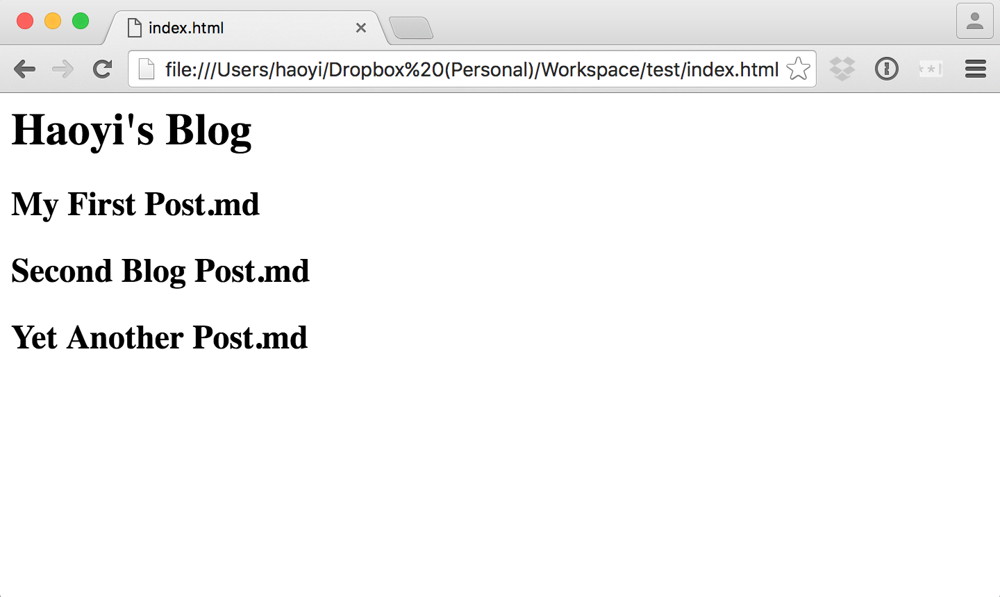
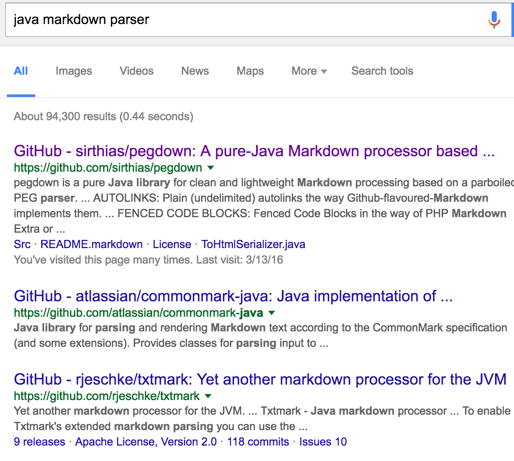
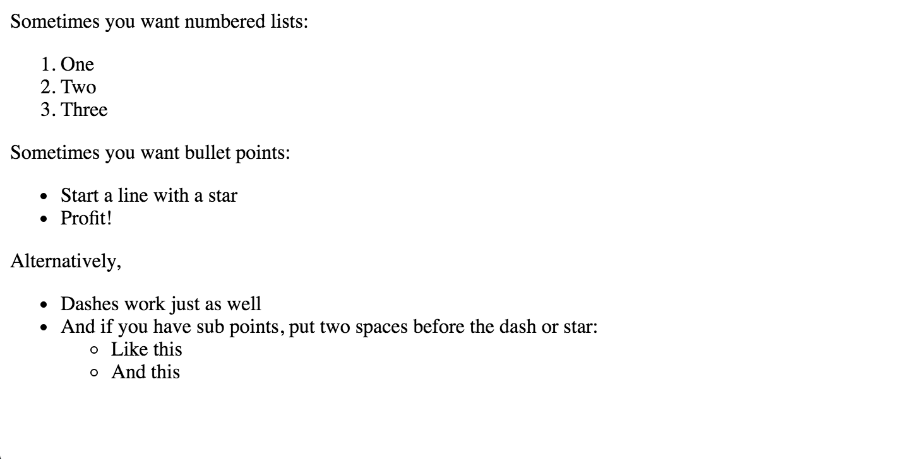
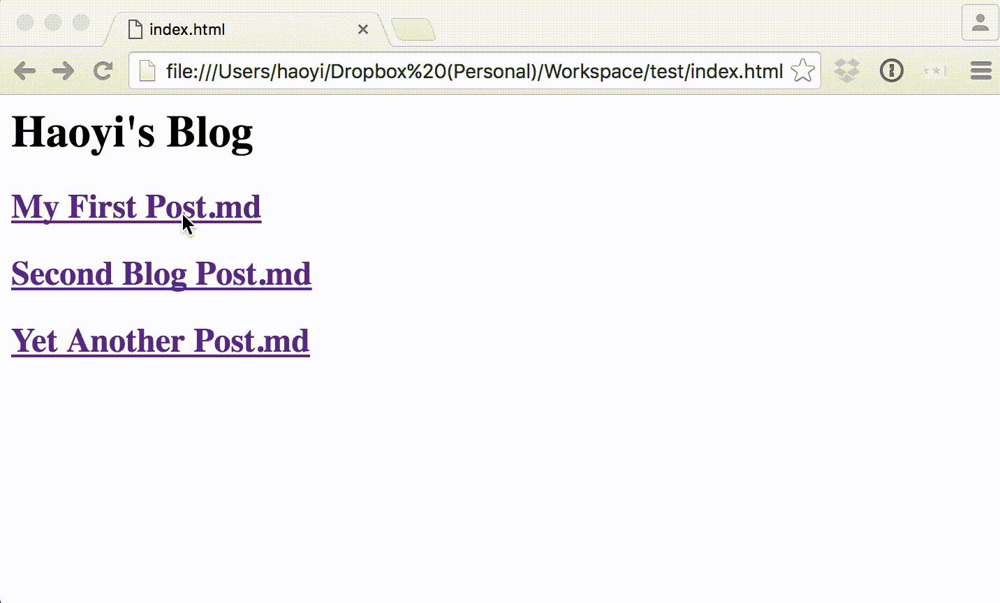
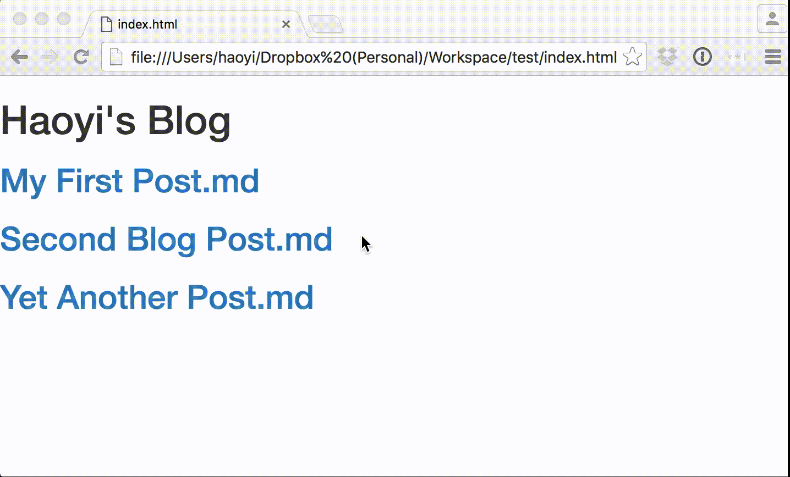

The Scala programming language has traditionally been a tool used for building
"serious business" systems: compilers, big data, distributed systems or large
web applications. With the advent of [Scala.js](http://www.scala-js.org/),
people are starting to use it for front-end Web work, while the
[Ammonite-REPL] has turned it into a pleasant interactive experience.

This post will explore the new [Scala Scripting] functionality in the Ammonite
project, and use it in the context of creating your own DIY blog engine in 15
minutes. We'll see how it compares to both the status-quo Scala programming
experience, other scripting languages like Python or Bash, and what place it
can find in your Scala programming toolbox.

[Ammonite-REPL]: http://www.lihaoyi.com/Ammonite/
[Scala Scripting]: http://www.lihaoyi.com/Ammonite/#ScalaScripts
-------------------------------------------------------------------------------

- [Serious Business](#serious-business)
- [Scala Scripting with Ammonite](#scala-scripting-with-ammonite)
- [Ammonite Goodies](#ammonite-goodies)
    - [Importing Files](#importing-files)
    - [Importing Libraries](#importing-libraries)
    - [Startup Performance](#startup-performance)
    - [Filesystem Operations](#filesystem-operations)
- [The 15 Minute Static Blog](#the-15-minute-static-blog)
    - [Minute 0: Hello World](#minute-0-hello-world)
    - [Minute 1: Deciding the Content Layout](#minute-1-deciding-the-content-layout)
    - [Minute 4: Generating a HTML Page](#minute-4-generating-a-html-page)
    - [Minute 8: Rendering Markdown](#minute-8-rendering-markdown)
    - [Minute 12: Cleanup and Links](#minute-12-cleanup-and-links)
    - [Minute 15: Bootstrap](#minute-15-bootstrap)
- [In The Wild](#in-the-wild)
- [Limitations](#limitations)
- [Conclusion](#conclusion)

## Serious Business

Traditionally, Scala has always been used for engineering big, complicated
systems. Looking at Github's [Trending Scala Repositories] brings up, at time
of writing, things like [apache/spark](https://github.com/apache/spark),
[apache/incubator-predictionio](https://github.com/apache/incubator-predictionio),
[akka/akka](https://github.com/akka/akka) and
[scalanlp/breeze](https://github.com/scalanlp/breeze).

Looking at this list of things, the focus is pretty clear: distributed systems,
type-system & compiler research, big-data, machine-learning. Serious Business.

It turns out that Scala is a great language for Serious Business. Some nice
properties include:

- Relatively high-performance on the high-performance JVM runtime makes your
  web-scale or big-data Serious Business complete faster.

- Type-safety makes sure you don't make careless mistakes when doing your
  very-important Serious Business.

- Good tools for abstractions (inline-functions, implicits, typeclasses) means
  you can manage the complexity of your Serious Business and keep it from
  getting out of hand. \

While Scala is great for doing Serious Business, it is less ideal for doing
quick, hacky 1-20 liners in the command-line or as scripts. Your options have
traditionally been:

- The REPL: whether the default or the [Ammonite-REPL], this works great for
  interactive work, but doesn't satisfy the use case where you need to write
  something down and run it later.

- Use the `scala` command to run script files: this works in theory, but in
  practice is unmaintained, and has enough rough edges (the error messages are
  atrocious!) and missing features (you can't import other files, or easily use
  third-part libraries) that it doesn't actually work in practice.

- Use a standalone [SBT](http://www.scala-sbt.org/) project. This means you
  pay the 3-4s startup time to run your project from the command line, not to
  mention all the boilerplate associated with it:

    - A `project/build.properties` file
    - A `build.sbt` file
    - A `src/` folder with `src/main/scala/pkg/` inside
    - And finally your single `Main.scala` file inside...
    - Wrapped in boilerplate `package pkg; object Main{def main(args: Array[String]): Unit = {}}`...
    - ... which then contains your real, useful code.

- Use [Conscript](http://www.foundweekends.org/conscript/), which isn't well
  documented and shares much of the same problems of the `scala` command
  (can't import files) and SBT (slow start times)

Clearly, none of these satisfy the use case of "write code in file, run it".
That is where [Scala Scripting] comes in.

## Scala Scripting with Ammonite

[Scala Scripting] avoids many of the limitations of the status-quo Scala world.
A new feature of the [Ammonite](http://www.lihaoyi.com/Ammonite/) project, Scala
Scripting lets you write tiny, self-contained Scala scripts that you can run
quickly-and-conveniently from the command line using the `amm` script-runner.

To begin with, you can download the Ammonite script-runner onto any machine
with a JVM (Unix/Bash is shown here, Windows works with some fiddling):

```bash
> sudo curl -L -o /usr/local/bin/amm https://git.io/vKSOR
> chmod +x /usr/local/bin/amm
```

Now, you can create and run a `.sc` file using the `amm` executable on your
path:

```scala
> cat Foo.sc
println("Hello World")

> amm Foo.sc
Hello World
```

A `.sc` file is simply a file full of Scala code, except top-level statements
can be anything, and not just `class`es `trait`s and `object`s. `amm` runs the
file, compiling it, caching the compiled code, and executing it. You can also
add a `#!/usr/bin/env amm` shebang line to let you execute the file directly

```scala
> cat Foo.sc
#!/usr/bin/env amm
println("Hello World")

> ./Foo.sc
Hello World
```

## Ammonite Goodies

So far, this isn't anything you couldn't do with the `scala` command, which
also lets you run these scripts:

```scala
> scala Foo.sc
Hello World
```

So what does Scala Scripting with Ammonite's `amm` runner give you over just
running scripts with the `scala` command? Quite a lot, it turns out

### Importing Files

The most basic feature that Scala Scripting with `amm` gives you over the
`scala` command is that it lets you import scripts from each other, using an
`import $file.Foo` syntax. For example:

```scala
> cat Bar.sc
val myMessage = "Hello World!"

> cat Foo.sc
import $file.Bar
println(Bar.myMessage)

> amm Foo.sc
Hello World!
```

Here, we have two scripts, `Foo.sc` and `Bar.sc`. `Foo.sc` imports a value
from `Bar.sc`, and uses it when you run your script. This is something that
is [impossible](http://stackoverflow.com/q/1529434/871202) using the standard
`scala` command, and is fundamental to any scripting language: Bash, Python,
Ruby, all let you import scripts from other scripts. And why not? If Python
forced you to put all your code in a single file, there's no way it would be
as popular as it is today! Scala Scripting gives you this capability for Scala
scripts.

This example is obviously trivial - you wouldn't split a 2-line script
into 2 files just because you could - but when your scripts grow to 100 lines
or more, the ability to split them becomes valuable.

In general, this import system works the same as you'd expect coming from
Python: `import $file.Foo` imports the `Foo.sc` file in the same folder,
`import $file.sub.Foo` would import the `sub/Foo.sc` file. You then get access
to the `Foo` object with all the definitions in that script file available as
fields or methods. Unlike in Ruby, imports don't dump all their contents
into local scope by default: use `import $file.Foo, Foo._` if you want to do
that explicitly.

You can do all the standard things you'd expect with Scala imports: rename
`Foo => ...` as part of the import, import multiple files at once, or import
a file and immediately import some value from it:

```scala
> cat Bar.sc
val myMessage = "Hello World!"

> cat Foo.sc
import $file.Bar, Bar.myMessage
println(myMessage)

> amm Foo.sc
Hello World!
```

The only limitation is that you have to `import $file.Bar` separately from
importing things *from* `Bar`, e.g. you can't `import $file.Bar.myMessage` all
at once. Instead, you need to `import $file.Bar, Bar.myMessage`.

Apart from that, though, it works basically seamlessly, and as you'd expect.
On-demand, the `Bar.sc` file is loaded, compiled, evaluated, made available
under the `$file.Bar` full path and imported as the `Bar` object. Similarly,
doing `import $file.sub.Foo` to load the `sub/Foo.sc` script will make it
available as the `Foo` object in the `$file.sub` package, and import `Foo`
for your use in your script. This works basically seamlessly, just as the
import system of a real scripting language would work.

### Importing Libraries

Part of the beauty of working with Scala/SBT or Java/Maven is the dependency
management system: rather than trying to remember to `apt-get install` or
`brew install` or `pip install` things before running your code, you simply add
any libraries you want to your build file (whether `build.sbt` or `pom.xml`)
and they get pulled down automatically for you when you compile your code. No
more forgetting to run the correct incantations, or needing to uninstall a
library because it clashes globally with another version someone else is
using. Just add the dependency to your build file, and the next time you run
your code, it just works. If someone else wants to run your code, they just
run it, the first time being slightly slower as dependencies get pulled down
and cached, and again it just works without manual installation.

This functionality is missing when you want to use the `scala` command to
run scripts. Sure, you *could* download the jars manually and use the `-cp` flag
to add them, but that's a pain in the neck and nobody does it.

With Scala Scripting, the `amm` command does all this for you. For example,
if I want to use the popular [Scalatags] HTML templating library to generate
some HTML in my script, I might try to do:

```scala
> cat Foo.sc
import scalatags.Text.all._
println(a("Hello", href := "http://www.google.com").render)

> amm Foo.sc
```

But this results in
```scala
Foo.sc:1: not found: value scalatags
import scalatags.Text.all._
       ^
Foo.sc:2: not found: value a
;val res_1 = println(a("Hello", href := "http://www.google.com").render)
                     ^
Foo.sc:2: not found: value href
;val res_1 = println(a("Hello", href := "http://www.google.com").render)
                                ^
Compilation Failed
```

Naturally, the `amm` script runner doesn't include a HTML generation library.
And why should it? It's a script runner, after all, not a web framework!
Nonetheless, you can easily pull down libraries using the `import $ivy` syntax:

```scala
> cat Foo.sc
import $ivy.`com.lihaoyi::scalatags:0.6.0`, scalatags.Text.all._
println(a("Hello", href := "http://www.google.com").render)

> amm Foo.sc
:: loading settings :: url = jar:file:/usr/local/bin/amm!/org/apache/ivy/core/settings/ivysettings.xml
:: resolving dependencies :: com.lihaoyi#scalatags_2.11-caller;working
	confs: [default]
	found com.lihaoyi#scalatags_2.11;0.6.0 in central
	found org.scala-lang#scala-library;2.11.8 in chain-resolver
	[2.11.8] org.scala-lang#scala-library;2.11.8
	found com.lihaoyi#sourcecode_2.11;0.1.1 in chain-resolver
	found com.lihaoyi#acyclic_2.11;0.1.2 in central
	found org.scala-lang#scala-compiler;2.11.0 in central
	found org.scala-lang.modules#scala-xml_2.11;1.0.1 in chain-resolver
	found org.scala-lang.modules#scala-parser-combinators_2.11;1.0.1 in m2
	found org.scala-lang#scala-reflect;2.11.8 in chain-resolver
	[2.11.8] org.scala-lang#scala-reflect;2.11.8
<a href="http://www.google.com">Hello</a>

> amm Foo.sc
<a href="http://www.google.com">Hello</a>
```

In the `import $ivy` statement, the ivy-organization, library-name, and version
are separated by `:`s, with the first `::` representing a Scala library
(similar to `%%` vs `%` in SBT). As you can see, the first time you run the
script it resolves and pulls down the relevant libraries from Maven Central,
and makes Scalatags available in your tiny `.sc` script! On subsequent runs,
it's cached and can be used instantly.

While downloading a HTML-generation library in a script may seem frivolous,
the Java ecosystem has thousands of libraries available in the standard Ivy
repositories. Implementations of languages from Ruby to Python to Javascript,
tools like the Google Closure Compiler, libraries for dealing with geospatial
data or obscure file formats. If there's a library for a task available in
*any* language, chances are it is also available in Java. And anything available
in Java is available to Scala Scripts via `import $ivy`.

Anything from the simplest library to the most complex framework
can be used in your Scala scripts. For example, if you want to spin up a HTTP
server for whatever reason, you can simply import Twitter's
[Finagle Server](https://twitter.github.io/finagle/guide/Quickstart.html) in
your script and get to work using it:

```scala
> cat Foo.sc
import $ivy.`com.twitter::finagle-http:6.36.0`
import com.twitter.finagle._, com.twitter.util._

val service = new Service[http.Request, http.Response] {
  def apply(req: http.Request): Future[http.Response] = {
    val response = http.Response(req.version, http.Status.Ok)
    response.contentString = "Hello!"
    Future.value(response)
  }
}

val server = Http.serve(":8080", service)
Await.ready(server)

> amm Foo.sc
Jul 23, 2016 1:26:13 PM com.twitter.finagle.Init$$anonfun$1 apply$mcV$sp
INFO: Finagle version 6.36.0 (rev=7efeb4cc2babd7c99731090fa76ad960627fce14) built at 20160708-090553
```

And immediately you can navigate to `localhost:8080` and see `Hello!`
show up in your browser.

### Startup Performance

While the last two points are comparing the advantages of using Scala
Scripting's `amm` command over the `scala` command, using SBT also satisfies
those criterion. SBT allows you to use multiple files in a project, and depend
on libraries via your `build.sbt` file. Nevertheless, SBT has its own problems.
One big one is performance.

For example, if we compare a `.sc` script and a `.scala` file run using SBT:

```scala
> cat Foo.sc
println("Hello!")

> cat Foo.scala
object Foo{
  def main(args: Array[String]): Unit = {
    println("Hello!")
  }
}
```

The first thing you might notice is that the `.scala` file we'll feed into
SBT has all sorts of boilerplate around the code we actually care about, while
the `.sc` file doesn't. It slows you down writing a short script if you need
these reams of boilerplate. Nevertheless, the slowdown doesn't stop when you're
done writing it:

```bash
> time sbt run
[info] Loading global plugins from /Users/haoyi/.sbt/0.13/plugins
[info] Set current project to test (in build file:/Users/haoyi/test/)
[info] Updating {file:/Users/haoyi/Dropbox%20(Personal)/Workspace/test/}test...
[info] Resolving org.fusesource.jansi#jansi;1.4 ...
[info] Done updating.
[info] Compiling 1 Scala source to /Users/haoyi/test/target/scala-2.10/classes...
[info] Running Foo
Hello!
[success] Total time: 1 s, completed Jul 23, 2016 1:43:00 PM

real	0m5.334s
user	0m13.813s
sys	0m0.863s
> time sbt run
[info] Loading global plugins from /Users/haoyi/.sbt/0.13/plugins
[info] Set current project to test (in build file:/Users/haoyi/Dropbox%20(Personal)/Workspace/test/)
[info] Running Foo
Hello!
[success] Total time: 0 s, completed Jul 23, 2016 1:43:06 PM

real	0m3.699s
user	0m9.042s
sys	0m0.592s
```

As you can see, while the first run (where we need to compile the code) takes
more than 5 seconds, subsequent runs still end up taking about 3.7 seconds,
which is a lot of time given we just need to run one line of code! Obviously
this time does not go up linearly with the size of our code snippet, but
nevertheless it is a hefty fixed cost to running any code using SBT. While
it might not matter for large, [Serious Business](#serious-business)
applications, it's a pain for small 1-10 line scripts.

With a Scala Script, we can see that the first run isn't much better. We still
need to compile the code, and Scala compiles code really slow...

```
> time amm Foo.sc
Hello!

real	0m4.632s
user	0m15.607s
sys	0m0.665s
```

However, for subsequent runs, this time drops:

```
> time amm Foo.sc
Hello!

real	0m0.557s
user	0m0.699s
sys	0m0.084s
```

We're looking at about 0.5 seconds of overhead for running arbitrary Scala
Scripts, vs ~3.7 seconds using SBT. While 0.5 seconds is still not *great* -
you wouldn't want to call it in a tight loop using `ls | xargs` for example -
at least it's not infuriatingly-slow.

While it's possible to make SBT projects start up quickly using `sbt stage`
and running the generated executable, it takes third-party plugins and is
fiddly to set up. With a Scala Script, you can just run it directly and benefit
from the "reasonable" startup overhead once the script (and any it imports)
are compiled during the first run.

### Filesystem Operations

Traditionally, when working in a Serious Business language like Scala, there
is always a tension between doing your file operations in your Serious Business
language, or writing a Bash script and shelling out to run it. The tradeoff is
basically:

- Doing your file operations in your Serious Business language means you get
  all the tooling, safety, performance, and other nice properties of your
  Serious Business language

- Doing your file operations in Bash is 5-10x more concise than doing it in
  your Serious Business language (e.g. using the `java.nio` package)

In the end, both are bad choices: one is tediously verbose, and the other is
incredibly sketchy and unsafe.

To solve this dilemma, Ammonite includes a really nice
[Ammonite-Ops](http://www.lihaoyi.com/Ammonite/#Ammonite-Ops) package,
which you can use to perform basic filesystem operations:

```scala
> cat Foo.sc
import ammonite.ops._

println("Starting contents")
ls! cwd foreach println

mkdir(cwd/"my-folder")

println("Contents after creating folder")
ls! cwd foreach println

write(cwd/"my-folder"/"foo.txt", "Hello Hello")
println("Written file contents")
println(read! cwd/"my-folder"/"foo.txt")


> amm Foo.sc
Starting contents
/Users/haoyi/Dropbox (Personal)/Workspace/test/Foo.sc
Contents after creating folder
/Users/haoyi/Dropbox (Personal)/Workspace/test/Foo.sc
/Users/haoyi/Dropbox (Personal)/Workspace/test/my-folder
Written file contents
Hello Hello
```

As you can see, you can conveniently perform common operations like `ls`,
`mkdir`, `read ` and `write` all from the comfort of your Scala code. No longer
do you need to deal with `BufferedReader`s or `BufferedWriter`s or
`InputStreamReader`s and all that boilerplate.

`ammonite.ops` also provides a convenient API for spawning subprocesses and
printing or capturing their output:

```scala
> cat Foo.sc
import ammonite.ops._, ImplicitWd._

%git 'init
%git('add, "-A")
%git('commit, "-am", "First Commit")
%git 'branch
val log = %%('git, 'log, "--pretty=oneline").out.lines
val hashes = log.map(_.split(" ").apply(0))
println("Hashes")
hashes.foreach(println)


> amm Foo.sc
Reinitialized existing Git repository in /Users/haoyi/Dropbox (Personal)/Workspace/test/.git/
[master a604379] First Commit
 1 file changed, 4 insertions(+)
* master
Hashes
a604379bc68b9b48a70451c8323a85f7d8713092
06b5fe2352c5842ccff81d6a4b17d97e907c05b8
```

Here, `%` operations run a command immediately and print any output to stdout,
while `%%` operations like the `git log` capture the output and make it
available as a value you can use in your program. This makes creating
subprocesses just as easy as working in Bash, and without all the boilerplate
associated with the `sys.process` or `java.lang.ProcessBuilder` APIs. For the
rare cases where you need extra control those APIs are still available, but
for the common case this is far more convenient.

With `ammonite.ops`, basic file and process operations are as convenient in
Scala as they would be in Bash. That means you no longer feel the urge to
shell-out to a Bash script in order to make things more concise: you can
comfortably do all your work in Scala, both low-level file operations and
high-level logic. Want to shell out to [Git](https://git-scm.com/), and
then take the output and process it using
[Scala collection operations](https://twitter.github.io/scala_school/collections.html)?
Go ahead! The example above has already shown you how to do it.

## The 15 Minute Static Blog

The initial selling point for [Ruby on Rails](http://rubyonrails.org/) was a
demo of how you could
[Build your own Blog Engine in 15 minutes](https://www.youtube.com/watch?v=Gzj723LkRJY).
This was impressive in the 2005 world where fiddling with PHP/MySQL/Apache
to first set up a website could easily take hours, and it was impressive how
fast Rails let you set up and start making progress.

In 2016, the new hotness is static site generators; unlike dynamic blogs, these
generate the bulk of the web page at build-time, only leaving small sections
like the comments to be generated dynamically, often by third-party services
like [Disqus]. Here, we will use Ammonite's Scala Scripting functionality
discussed above to do something you probably couldn't imagine doing using
traditional Scala tooling: building a static blog generator in 15 minutes with
zero boilerplate.

### Minute 0: Hello world

Just as a reminder, we will start from the simplest possible working script:

```scala
> cat Blog.sc
println("Hello!")

> amm Blog.sc
Hello!
```

This works, and will be our starting point to expand into a fully functional
static blog engine

### Minute 1: Deciding the Content Layout

Typically, static blog engines take their input as markdown files, with
additional metadata (provided in each file, or as separate JSON/YAML files)
and use that to generate HTML. For this exercise, let's arbitrarily decide
that there will be a `posts/` folder that contains any markdown files we
want to convert into blog posts, and each one will be named

- `1 - My First Post.md`
- `2 - Second Blog Post.md`
- `3 - Yet Another Post.md`
- etc.

With the number before the `-` indicating the order of the blog post in the
final blog. We can create some sample posts at the command line:

```bash
> mkdir posts
> touch "posts/1 - My First Post.md"
> touch "posts/2 - Second Blog Post.md"
> touch "posts/3 - Yet Another Post.md"

> ls
Blog.sc	posts

> ls posts/
1 - My First Post.md	2 - Second Blog Post.md	3 - Yet Another Post.md
```

Make our `Blog.sc` file find these posts is easy with the filesystem operations
provided to Scala Scripts:

```scala
> cat Blog.sc
import ammonite.ops._

val postFiles = ls! cwd/'posts
val unsortedPosts = for(path <- postFiles) yield {
  val Array(prefix, suffix) = path.last.split(" - ")
  (prefix.toInt, suffix, path)
}

val sortedPosts = unsortedPosts.sortBy(_._1)

println("POSTS")
sortedPosts.foreach(println)
```
```scala
> amm Blog.sc

POSTS
(1,My First Post.md,/Users/haoyi/Dropbox (Personal)/Workspace/test/posts/1 - My First Post.md)
(2,Second Blog Post.md,/Users/haoyi/Dropbox (Personal)/Workspace/test/posts/2 - Second Blog Post.md)
(3,Yet Another Post.md,/Users/haoyi/Dropbox (Personal)/Workspace/test/posts/3 - Yet Another Post.md)
```

As you can see, we can easily mix bash-like operations like `ls` with
full-fledged Scala code like for-loops, `.foreach`, or pattern matching
on `Array()`s to extract the first and second elements, and good old `println`
for debugging and seeing what's going on. Here, we can see that
our script is able to understand the layout of the blog posts, extract their
name, and sort them in order.

### Minute 4: Generating a HTML Page

A static blog engine needs to generate a static blog, and static blogs are made
of HTML pages. We could generate HTML by stitching together strings like
`"<div>" + content + "</div>"`, but doing so is tedious and unsafe, prone to
[XSS injection] if we're not careful. Luckily, in Scala Scripts we can easily
import whatever Java or Scala libraries we want, including e.g. the [Scalatags]
HTML generation library:

```diff
> git diff
diff --git a/Blog.sc b/Blog.sc
index a57c0d6..a2cdbac 100644
--- a/Blog.sc
+++ b/Blog.sc
@@ -1,3 +1,4 @@
+import $ivy.`com.lihaoyi::scalatags:0.6.0`
 import ammonite.ops._

 val postFiles = ls! cwd/'posts
@@ -10,3 +11,17 @@ val sortedPosts = unsortedPosts.sortBy(_._1)

 println("POSTS")
 sortedPosts.foreach(println)
+val HTML = {
+  import scalatags.Text.all._
+
+  html(
+    head(),
+    body(
+      h1("Haoyi's Blog"),
+      for((_, suffix, _) <- sortedPosts)
+      yield h2(suffix)
+    )
+  ).render
+}
+
+write(cwd/"index.html", HTML)
```
```scala
> amm Blog.sc
POSTS
(1,My First Post.md,/Users/haoyi/Dropbox (Personal)/Workspace/test/posts/1 - My First Post.md)
(2,Second Blog Post.md,/Users/haoyi/Dropbox (Personal)/Workspace/test/posts/2 - Second Blog Post.md)
(3,Yet Another Post.md,/Users/haoyi/Dropbox (Personal)/Workspace/test/posts/3 - Yet Another Post.md)
> cat index.html
<html><head></head><body>
<h1>Haoyi's Blog</h1><h2>My First Post.md</h2><h2>Second Blog Post.md</h2>
<h2>Yet Another Post.md</h2></body></html>
```

Now, the HTML being written to `index.html` isn't particularly nicely
formatted, but it'll do for now. In fact, you can open up `index.html` in the
browser and see it:



Not particularly pretty, but it'll do for now, and we can build on top of it.

### Minute 8: Rendering Markdown

As sample blog posts, I'm just going to take some generic text from the
[Github Markdown Guide](https://guides.github.com/features/mastering-markdown/):

```
> head -n 5 posts/1\ -\ My\ First\ Post.md
Sometimes you want numbered lists:

1. One
2. Two
3. Three
```
```
> head -n 5 posts/2\ -\ Second\ Blog\ Post.md
# Structured documents

Sometimes it's useful to have different levels of headings to structure your documents. Start lines with a `#` to create headings. Multiple `##` in a row denote smaller heading sizes.

### This is a third-tier heading
```
```
> head -n 5 posts/3\ -\ Yet\ Another\ Post.md
There are many different ways to style code with GitHub's markdown. If you have inline code blocks, wrap them in backticks: `var example = true`.  If you've got a longer block of code, you can indent with four spaces:

    if (isAwesome){
      return true
    }
```

Perhaps not the most insightful thought-pieces, but they'll do for now. The
next question would be, how can we parse the markdown?

It turns out, there are perfectly good markdown parsers in Java,



And we can pick any  we'd like. Glancing through them, it seems
[atlassian/commonmark-java](https://github.com/atlassian/commonmark-java) is
the most active and has the clearest readme, so let's use that.

The readme gives you the maven snippet necessary to use this parser

```xml
<dependency>
    <groupId>com.atlassian.commonmark</groupId>
    <artifactId>commonmark</artifactId>
    <version>0.5.1</version>
</dependency>
```

This directly corresponds to the `$ivy` import:

```scala
import $ivy.`com.atlassian.commonmark:commonmark:0.5.1`
```

Note that it's a single `:` between the `groupId` and the `artifactId`, as this
is a Java library (Scala libraries would need a `::`)

They also give us some Java sample code to get started using the library.
Translating into Scala is basically replacing all the local variables with
`val`s. We can use this in our code, reading the `.md` files, transforming them
into HTML and writing them into HTML files:

```diff
> git diff
diff --git a/Blog.sc b/Blog.sc
index a2cdbac..d6419a9 100644
--- a/Blog.sc
+++ b/Blog.sc
@@ -1,4 +1,6 @@
 import $ivy.`com.lihaoyi::scalatags:0.6.0`
+import $ivy.`com.atlassian.commonmark:commonmark:0.5.1`
+
 import ammonite.ops._

 val postFiles = ls! cwd/'posts
@@ -11,6 +13,20 @@ val sortedPosts = unsortedPosts.sortBy(_._1)

 println("POSTS")
 sortedPosts.foreach(println)
+for((_, suffix, path) <- sortedPosts) {
+  import org.commonmark.html.HtmlRenderer
+  import org.commonmark.node._
+  import org.commonmark.parser.Parser
+
+  val parser = Parser.builder().build()
+  val document = parser.parse(read! path)
+  val renderer = HtmlRenderer.builder().build()
+  val output = renderer.render(document)
+  write(
+    cwd/'blog/(suffix.stripSuffix(".md").replace(" ", "-").toLowerCase + ".html"),
+    output
+  )
+}
 val HTML = {
   import scalatags.Text.all._
```

You can see the new `for` loop in the middle with all the code cribbed from
the `atlassian/commonmark-java` docs, basically verbatim. We are converting the
"raw" names of the files to URL-friendly names using a `.replace` and
`.toLowerCase`; this isn't particularly robust but it'll do for now.

Running this, it will
download the `atlassian/commonmark-java` library the first time and give you

```
> amm Blog.sc
POSTS
(1,My First Post.md,/Users/haoyi/Dropbox (Personal)/Workspace/test/posts/1 - My First Post.md)
(2,Second Blog Post.md,/Users/haoyi/Dropbox (Personal)/Workspace/test/posts/2 - Second Blog Post.md)
(3,Yet Another Post.md,/Users/haoyi/Dropbox (Personal)/Workspace/test/posts/3 - Yet Another Post.md)
> tree
.
├── Blog.sc
├── blog
│   ├── my-first-post.html
│   ├── second-blog-post.html
│   └── yet-another-post.html
├── index.html
└── posts
    ├── 1\ -\ My\ First\ Post.md
    ├── 2\ -\ Second\ Blog\ Post.md
    └── 3\ -\ Yet\ Another\ Post.md
```

As you can see, our `my-first-post.html` and `second-blog-post.html` files are
all in place. You can look at the generated code:

```xml
> head blog/my-first-post.html
<p>Sometimes you want numbered lists:</p>
<ol>
<li>One</li>
<li>Two</li>
<li>Three</li>
</ol>
<p>Sometimes you want bullet points:</p>
<ul>
<li>Start a line with a star</li>
<li>Profit!</li>
```

Or open them in the browser:



Sure it's missing all the `<html></html>` stuff that's meant to wrap it, but
we can fix that.

### Minute 12: Cleanup and Links

The last two things to make our blog-engine kinda-functional are:

- Properly wrap the blog posts in `<html><body></body></html>` wrappers
- Add links between the pages

This can be done relatively easily:
```diff
> git diff
diff --git a/Blog.sc b/Blog.sc
index d6419a9..98977f9 100644
--- a/Blog.sc
+++ b/Blog.sc
@@ -8,7 +8,9 @@ val unsortedPosts = for(path <- postFiles) yield {
   val Array(prefix, suffix) = path.last.split(" - ")
   (prefix.toInt, suffix, path)
 }
-
+def mdNameToHtml(name: String) = {
+  name.stripSuffix(".md").replace(" ", "-").toLowerCase + ".html"
+}
 val sortedPosts = unsortedPosts.sortBy(_._1)

 println("POSTS")
@@ -22,9 +24,17 @@ for((_, suffix, path) <- sortedPosts) {
   val document = parser.parse(read! path)
   val renderer = HtmlRenderer.builder().build()
   val output = renderer.render(document)
+  import scalatags.Text.all._
   write(
-    cwd/'blog/(suffix.stripSuffix(".md").replace(" ", "-").toLowerCase + ".html"),
-    output
+    cwd/'blog/mdNameToHtml(suffix),
+    html(
+      head(),
+      body(
+        h1(a("Haoyi's Blog", href := "../index.html")),
+        h1(suffix.stripSuffix(".md")),
+        raw(output)
+      )
+    ).render
   )
 }
 val HTML = {
@@ -35,7 +45,7 @@ val HTML = {
     body(
       h1("Haoyi's Blog"),
       for((_, suffix, _) <- sortedPosts)
-      yield h2(suffix)
+      yield h2(a(suffix, href := ("blog/" + mdNameToHtml(suffix))))
     )
   ).render
 }
```

We're not doing anything particularly fancy: just wrapping the output in a
"standard" `html`/`head`/`body` wrapper (which you can tweak yourself) and
doing some string-munging to make sure the links all point at the right files.

We can run it:

```
> rm -rf index.html
> rm -rf blog/
> amm Blog.sc
```

And it works!




### Minute 15: Bootstrap

The last step would be to layer on some
[Bootstrap CSS](http://getbootstrap.com/getting-started/) over our ugly
unstyled page, because that's how you take unstyled content and make it
web-scale.

```diff
> git diff
diff --git a/Blog.sc b/Blog.sc
index 98977f9..66bca16 100644
--- a/Blog.sc
+++ b/Blog.sc
@@ -13,6 +13,13 @@ def mdNameToHtml(name: String) = {
 }
 val sortedPosts = unsortedPosts.sortBy(_._1)

+val bootstrapCss = {
+  import scalatags.Text.all._
+  link(
+    rel := "stylesheet",
+    href := "https://maxcdn.bootstrapcdn.com/bootstrap/3.3.6/css/bootstrap.min.css"
+  )
+}
 println("POSTS")
 sortedPosts.foreach(println)
 for((_, suffix, path) <- sortedPosts) {
@@ -28,7 +35,7 @@ for((_, suffix, path) <- sortedPosts) {
   write(
     cwd/'blog/mdNameToHtml(suffix),
     html(
-      head(),
+      head(bootstrapCss),
       body(
         h1(a("Haoyi's Blog", href := "../index.html")),
         h1(suffix.stripSuffix(".md")),
@@ -41,7 +48,7 @@ val HTML = {
   import scalatags.Text.all._

   html(
-    head(),
+    head(bootstrapCss),
     body(
       h1("Haoyi's Blog"),
       for((_, suffix, _) <- sortedPosts)
```

Here, we're simply including the `link` as described in the Bootstrap docs,
except we're converting it to Scalatags syntax and stripping off the security
related bits because YOLO.

And there you have it!



The final code, if anyone wants to try it, is

```scala
> cat Blog.sc
import $ivy.`com.lihaoyi::scalatags:0.6.0`
import $ivy.`com.atlassian.commonmark:commonmark:0.5.1`

import ammonite.ops._

val postFiles = ls! cwd/'posts
val unsortedPosts = for(path <- postFiles) yield {
  val Array(prefix, suffix) = path.last.split(" - ")
  (prefix.toInt, suffix, path)
}
def mdNameToHtml(name: String) = {
  name.stripSuffix(".md").replace(" ", "-").toLowerCase + ".html"
}
val sortedPosts = unsortedPosts.sortBy(_._1)

val bootstrapCss = {
  import scalatags.Text.all._
  link(
    rel := "stylesheet",
    href := "https://maxcdn.bootstrapcdn.com/bootstrap/3.3.6/css/bootstrap.min.css"
  )
}
println("POSTS")
sortedPosts.foreach(println)
for((_, suffix, path) <- sortedPosts) {
  import org.commonmark.html.HtmlRenderer
  import org.commonmark.node._
  import org.commonmark.parser.Parser

  val parser = Parser.builder().build()
  val document = parser.parse(read! path)
  val renderer = HtmlRenderer.builder().build()
  val output = renderer.render(document)
  import scalatags.Text.all._
  write(
    cwd/'blog/mdNameToHtml(suffix),
    html(
      head(bootstrapCss),
      body(
        h1(a("Haoyi's Blog", href := "../index.html")),
        h1(suffix.stripSuffix(".md")),
        raw(output)
      )
    ).render
  )
}
val HTML = {
  import scalatags.Text.all._

  html(
    head(bootstrapCss),
    body(
      h1("Haoyi's Blog"),
      for((_, suffix, _) <- sortedPosts)
      yield h2(a(suffix, href := ("blog/" + mdNameToHtml(suffix))))
    )
  ).render
}

write(cwd/"index.html", HTML)
```

Paste this into a `Blog.sc` file, put markdown files in the `1 - Hello.md`
`2 - Post.md` format under `posts/` and run `amm Blog.sc` to generate the HTML
pages. Once generated, those pages can go anywhere: view them locally, push
them to github pages, where-ever. They're static, and require no hosting. The
first time you run the script, it will take 2-3 seconds to compile, and every
time after you change the code. After that, though, it should be fast and run
in about 0.5s. You can edit the markdown files and it will re-generate quickly,
as long as you don't touch the Scala code and it does not need to re-compile.

And that's our 15 Minute Static Blog Engine using Scala Scripting, in 60 lines
of code!

Although the blog engine we built is in no means complete, it is a start and
it's just more of the same to flesh out details: adding a
`<meta charset="utf-8" />` tag, adding a [Disqus] comment box,
[Google Analytics](https://www.google.com/analytics),
or adding custom CSS to make it look more pretty. The source code for
[this blog itself](https://github.com/lihaoyi/blog) would be an interesting
example of a blog-engine written as Scala Scripts, but fleshed out with all
the bells and whistles I wanted in a "real" deployment.

## In The Wild

Ammonite's Scala Scripting functionality is new, and although many people are
already using the [Ammonite-REPL], there hasn't been time for wide adoption
of these scripts.

Nevertheless, this blog itself is generated using scala scripts, with three
files in the
[https://github.com/lihaoyi/blog](https://github.com/lihaoyi/blog) repo, with
the added code implementing functionality such as [generating timestamps from
git history](https://github.com/lihaoyi/blog/blob/6dbf5bf555706bb269bf8357151253f6029f0d8d/build.sc#L17-L41)
(easy to do by shelling out to git via `$$('git, 'log, ...)`),
[responsive CSS](https://github.com/lihaoyi/blog/blob/6dbf5bf555706bb269bf8357151253f6029f0d8d/pageStyles.sc#L1)
(built using [Scalatags CSS](http://www.lihaoyi.com/scalatags/#CSSStylesheets))
and a flag to
[push to github pages](https://github.com/lihaoyi/blog/blob/6dbf5bf555706bb269bf8357151253f6029f0d8d/build.sc#L176-L184).

Apart from this blog, other use cases for Scala Scripts include Ammonite's own
[CI Runner](https://github.com/lihaoyi/Ammonite/blob/f3fb8cdf7a321711ff3c1a34a9829ac8bda63833/ci/build.sc#L1),
and my [Resume](https://github.com/lihaoyi/Resume/blob/58f832decae4d416bd4a0d7df385367682e49e79/Resume.sc#L1).
There are many usages in the wild of people using an
[older version of Scala Scripts](https://github.com/search?l=scala&q=%22load.ivy%22&ref=searchresults&type=Code&utf8=%E2%9C%93)
that lacks some of the modern niceties they current provide.


## Limitations

Ammonite's Scala Scripts have some limitations that are inherent to their
design:

- They run on the [JVM](https://en.wikipedia.org/wiki/Java_virtual_machine),
  and will likely never have a sub-100ms startup cost [due to classloading
  and other overheads](https://github.com/lihaoyi/Ammonite/issues/322#issuecomment-234934906).
  At a few 100ms, the overhead is far more than the 20-30ms it takes to start
  Python or Bash. While there may be improvements to make the JVM or compiled
  Scala code start faster, those would be incremental, and won't be the
  order-of-magnitude improvement to be competitive with other scripting
  languages.

- The first run of a new or changed script will always take several seconds.
  This is inherent in its reliance on the Scala compiler, famously one of the
  slowest compilers in the world. Cached scripts start ok-fast, so if you're
  running scripts much more than modifying them it's not too terrible, but the
  edit-run cycle will always be far slower than traditional scripting
  languages. Work done by the Scala team to speed up the Scala compiler will
  help, but it will never be as fast as modifying and running a Python script.

## Conclusion

In this post, we've explored the world of [Scala Scripting] using the Ammonite
script-runner `amm`. We've toured the features that make it distinct from
existing Scala tools, and demonstrated how you can use it "for real" to make
a working static blog engine in 15 minutes and 60 lines of code. We've
discussed at the limitations, and seen a few examples of it being used for real
work. This initial release of Ammonite's Scala Scripting functionality is new,
and thus has some [known](https://github.com/lihaoyi/Ammonite/issues/418)
[bugs](https://github.com/lihaoyi/Ammonite/issues/417). These will get ironed
out in coming releases as the feature stabilizes.

Realistically, Scala Scripts are always going to be a hybrid of Serious
Business Scala code and Python scripts; hopefully less hacky than Python
scripts, with static types that help catch errors before code gets run, and
hopefully less Serious Business than Scala code living in SBT projects, letting
you take advantage of both your Scala/JVM knowledge as well as the wealth of
JVM libraries to write small scripts in, without too much overhead.

What's next for Scala Scripting? The next step, after this "launch", would be
continual polish work on the existing feature-set - which is largely
freshly-build and somewhat raw - and see if this style of programming gains any
traction among the Scala community.

-------------------------------------------------------------------------------

Fundamentally, [Scala Scripting] is an experiment that tests a hypothesis that
it is possible to make a script-file format for Scala
that is sufficiently pleasant to use that people will actually use it.

"Pleasant" encompasses many things: tool support, startup time, documentation,
error-reporting, extensibility, predictability, featureset, and many other
things.

The "status quo" script-running functionality clearly did not make the cut,
whether using the `scala` executable, or SBT. But I believe that this release
of Ammonite's Scala Scripting feature is sufficiently improved
that it's worth another shot at pushing it to see if it can get traction. In
every category mentioned above, Scala Scripting with Ammonite is an significant
improvement over the status quo.

[Scala.js](http://www.scala-js.org/) and the [Ammonite-REPL] have already shown
that the Scala language is useful for far more than just the Serious Business
applications it has traditionally been used for. We shall see if Scala
Scripting manages to find a niche within the Scala community and ecosystem.

If you yourself are interested in this project, try it out, ask questions on
the [Gitter Channel](https://gitter.im/lihaoyi/Ammonite), and get involved!
While the project has had help from
[Google Summer of Code](https://summerofcode.withgoogle.com/), we could
definitely use more people to share the vision and help drive the project
forward.


[Trending Scala Repositories]: https://github.com/trending/scala?since=daily
[Disqus]: https://disqus.com/
[Scalatags]: http://www.lihaoyi.com/scalatags/
[XSS injection]: https://en.wikipedia.org/wiki/Cross-site_scripting