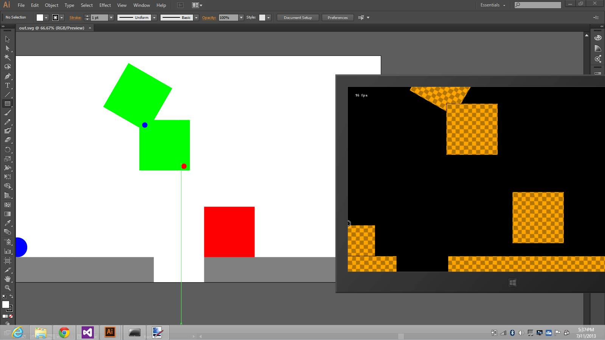
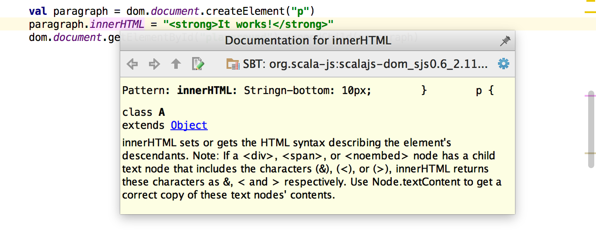
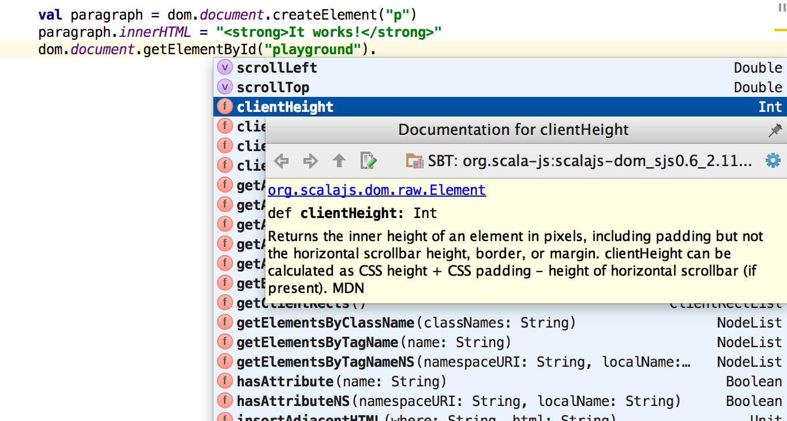
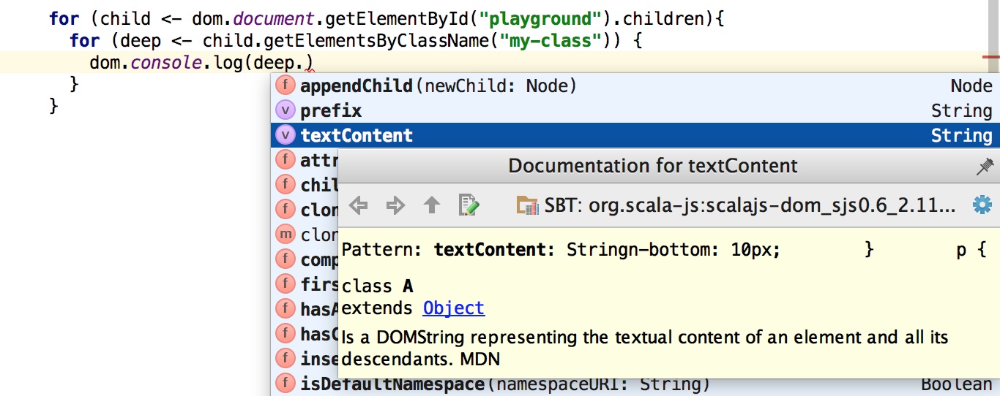
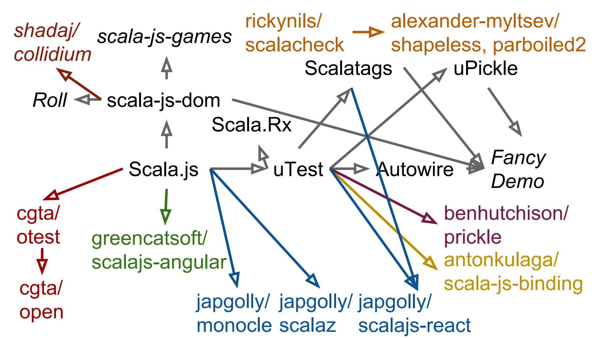
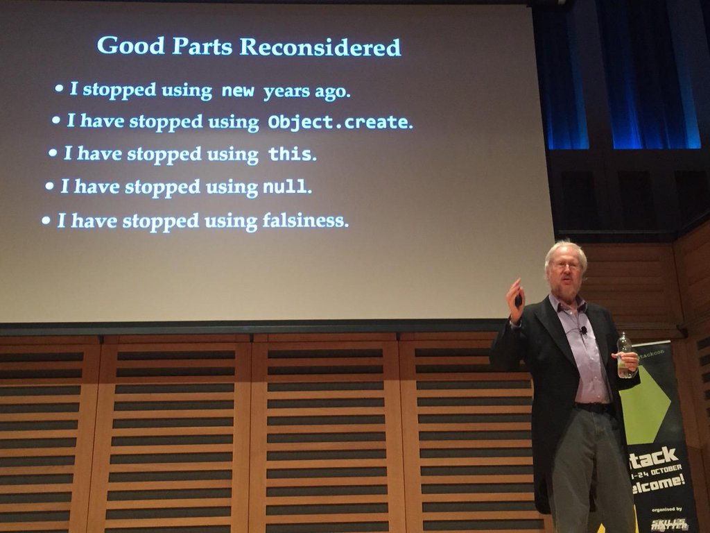

Three years ago, I downloaded the nascent
[Scala.js] compiler and tried to use it on a toy project.

Since then, it
has matured greatly: the compiler itself is rock-solid. It has a huge ecosystem
of libraries. It has a vibrant community, been adopted by some of the [largest
commercial users of the Scala language][Twitter], and is playing a key role in shaping
evolution of the language. By any measure, it is a success, and I was one of
the key people who evangelized it and built foundations for the open-source
community and ecosystem that now exists.

However, three years ago in late 2013, when I first got involved in the
project, things were different. The compiler was unstable, buggy, slow, and
generated incredibly bloated, inefficient Javascript. No ecosystem, no
libraries, no tools, nobody using it, no adoption in enterprise. Clearly, a lot
of the things people now see as reasons to use Scala.js did not apply back
then. So why did I put in the effort I did? This post will explore the reasons
why.

[Scala.js]: http://www.scala-js.org/

-------------------------------------------------------------------------------

There are many compile-to-Javascript languages in the world: virtually every
widely-used language has a compile-to-Javascript version of some level of
quality ([Google Web Toolkit], [PyJS], [Opal Ruby], ...), and then there are
those languages that were designed specifically
with Javascript as a target ([Coffeescript], [TypeScript], ...).
Scala.js is one of them, probably one of the most robust and production-ready
of the compile-to-JS languages. Over the last three years I have played a large
role investing time and effort evangelizing Scala.js and building out the
ecosystem and community to what it is today.

However, Scala.js was not always the solid, production-ready platform that
it is today. When I first
got involved, it was a sketchy new project with so many bugs and problems that
using it for a "real world" use case would have been unheard of. While I have
spent considerable time giving talks telling
people why "Scala.js is good", I have never talked about the core reasons
why I started working on Scala.js long-before it was "good" by any measure. Why
Scala.js, and not one of the
[many alternatives](https://github.com/jashkenas/coffeescript/wiki/List-of-languages-that-compile-to-JS)?
This post will tell that story.


- [My Involvement with Scala.js](#my-involvement-with-scalajs)
- [The More Things Change](#the-more-things-change)
- [The More They Stay The Same](#the-more-they-stay-the-same)
    - [Perfect IDE Support](#perfect-ide-support)
    - [Seamless Javascript Interop](#seamless-javascript-interop)
        - [Clunky Interop](#clunky-interop)
        - [Heavy, Smooth Interop](#heavy-smooth-interop)
    - [Perfect Scala Compatibility](#perfect-scala-compatibility)
        - [The Compatibility Status Quo](#the-compatibility-status-quo)
        - [Scala.js' Compatibility](#scalajs-compatibility)
    - [Cross-Platform Ecosystem](#cross-platform-ecosystem)
        - [Anemic Ecosystems of the Past](#anemic-ecosystems-of-the-past)
        - [Bootstrapping the Scala.js Ecosystem](#bootstrapping-the-scalajs-ecosystem)
        - [Take-aways from the Bootstrapping](#take-aways-from-the-bootstrapping)
    - [Static Optimizability](#static-optimizability)
        - [Compiling Dynamic Languages](#compiling-dynamic-languages)
        - [compile-to-JS](#compile-to-js)
        - [Static types and Scala](#static-types-and-scala)
        - [Case Study: Opal](#case-study-opal)
        - [Revenge of the Static Types](#revenge-of-the-static-types)
    - [Solving Real Problems](#solving-real-problems)
        - [My Problems with Web Development](#my-problems-with-web-development)
        - [Refactoring is Painful](#refactoring-is-painful)
        - [Re-implementing code in two different languages sucks](#re-implementing-code-in-two-different-languages-sucks)
        - [It's too difficult to declare "non-trivial" abstractions](#its-too-difficult-to-declare-non-trivial-abstractions)
        - [Scala.js Solves Real Problems](#scalajs-solves-real-problems)
- [Conclusion](#conclusion)


## My Involvement with Scala.js

Although many people in the Scala community think of me as the "Scala.js person",
I actually have never contributed seriously to the core compiler in
[https://github.com/scala-js/scala-js](https://github.com/scala-js/scala-js).
Rather, my contribution has been mostly community, ecosystem and evangelism:

- 8 talks at meetups & conferences:
    - [Making Games with Scala.js](https://docs.google.com/presentation/d/1NJZ2ilBCeQhI3OgE8HSjfLxUlvUfV0cXgZU6_8dAXuM/edit#slide=id.p),
      15 Nov 2013
    - [Living Coding Scala.js](http://www.lihaoyi.com/post/TalksIveGiven.html#live-coding-scalajs),
      28 Feb 2014
    - [Cross-platform development with Scala.js](http://www.lihaoyi.com/post/TalksIveGiven.html#cross-platform-development-with-scalajs),
      9 Aug 2014
    - [Hands-on Scala.js](http://www.lihaoyi.com/post/TalksIveGiven.html#hands-on-scalajs),
      14 Nov 2014
    - [Bootstrapping the Scala.js Ecosystem](http://www.lihaoyi.com/post/TalksIveGiven.html#bootstrapping-the-scalajs-ecosystem),
      7 Dec 2014
    - [Scala.js: Safety & Sanity in the wild west of the web](http://www.lihaoyi.com/post/TalksIveGiven.html#scalajs---safety--sanity-in-the-wild-west-of-the-web),
      8 Mar 2015
    - [Why (You might like) Scala.js](http://www.lihaoyi.com/post/TalksIveGiven.html#why-you-might-like-scalajs),
      17 Mar 2015
    - [Client-side web dev with Scala.js](http://www.lihaoyi.com/post/TalksIveGiven.html#client-side-web-dev-without-javascript-with-scalajs),
      10 Fen 2016
- Wrote the first Scala.js libraries: [Scalatags](https://github.com/lihaoyi/scalatags),
  [uTest](https://github.com/lihaoyi/utest), [uPickle](http://www.lihaoyi.com/upickle-pprint/upickle/),
  [Scala.Rx](https://github.com/lihaoyi/scala.rx), [Scala-Js-Dom](http://scala-js.github.io/scala-js-dom/)
- Wrote the [Hands-on Scala.js e-book](http://www.lihaoyi.com/hands-on-scala-js/), a
  126 page e-book tutorial introducing people to Scala.js
- Set up the [Scala-Js-Fiddle](http://www.scala-js-fiddle.com/),
  the online sandbox for playing with Scala.js code in the browser.

In a way, [Living Coding Scala.js](http://www.lihaoyi.com/post/TalksIveGiven.html#live-coding-scalajs)
and [Cross-platform development with Scala.js](http://www.lihaoyi.com/post/TalksIveGiven.html#cross-platform-development-with-scalajs)
were Scala.js' two big "break-out" presentations: they reached about 10000
views on-line, and were the first time the broader Scala community had a chance
to see that this "Scala.js" thing existed and how to use it. Most of the early
community came from people who had watched those talks, and most of them got
started with Scala.js via my
[Hands-on Scala.js e-book](http://www.lihaoyi.com/hands-on-scala-js/).

By this point, the ecosystem is mostly self sustaining: even though people
continue to think of me as the "Scala.js person", I haven't been actively
using, contributing or evangelizing Scala.js for over a year. Other
people have taken on building [libraries](https://github.com/MediaMath/scala-json)
and [frameworks](http://udash.io/), writing
[documentation](https://ochrons.github.io/scalajs-spa-tutorial/en/index.html),
or evangelizing it at [meetups](http://www.meetup.com/Austin-Scala-Enthusiasts/events/228282197/)
and [conferences](https://www.youtube.com/watch?v=aqtoe0xDayM). We even have
a new [Scala Fiddle] being built to replace the existing one which is showing
its age.

[Scala Fiddle]: https://scalafiddle.io/

I am probably still the individual who has spent the most time telling people why
*they* should use Scala.js, but I have never really told people why *I* started
using Scala.js, especially early on when things were rough, performance in all
aspects were poor and many of the niceties that exist today do not exist. What
was in it for me?

## The More Things Change

I first got involved with Scala.js in [Sep
2013](https://groups.google.com/forum/#!topic/scala-js/4T5URZZ2a0A). At the
time I wanted to make a 2D physics-platformer game (what would eventually
become [Roll]), and had just prototyped an [implementation using
C#/F#](https://github.com/lihaoyi/FSharpMetro) to be played on the new-fangled
Windows touch-screen computers. Here's an early screenshot:

[Roll]: http://www.lihaoyi.com/roll/



Not satisfied with a possible market of people-with-windows-touchscreen-computers,
I decided to try and port the game to the web so it could run on more
platforms. I had done enough Javascript to know I didn't really enjoy it, was
working actively with our Python/Coffeescript website at work, and
knew Scala from some freelance projects I had done while in college. I came
across [Sebastien's talk at Scaladays
2013](http://lampwww.epfl.ch/~doeraene/presentations/scala-js-scaladays2013/),
decided that this side-project platform-game was small enough that the
risk of using unknown technologies was fine.
It was September, 2013.

The Scala.js of Sep 2013 was very different from the Scala.js that exists right
now, in Aug 2016. The easiest way to compare the Scala.js of Aug 2016 to the
Scala.js of Sep 2013 is to look at the numbers:

|Date                  | Aug 2016                     | Sep 2013                           |
|----------------------|------------------------------|------------------------------------|
|Version               | 0.6.11                       | 0.1.0-SNAPSHOT                     |
|Edit-Refresh time     | 1-2s                         | [20-30s][Slow Compiler]            |
|Hello-World Code Size | ~100kb prod/~1mb dev         | >1mb prod/[28.6mb][Bloated JS] dev |
|Performance Slowdown  | [~1-2x][Perf]                | >10x                               |
|Libraries             | Dozens ([Js] & [Scala])      | None                               |
|Frameworks            | [React], [Angular], [Vue]... | None                               |
|Users                 | [Thousands][Gitter]          | 0-1                                |
|Test Suite            | Scala Compiler Suite         | [YOLO][No Tests]                   |
|"Enterprise Use"      | [Yes][Twitter]               | No                                 |
|Core Maintainers      | 3                            | 1                                  |

[Twitter]: https://twitter.com/stuhood/status/754092715067838464
[No Tests]: https://groups.google.com/forum/?nomobile=true#!topic/scala-js/St8Jz-89vxY
[Slow Compiler]: https://groups.google.com/forum/#!topic/scala-js/k8Rpvc5ojZY
[Bloated JS]: https://groups.google.com/forum/#!topic/scala-js/mBlhq2HPsgU
[Gitter]: https://gitter.im/scala-js/scala-js
[Js]: http://www.scala-js.org/libraries/facades.html
[Scala]: http://www.scala-js.org/libraries/libs.html
[Perf]: http://www.scala-js.org/doc/internals/performance.html
[React]: https://github.com/japgolly/scalajs-react
[Angular]: https://github.com/greencatsoft/scalajs-angular
[Vue]: https://github.com/fancellu/scalajs-vue

If you are a front-end engineer looking for a compile-to-JS
language in Aug 2016, or a back-end Scala engineer looking for a way to re-use
your Scala skills working on the web, the Aug 2016 version of Scala.js paints
a pretty attractive picture. In contrast, the Sep 2013 version of Scala.js
looks no where near as nice. In fact, if you were an engineer looking at making
something "for real" in Sep 2013 (rather than just messing around as I was) you
would have to be insane to choose Scala.js at the time.

However, some things don't change. It turns out that there are some properties
of Scala.js that, even back in 2013, made it an attractive platform for a
developer to experiment with...

## The More They Stay The Same

Not every characteristic of a language or platform is created equal: some
characteristics are easy to change. Others are hard to change but, but the
path to change them is straightforward if you're willing to put in the
(possibly months) of grunt work. Still other characteristics are
basically frozen: no matter how many engineers or how much money you throw
at trying to change them, it's not clear you'll make any progress at all.

The way Scala.js has changed from Sep 2013 to Aug 2016 falls mostly in the
first two buckets. Some are relatively easy:

- No test suite? Well, write one! Or leverage existing tests that others use
  (The Scala.js team ended up re-using the "partest" Scala compiler parallel
  testing suite)

- Edit-Refresh time taking too long? Cache the things you don't need re-compute
  every single time: instant 10x speedup

While others are difficult but straightforward:

- No libraries? Write them. Need a unit test library? HTML generation library?
  Serialization library? Bindings for Javascript libraries? It's a lot of work,
  but not so much work you can't sit down, crank out a (simple version of a)
  library in a week, and in a few months you have quite a collection

- No users? Well, if the *product itself* is in good shape, and the *only*
  problem is nobody knows about it, go tell people! Post on mailing lists,
  forums, twitter. Show it off at conferences and meetups. Obviously if the
  product you're trying to sell isn't ready due to other issues, this won't
  work. But if it really is in good shape, and you just need users, you can
  spend the time and effort to get them.

However, the characteristics that have stayed the same in Scala.js over the last
three years fall into the last bucket: not going to change any time soon.
None of the competitors I saw to Scala.js really get them right, and since
these are basically frozen, it's unlikely they will "suddenly" be able to get
them right in the near future

Despite how poorly the Sep 2013 version of Scala.js compares to that of Aug
2016, these things are entirely unchanged throughout all that time:

- [Perfect IDE Support](#perfect-ide-support)
- [Seamless Javascript Interop](#seamless-javascript-interop)
- [Perfect Scala Compatibility](#perfect-scala-compatibility)
- [Cross-Platform Ecosystem](#cross-platform-ecosystem)
- [Static Optimizability](#static-optimizability)
- [Solving Real Problems](#solving-real-problems)

I'll go through each one in turn.

## Perfect IDE Support

I live by my IDE. When I start working on a codebase, I will happily sacrifice
multiple *days* trying to get an IDE set up so I can be comfortable working on
that codebase. Even if it involves figuring out how to set up an
Samba/SSHFS-share from an Ubuntu VM onto a Windows host because the rest of the
team/company/world all uses Vim or Emacs over SSH, I will do it. The time
invested in setting up pays for itself really quickly in time saved having the
IDE find things for me.

The first thing I noticed when I first started using Scala.js, back in Sep 2013,
was how perfect the IDE support was. You get from your IDE everything you'd
expect working in a language like Java or Scala or C#, such as immediate
error-highlighting:


Inline documentation:



And autocomplete, to help you explore unfamiliar APIs and learn how to use them:



You didn't just get IDE support for writing Scala code interacting with the
Scala standard library or other Scala code, but you got IDE support for
interacting with the [Javascript DOM APIs] and other Javascript libraries!

This was IDE support on the level of dedicated Web-IDEs like [WebStorm], but
better: Scala.js knows the types of the various functions involved, and knows
what types they return. When code starts become less trivial: with loops,
chained attribute accesses and funtion calls, Javascript IDEs tend to fail at
providing help because they cannot guess the types at any particular spot, and so
don't know e.g. what methods to show in the autocomplete box.

With Scala.js, the way type-inference works is well known and standardized, so
your code. even in more knotty Scala.js code, any IDE would be able to provide
perfect assistance:

[Javascript DOM APIs]: https://developer.mozilla.org/en-US/docs/Web/API/Document_Object_Model
[WebStorm]: https://www.jetbrains.com/webstorm/



Building a production-ready IDE is a massive undertaking; even providing a
good plugin for an existing IDE is perhaps one person-year of work. If you want
support for Vim, Emacs, Sublime, Atom, Eclipse and IntelliJ, you're signing up
for a lot of work!


This is an issue for every compile-to-JS language:

- Languages like [Dart] and [TypeScript] probably
  have more people working full-time on their various custom IDE integrations
  than there are people working on Scala.js, in total! But they have corporate
  backing and can afford to.

- Other less-well-financed
  for-the-web languages such as [PureScript] or the various Python-to-Javascript
  converters ([Brython], [RapydScript], ...) are just entirely unable to allocate
  the necessary resources to provide decent IDE support. That doesn't stop you
  from using them, but hopefully you really like Vim/Emacs/Sublime Text without
  any code-intelligence.

- Lastly, more dynamic languages like Javascript itself, or popular variants
  like (at the time) [Coffeescript], have tremendous amounts of effort going
  into IDEs like [WebStorm], but due to the dynamic nature of the language
  how much it can help (with autocomplete, error-highlighting, etc.) is
  limited.


[Dart]: https://www.dartlang.org/
[TypeScript]: https://www.typescriptlang.org/
[PureScript]: http://www.purescript.org/
[Brython]: http://www.brython.info/
[RapydScript]: http://www.rapydscript.com/

In the case of Scala.js, they (or at the time, *he*, since it was just one
person...) was also unable to allocate time and resources to provide custom
IDE support for the project; but we didn't need to! As far as the editor is
concerned, Scala.js code is just Scala code like any other. Any editor which
provides Scala support:

- IntelliJ
- Eclipse
- Vim, Emacs, Sublime, Atom...

Provides just-as-good support for Scala.js out-of-the-box.

There is no "Scala.js IntelliJ Plugin". There is no "Scala.js IDE". There are
almost no "Scala.js tools" in general! All the standard-Scala IDEs and tools work
just fine.

Tooling and IDE support is always a major issue when creating a new language -
whether compile-to-JS or not. It's not just an incredible upfront cost for a
young language without a community or corporate backing, but also a heavy
ongoing maintenance cost over time. With Scala.js, I saw that
right-out-of-the-box it was born with perfect IDE and tool support, multiple
existing, well-maintained IDEs. This was entirely for free, and with no added
maintenance cost. And that's a great bargain!

## Seamless Javascript Interop

In the section above, I used a simple code example to show off how the IDE
helps when working with Scala.js code. However, one thing to notice is that
the code isn't really Scala-Scala code at all: it's Scala code interacting
with the [Javascript DOM APIs], using the normal functions and attributes!
Furthermore, it looks more or less exactly the same as the equivalent
Javascript code! Here it is in Scala:

```scala
import dom._

val paragraph = document.createElement("p")
paragraph.innerHTML = "<strong>It works!</strong>"
document.getElementById("playground").appendChild(paragraph)
```

And here it is in Javascript:

```javascript
var paragraph = document.createElement("p")
paragraph.innerHTML = "<strong>It works!</strong>"
document.getElementById("playground").appendChild(paragraph)
```

Other than the fact that Scala has `val`s where in Javascript you'd use `var`,
and an import at the top, the two snippets are entirely identical!

The Scala and Javascript languages are, superficially, similar: `.` for
attribute access, `()` for calling functions, `() =>` to define anonymous
inline functions, etc.. Not only is Scala.js code
normal, idiomatic Scala code, it also looks almost exactly the same as normal,
idiomatic Javascript code.

Obviously, this does not hold as you get more advanced, and start comparing
"more advanced" Scala (with implicits, traits, typeclasses...) to "more
advanced" Javascript (dealing with prototypes, using libraries like React.js,
...). However, even this base-level similarity is already great to have when
trying to figure out how to inter-operate between them.

### Clunky Interop

Many other languages are not as fortunate. For example, here's how you create
an element in [ClojureScript], compared with Javascript

[ClojureScript]: https://github.com/clojure/clojurescript

```cljs
(let [paragraph (.createElement js/document "p")]
    (set! (. paragraph -innerHTML) "<b>Bold!</b>"))
```
```javascript
var paragraph = document.createElement("p")
paragraph.innerHTML = "<strong>It works!</strong>"
```

Now, the conversion between these two snippets is mechanical, so it's not
something you need a PhD to perform. Nevertheless, it is clear that using
Javascript APIs in ClojureScript, while looking like ClojureScript, looks
almost nothing like the Javascript it represents.

This mapping is something
that everyone who wishes to learn Clojurescript will have to internalize.

[Google Web Toolkit]'s Java-to-Javascript interop is also clunky, but for a
different reason. The traditional way this has happened has been through the
[Javascript Native Interface] system, which lets you define the way your Java
methods call your Javascript code as... magic comments within your Java source
files:

[Javascript Native Interface]: http://www.gwtproject.org/doc/latest/DevGuideCodingBasicsJSNI.html


```java
package mypackage;
public MyUtilityClass
{
    public static int computeLoanInterest(int amt, float interestRate, int term) { ... }
    public static native void exportStaticMethod() /*-{
       $wnd.computeLoanInterest =
         $entry(@mypackage.MyUtilityClass::computeLoanInterest(IFI));
    }-*/;
}
```
```java
public native void doSomething() /*-{
    this.@com.company.app.client.MyClass::doSomethingElse(Ljava/lang/String;)("immediate");
    someObj.onclick = function() {
        this.@com.company.app.client.MyClass::doSomethingElse(Ljava/lang/String;)("on click");
    }
}-*/;
```

- [Source](http://www.gwtproject.org/doc/latest/FAQ_Client.html#JavaScript_Native_Interface)

These comments have their own non-Java, non-Javascript syntax that looks like
an odd hybrid of Java, Javascript and C++. It's not all bad: they're heavily
documented, well specified, with lots of notes and FAQs about how to use them
and what to look out for. Nevertheless, I couldn't help but feel that even in
Scala.js 0.1.0-SNAPSHOT, the interoperability with the Javascript world was far
smoother.

### Heavy, Smooth Interop

For a more meaty example, we can look at the logic from my [Roll]
physics-platform game, for animating the moving clouds in the background:

- [Source](https://github.com/lihaoyi/roll/blob/050846f4bccfd4b0111c88601c036876cffb6eb3/src/main/scala/roll/gameplay/modules/Clouds.scala#L1)

To begin with, we are defining a Scala `class`, which takes a Javascript
`cp.Vect` object coming from the popular [ChipmunkJS] library:

[ChipmunkJS]: https://github.com/josephg/Chipmunk-js

```scala
class Clouds(widest: cp.Vect) {
```

We call a Scala function that creates a Javascript `Image` object, using data
loaded from our Scala resource `bundle` object:
```scala
val cloudImg =
    dom.extensions
      .Image
      .createBase64Svg(scala.js.bundle.apply("sprites/Cloud.svg").base64)
```

We model a `Cloud` as a pair of a Scala `Double` representing its velocity,
and a Javascript `cp.Vect` representing its position,
and initialize them with random doubles from our Scala `math.random` function`:

```scala
class Cloud(var pos: cp.Vect, val vel: Double)
val clouds = Seq.fill((widest.x * widest.y / 100000).toInt){
  new Cloud(
    widest * (math.random, math.random) * 2,
    math.random
  )
}
```

On update, we have a Scala for-loop (which translates into a `.foreach` method
call) which does some arithmetic and updates the Javascript attributes `.x` and
`.y` on our `cp.Vect` objects:

```scala
def update() = {
  for(cloud <- clouds){
    cloud.pos.x += cloud.vel
    cloud.pos.x = (cloud.pos.x + widest.x/2) % (widest.x * 2) - widest.x/2
  }
}
```

And lastly, we have a Scala function `draw` that uses a Scala for-loop to draw
everything using our Javascript [CanvasRenderingContext2D] object, and the
`.x` and `.y` from our Javascript `cp.Vect` objects:

[CanvasRenderingContext2D]: https://developer.mozilla.org/en/docs/Web/API/CanvasRenderingContext2D

```scala
def draw(ctx: dom.CanvasRenderingContext2D) = {
  for(cloud <- clouds){
    ctx.drawImage(
      cloudImg,
      cloud.pos.x - cloudImg.width/2,
      cloud.pos.y - cloudImg.height/2
    )
  }
}
```

**As you can see, you can freely mix Scala-Scala code and Scala-Javascript
interop code, and not only does it work as intended, it looks perfectly
natural**. Not only can you call function back and forth, you can also freely
pass around Scala objects or Javascript objects, read/write their attributes
or call their methods, and everything just works as expected. And this is not
restricted to "Standard Library" Javascript APIs: the above example makes heavy
use of classes, attributes and functions defined in the third-party
[ChipmunkJS] library, and they feel just as natural to use in Scala as any
other Scala code.

While you do not see any indications of what's a Javascript
object/function/attribute and what's a Scala object/function/attribute in the
source code, the compiler knows, and your IDE knows, and will do the right
thing in both cases. If you wish to know, it's simply a matter of jumping to
the definition of the thing you're unsure of (`Ctrl B` in IntelliJ) and
seeing for yourself! For example, jumping to `cp.Vect` above brings us to
its definition:

```scala
@JSName("cp.Vect")
class Vect(var x: Double, var y: Double) extends js.Object
```

Where the `extends js.Object` is a clear, unambiguous marker that this is a
Javascript class, represented by `cp.Vect` in Javascript-land, and its `x` and
`y` attributes are mutable Javascript attributes.

This seamless interop is rare in the world of compile-to-JS
languages, especially those not specifically designed for it such as
Coffeescript or Typescript. With Scala.js, your Javascript-interop code fits
in perfectly with your Scala-Scala code, and also fits in almost-perfectly with
any Javascript code you find on StackOverflow. You can mix and match your Scala
objects/functions/attributes with javascript objects/functions/attributes, and
there's no awkwardness going from one to another.


[Coffeescript]: http://coffeescript.org/
[Typescript]: https://www.typescriptlang.org/

While it's always better to have "easier interop", the level of interop that
Scala.js has results in two surprising benefits:

- **You can easily make use of libraries from the Javascript ecosystem**. Using
  a new library can be done without writing any bindings, and if you want to
  write bindings (which provide type-checking and IDE autocomplete) they can be
  done yourself, incrementally as-needed, in just a few minutes, and as a
  result many people have published bindings that you can use. Thus Scala.js
  does not need a "replacement" for widely-used libraries like jQuery,
  [React.js], [Angular] or [Vue].js: you can use the real thing, written in
  Javascript. Want to leverage the mature [ChipmunkJS] physics engine instead
  of writing your own? Go ahead!

- **Dealing with Javascript APIs is often *more* pleasant in Scala.js than it
  is in raw Javascript**! This is due to the seamless interop combined with the
  [Perfect IDE Support](#perfect-ide-support) you get
  working with Javascript types in Scala.js. Not sure what the difference
  between `.children` and `.childNodes` is? You can read the type signature
  (`HTMLCollection` vs `NodeList`) and a description right in the autocomplete
  menu, without having to google across multiple Stackoverflow/MDN pages to
  figure out which one you want.

All this has
been the case since I started working with it in Sep 2013: even when "Hello
World" resulted in >1mb of really-slow Javascript, when there were no tests,
no users, no libraries, already the Javascript-interop experience was
already best-in-class in the compile-to-JS world. And it was already clear that
the knock-on advantages of this best-in-class Javascript interop would be many!

## Perfect Scala Compatibility

Another thing that surprised me when I started working with Scala.js, is just
how much *Scala* works in it. That is to say, Scala.js isn't "a language that
looks like Scala" or "Scala, sorta". Rather, it is basically full-fledged
Scala. While it has edge cases and differences from Scala-on-JVM, these are
rare and inconsequential enough that you can go a long time without bumping
into or even noticing any difference. It's real Scala.

### The Compatibility Status Quo

A language has many features, some used more and some used less. When you
try to convert the language to Javascript, it is natural that not every feature
will be supported to the same amount. Some are just harder to support, others
are easy to support but less important. Yet other features are difficult to 
support, but important enough the you'd put in the effort to make it happen.
Since implementing each feature requires effort, it's only natural the author
of a compile-to-JS language would prioritize some features over others.

When dealing with these
compile-to-JS languages, the "degree of compatibility" for each feature
of the language can be roughly broken down into four categories.

1. **Not implemented at all**: you can't even try to use it; it doesn't exist.
   e.g. in Scala.js, [there is no runtime
   reflection](http://www.scala-js.org/doc/semantics.html#reflection). Never
   was, probably never will be. That's just the way things are.

2. **Implemented but behaves strangely**: it's there, but might not work as you
   would hope. e.g. in Scala.js, accessing an out-of-bounds array is possible,
   but it just returns `undefined` rather than throwing an exception as it does
   in the JVM. Probably not what you'd expect, probably not what you want, but
   in the grand scheme of things it's just an annoyance when debugging: you can
   work around it and life goes on.

3. **Implemented and behaves mostly correct**: not perfect, but probably what
   you want. e.g. in Scala.js, [`Float`s behave as `Double`s by
   default](http://www.scala-js.org/doc/semantics.html#floats-can-behave-as-doubles-by-default).
   This *is* a behavioral difference: the results your float arithmetic on
   Scala.js will be 0.000000001% different from the results on normal Scala-JVM!
   But you are unlikely to ever notice.

4. **Implemented and behaves perfectly**: an example of this would be Scala.js'
   implementation of `Int`s. You may know that Javascript, which Scala.js
   compiles to, simply does not have integers: it has a single number type that
   represents a `Double`-precision floating point value. Nevertheless, there
   are ways to make them behave like integers, and Scala.js jumps through all
   the hoops and ticks all the boxes to make sure that you, as a programmer
   using Scala.js, can just treat them as integers and forget about them.

In general, most other languages which have some kind of compile-to-JS
functionality added on have

- Most of their features falling into bucket 1.,

- With some falling into bucket 2.

- And enough falling into bucket 3. to make a few cute demos.

This looks fine for the demos, but when actually try to *use* the
compile-to-JS functionality you very quickly bump into all the things
which are missing (1.) or broken (2.).

For example, I had tried to use the
[PyJs](http://pyjs.org/) Python-to-Javascript compiler to cross-compile some
trivial string mangling routines (if a string is too long, cut out the middle
and replace it with `...`), and immediately bumped into the fact that PyJS's
`str`s behave differently from Python `str`s and the `unicode` function (common
in almost any serious program that needs to deal with non-english words) didn't
exist at all. Nevermind trying to do "more advanced" Python things like
decorators, multiple-inheritance, etc. when even the basics don't work.

Apart from language compatibility, there is also the standard library. While
a Python-to-Javascript compiler may work with Python-the-language, it's almost
certainly not going to work with all the C extension modules that make up
the Python standard library: these will all have to be re-written in Javascript
or in Python for the compiler to deal with! Given how many C extension modules
live in the standard libraries of Python, Ruby, or many other common "dynamic"
languages, it is no surprise that none of the to-Javascript compilers really
support more than a tiny fraction of them.

### Scala.js' Compatibility

With Scala.js, basically every feature of the Scala language is in bucket 4.,
with a [small list of things](http://www.scala-js.org/doc/semantics.html)
scattered throughout buckets 1., 2. and 3., short enough to list on a single
page. Many of these have switches you can use to move them to bucket 4. in
exchange for a performance penalty. Rather than listing what works, Scala.js
lists what *doesn't* work: the vast majority of Scala works perfectly. Multiple
inheritance? Extension-methods? Typeclasses? Macros? They all work perfectly!

Furthermore, the bulk of the Scala standard library is written in Scala. While
there are some Java or native library dependencies (which won't work in Scala.js,
i.e. bucket 1. above),
empirically these tend to be few and far between. Empirically, re-implementing
all the Java packages that a typical Scala program depends on ([which has been
done](https://github.com/scala-js/scala-js/tree/master/javalib/src/main/scala/java))
is much, much easier than re-implementing all the C modules that a typical
Python program depends on.

Practically, what does this mean?

**This means that if you are using Scala.js, you are writing Scala**. Full Scala,
not some narrow subset of the language. All the language features you are used
to, almost all of the standard library, many third-party libraries: you can use
them in Scala.js just as you would in Scala-on-the-JVM.

**This means that if you are writing *your own* library or application code,
there's usually no reason why it can't work on Scala.js**, unless it touches
processes/filesystem/networking or uses runtime reflection. It turns out that
most libraries, and large portions of most applications, do not, and your
code often runs on Scala.js automatically, without needing to lift a finger.
This applies to not just toy examples, but to large real-world codebases like
the [Katai Struct Parser-Generator] or the [Netlogo Compiler].

[Katai Struct Parser-Generator]: http://kaitai.io/repl/
[Netlogo Compiler]: https://github.com/NetLogo/NetLogo

**This means that you do not need to "know Scala.js". Scala.js is Scala**. If
you can write Scala you can write Scala.js. Sure if you want to deal with the
[Javascript DOM APIs], or inter-operate with
[React.js](https://github.com/japgolly/scalajs-react) you have to learn the
interface of those libraries, but they're just libraries: the Scala you are
writing to deal with them is the same Scala that you run on the JVM that deals
with JVM libraries. Want to do something odd, like cross-compile some codebase
against different Scala versions and have version-specific third-party
dependencies and version-specific compatibility shims? It's the same in
Scala.js as it is in traditional Scala.

[React.js]: https://github.com/japgolly/scalajs-react

**This means there are no books like the [Purescript Book] or
[The Dart Programming Language]**: books that walk you
through the semantics of the language. While there are tutorials like
[Hands-on Scala.js] to gently introduce you to using Scala.js, there is no
"Scala.js Book" that explains how objects work, how functions work,
how the type system works, what the control-flow structures are, all that.
This is because you can learn this from any old Scala book or tutorial. Apart
from saving time writing books, this also greatly reduces the on-boarding cost
for the non-trivial number of Scala-JVM developers out there: they already know
how everything works.

Even from the start, Scala.js' compatibility with "normal" Scala-on-the-JVM
has been top-notch. Scala.js has always been truly *just Scala*. Even when I
started using the pre-0.1.0 project in Sep 2013, the compatibility
with "normal" Scala far exceeded what any other language's compile-to-JS
version provided.

[Hands-on Scala.js]: http://www.lihaoyi.com/hands-on-scala-js/
[Purescript Book]: https://leanpub.com/purescript/read
[The Dart Programming Language]: https://www.amazon.com/Dart-Programming-Language-Gilad-Bracha/dp/0321927702

In fact, you do not even need to *know about* Scala.js to write Scala code that
runs in the browser! Any code you write that does not deal with JVM-specific
things like the filesystem should in theory automatically be valid Scala.js.
And it turns out that in practice, this is indeed the case...

## Cross-Platform Ecosystem

One big selling point of Scala.js has always been the ability to write
cross-platform code that runs on both browser and server, on both the
Javascript runtime and on the JVM.

This is a feature that most other "normal" languages with added
compile-to-JS functionality lack.

I personally find that incredibly surprising: if you're already going through
the effort to compile your language X to Javascript, and are running X on the
server, isn't it the natural next step to stop copy-pasting your algorithms and
business-logic between your server-codebase and your browser-codebase? That's
what *I* would do. However, for whatever reason, this hasn't happened for the
vast majority of existing compile-to-JS languages of the past.

Even languages that are specifically meant for cross-compilation have the same
problem, from a different angle. [Ur-Web], for example, does not have any
libraries at all, cross-platform or not, despite having been worked on for
years. If you try to make your own cross-platform language *"FooLang"*
that runs in the browser, you'd be in the same state:
building out a cross-platform ecosystem of libraries and tools is *hard*.

With Scala.js, cross-platform code that runs
on both browser/JS and server/JVM is a fact of life, so boring that it's easy
to forget how rare it is in the broader web-development community. Whether
we're talking about [entire][Katai Struct Parser-Generator]
[applications][Netlogo Compiler], libraries for
[functional programming](https://github.com/japgolly/scalaz/tree/v7.2.0-JS)
or [binary serialization][BooPickle] or other things, or even just [snippets,
constants and helpers within a larger
application](http://www.scala-js.org/doc/project/cross-build.html), they all
can be cross-compiled. In fact, they all *have* been cross-compiled! Thus
we have a massive ecosystem of libraries to use in Scala.js, many of them
cribbed from the Scala-JVM or Javascript ecosystems, and it all Just Works.

### Anemic Ecosystems of the Past

If you look at other compile-to-JS languages like:

- [Google Web Toolkit] which lets you compile Java to Javascript,
- The [Opal Ruby] Compiler for Ruby
- [Brython], [PyJS], [Skulpt], [Transcrypt] or [RapydScript] for Python
- Various flavors of C#-to-Javascript ([Salterelle], [Bridge.Net], [JSIL])
- Or Haskell-to-Javascript compilers ([Haste], [Faye])

You'll notice one thing in common: none of them have a standard way of
writing code that runs on both their "original" runtime (JVM, MRI, CPython,
CLI, ...) and on Javascript. And the reason why is straightforward: none of
them are compatible enough, complete enough to really let you write
"full" Java/Ruby/Python/C#/etc..

As described [above](#perfect-scala-compatibility),
they all have most of their functionality within the "doesn't work at all" or
"works but not really" buckets. While *some* parts of each particular language
works well, *not enough* of it works perfectly in order to take "arbitrary"
code and cross-compile it to run on both their host runtime and Javascript.
You have to take special care to write "GWT Java" or "Opal Ruby" or "Brython
Python" if you want it to work in the browser. For example if you take "plain
old Java" from some random Java project, you can be totally sure it won't work
at all...

#### Case Study: Google Web Toolkit's Ecosystem

[Google Web Toolkit] probably has the best compatibility out of any of those
listed, and although [Guava seems to have GWT support], searching for
`GWT Libraries` on google returns only a handful, and those purpose-made for
GWT. If you want to use "common" Java libraries like [Apache Commons] or
[TestNG] or [Joda Time] or [Google Gson], you are out of luck.

[TestNG]: http://testng.org/doc/index.html
[Google Gson]: https://github.com/google/gson

Why?

It's hard to say concretely *why* this is the case, especially as someone who
hasn't been deeply involved in GWT development in the past, but I can
speculate.

**My personal theory is that GWT simply isn't compatible enough with "normal
Java" for cross-compiling libraries to be a reality**.

"Normal Java", as it turns out, is pretty different from the Java you learn
in school. It makes use of features like:

- Runtime reflection (For serialization, dependency injection, ...)

- Filesystem-based external configuration or DSL files (e.g. XML config,
  file-based HTML templates, ...)

- Classloader manipulation (e.g. for loading config files, SL4J logger detection, ...)

- Bytecode manipulation (AspectJ, AOP, ...)

You probably did not learn this stuff in school; you probably aren't even going
to use this stuff line-by-line in your Java code. But when working in a
non-trivial Java codebase you do end up using these things day-by-day. And
these are things that GWT doesn't support. How then, could you port your
day-by-day work to run on GWT? You cannot.

While this describes GWT, I'd guess that the same reasoning applies to
Opal Ruby, or the dozens of Python-to-JS compilers: they're just not compatible
enough to take "normal", "real world" Ruby or Python and have it run in JS.
Sure you can run "programming 101" Ruby or Python, but doing real-world work
requires running real-world code.

In the end, it comes down to
[compatibility](#perfect-scala-compatibility): for a vibrant cross-platform
ecosystem of libraries to exist, the compile-to-JS version of a language *Foo*
must be *very* compatible with how *Foo* is written, in the wild.

And so a cross-platform ecosystem of Java, Python or Ruby modules that runs in
the browser hasn't materialized. Not because there's no desire to run all this
code in the browser - [there](http://stackoverflow.com/questions/2213734/using-gson-library-in-gwt-client-code)
[is](http://stackoverflow.com/questions/10311754/date-time-library-for-gwt)
[plenty](http://stackoverflow.com/questions/14681991/how-to-use-org-apache-commons-in-gwt)
- but because all that code just doesn't work in it.

[Joda Time]: http://www.joda.org/joda-time/
[Apache Commons]: https://commons.apache.org/
[Guava seems to have GWT support]: http://stackoverflow.com/questions/2005687/guava-libraries-and-gwt
[RapydScript]: http://www.rapydscript.com/
[Transcrypt]: http://transcrypt.org/
[Skulpt]: http://www.skulpt.org/
[PyJS]: http://pyjs.org/
[Brython]: http://www.brython.info/
[Faye]: https://github.com/faylang/fay/wiki
[Haste]: http://haste-lang.org/
[Salterelle]: http://saltarelle-compiler.com/
[Bridge.Net]: http://bridge.net/
[JSIL]: http://jsil.org/
[Opal Ruby]: http://opalrb.org/
[Google Web Toolkit]: http://www.gwtproject.org/

### Bootstrapping the Scala.js Ecosystem

While Scala.js was not born with a rich ecosystem of libraries, it's
[Perfect Scala Compatibility](#perfect-scala-compatibility) meant that
it had the potential the support many of the libraries that are common in the
Scala ecosystem. While Scala.js and GWT technically support more-or-less the
same subsets of their language (no reflection, no file-based config/DSLs, etc.),
the way code is written *In the Wild* means that Scala.js supports much more
Scala code (which tends not to use reflection, file-based config/DSLs, etc.)
than GWT supports Java code (which tends to use all of it).

The first library that that was ported to Scala.js was the
[Scalatags] HTML templating library, by me, in
[Dec 2013](https://groups.google.com/forum/#!topic/scala-js/MiHTF8XI-2I).
Scalatags does basic string-operations to stitch together HTML strings while
properly escaping things, and there's no reason why we shouldn't be able to
stitch together HTML strings in the browser as well as we could stitch together
HTML blobs on the JVM! The actual change to make it happen turned out to be
[relatively straightforward](https://github.com/lihaoyi/scalatags/pull/11/files):
A few hours of effort, and we had a widely-used, non-trivial real-world
Scala library working with Scala.js.

**Porting Scalatags demonstrates the advantage of Scala.js being Scala**: there are
plenty of HTML templating libraries, both for Java and Scala. However, Java-based
libraries (e.g. [Mustache.Java](https://github.com/spullara/mustache.java)) tend
to have their HTML templates as a separate file
loaded at runtime, and they tend to use reflection when interpolating variables
or attributes within their templates. Scala templating engines like Scalatags
(and others like [Twirl](https://github.com/playframework/twirl)) tend to do
all their magic at compile-time. Thus even though Scala.js and GWT have the
same restrictions around reflection and loading files, Scala libraries work
with Scala.js and the equivalent Java libraries don't work with GWT.

A month after Scalatags was ported, it was followed by my [uTest] cross
Scala-JVM/JS test framework that lets you simultaneously test code on both
platforms.

Then a cross-compiled version of my [Scala.Rx] change-propagation library appeared.

And then a new [uPickle] cross Scala-JVM/JS serialization library.

While uTest and uPickle were written
specifically for Scala.js compatibility (because most traditional test-frameworks
and serialization libraries use reflection, which doesn't work in Scala.js)
Scala.Rx was an existing JVM library that just happened to work
basically-unchanged once a few of its dependencies (`Future`s and Atomics)
were ported.

These were then followed by a wealth
of cross-platform [test frameworks], [serialization libraries and other things]
built by members of the community.

Some started porting existing Scala
libraries: the famed (or feared?) [Scalaz] functional-programming library was
ported by [David Barri] in June 2014 with a few lines of build config and no code
changes ([commit](https://github.com/japgolly/scalaz/commit/84e2a0fdb513a94b8b24937fa01dce63d5c1d874)),
and in July 2014 [Alexander Myltsev] similarly ported the [Shapeless]
([commit](https://github.com/alexander-myltsev/shapeless/commit/e464d469f797309bdf413ec3f5bff854fa862067))
type-level programming library.

[Shapeless]: https://github.com/milessabin/shapeless
[Alexander Myltsev]: https://github.com/alexander-myltsev
[David Barri]: https://github.com/japgolly
[Scalaz]: https://github.com/scalaz/scalaz
[serialization libraries and other things]: http://www.scala-js.org/libraries/libs.html
[test frameworks]: http://www.scala-js.org/libraries/testing.html
[uPickle]: http://www.lihaoyi.com/upickle-pprint/upickle/
[uTest]: https://github.com/lihaoyi/utest
[Scala.Rx]: https://github.com/lihaoyi/scala.rx
[Scalatags]: https://github.com/lihaoyi/scalatags

By Dec 2014, an incomplete listing of the fledgling "ecosystem" looked like this:



This diagram taken from a talk I gave
[Bootstrapping the Scala.js Ecosystem](https://vimeo.com/113967983),
at the Scala Exchange 2014 in London. Since then, the ecosystem has grown much
larger, but even then the ability of Scala.js to sustain a broad and deep
ecosystem was obvious.

### Take-aways from the Bootstrapping

While this doesn't quite show a rich and thriving ecosystem, it does
demonstrate one thing: that writing cross-platform libraries in Scala.js,
which can run both in a browser as Javascript or on a server with a JVM,
is not only *possible*, but *really easy*. And it is easy in a way that is
*unique to Scala*: trying to port Java libraries to [Google Web Toolkit] or
Ruby libraries to [Opal Ruby] simply does not work as easily because those
compile-to-JS systems are not compatible enough with the way the languages
are written in the wild.

This listing has libraries of every sort:

- [uTest] or [BooPickle] that were designed from the start
  to be cross-platform,

- [Scalatags] or [Scala.Rx] which were originally written for the
  JVM and later cross-compiled to Scala.js by their author, and

- [Shapeless] or [Scalaz] which were also originally written for the
  JVM and later cross-compiled to Scala.js. But not by the author, instead by
  some random third-party who needed to use them.

- [scalajs-react](https://github.com/japgolly/scalajs-react) or
  [scalajs-angular](https://github.com/greencatsoft/scalajs-angular), which
  are bindings to third-party Javascript libraries.

[BooPickle]: https://github.com/ochrons/boopickle

Most other compile-to-JS languages have few libraries supporting their
Javascript side, and often none at all that can run on both Javascript and
their original runtime (JVM, MRI Ruby, CPython, ...), due to compatibility and
other reasons that make it a difficult task. Scala.js has many, of all sorts.

In fact, many of them were basically "free": huge, complex Scala libraries like
Shapeless or Scalaz, ported to Scala.js with a few lines of config. Equally
huge, battle-tested Javascript libraries like [React.js] or [Angular], made
available to Scala.js via it's
[Sealess Javascript Interop](#seamless-javascript-interop). Rather than having
to build out its own cross-platform ecosystem from scratch, Scala.js is able to
leverage *both* the existing Scala and Javascript ecosystems, benefiting from
both while paying the cost of neither.

Although there were no libraries when I just started working with Scala.js,
pretty early libraries of all sorts started appearing and it was clear that it was
different from earlier compile-to-JS languages.

**Building cross-platform libraries was so easy everyone could do it**.
In fact everyone *did* do it!

Now, in Aug 2016, it is obvious that Scala.js' library ecosystem is doing
great. The [libraries listing](http://www.scala-js.org/libraries/libs.html)
on the Scala.js website lists no less than:

- 6 cross-platform "Functional Programming" libraries
- 10 cross-platform Serialization libraries
- 9 cross-platform Testing libraries

This is in addition to various uncategorized utility libraries, libraries
such a [wix/accord] which are not listed on the main site, and the dozens of
Scala.js specific libraries and bindings to existing Javascript libraries.
In 2016, new Scala libraries are adding Scala.js support [as a matter of
course](https://github.com/getquill/quill/issues/18).
However, even back in Dec 2013 and early 2014,
even before this rich ecosystem has materialized, the unique potential of
Scala.js to allow such a rich cross-platform ecosystem to exist was already
obvious.

[wix/accord]: https://github.com/wix/accord

## Static Optimizability

One well-known fact is that statically-typed languages are far easier on
"traditional" compilers: by using the types, you have more knowledge about
what the variables within your program contain, what the functions you define
can do, and thus are better able to generate code that respects their behavior.

Javascript, however, is not a "traditional" compilation target. And many modern
runtimes use Just-In-Time "JIT" compilers, rather than "traditional"
ahead-of-time compilers. Nonetheless,
it turns out unintuitively that "traditional" static ahead-of-time
optimizeability is incredibly valuable for languages trying to compile-to-JS,
despite Javascript not being statically typed, and Scala.js benefits greatly as
a result.

### Compiling Dynamic Languages

If you try to compile dynamically-typed languages with a traditional
ahead-of-time compiler, you end up with generated code with tons of checks,
tons of branches, tons of hashtable-lookups. All this is to make sure the
behavior of the generated code matches exactly the behavior of the interpreted
version, even if the user does funky dynamic things like monkey-patching classes
at runtime.

If the language's semantics are defined as:

- `foo.bar()` calls whatever method `bar` that is defined by the type of the
  `foo` object

there's not much you can do except look up `bar` every time, in case someone
passes in a differently-typed `foo` object since you
last saw it. Whether you have an interpreter looking it up, or generate native
code to look it up, it's still slow. There are some tricks you can do to try
and speed things up, but overall it's an uphill battle: you simply don't know
what `foo` is until runtime! So if you are trying to generate code at
compile-time, you simply don't have the information necessary to make it fast.

It turns out many "modern" languages are no longer just using traditional compilers.
Many, including:

- Java (on OpenJDK/Hotspot)
- Javascript (on Chrome/V8, Firefox/IonMonkey, IE10/Chakra) or
- C# (on the .NET CLR)

Are using Just-In-Time (JIT) compilers. These basically defer much of the
"meat" of the compilation until runtime, when in theory you have more
information about real usage patterns and can make better
[profile-guided optimizations](https://en.wikipedia.org/wiki/Profile-guided_optimization).

This is really important in dynamic languages like Javascript,
since you often don't know you can e.g. inline a method call until you see
what method is actually being called, which you only really know at runtime.
However, it turns out that even traditional "static" languages like Java
and C# have enough dynamism, with their runtime-classloading and virtual
method dispatch, that they still see large benefits from JIT compilation
and its runtime optimizations.

These languages tend to be used on the server, or in the case of Javascript,
shipped as a heavyweight installation that needs to be installed on each
computer. Thus, while these JIT compilers are complex, huge pieces of software,
their size doesn't matter for what they're used for. However, that's not the
niche that Scala.js is targeting...

### compile-to-JS

The world of compile-to-JS languages is different.

**With a compile-to-JS language, you realistically cannot ship a runtime**: any
heavyweight runtime you ship hurts the download/page-load time the first time
a user downloads it, and even if it gets cached it will often get cleared and
need to get downloaded again.

That's in theory.

In practice, there are projects like [PyPyJS], impressive
feats of engineering in their own right, that do ship a heavyweight runtime.
It ends up taking 10s of seconds to download and initialize 10s of megabytes of
code on a reasonable internet connection, probably longer for users on mobile
or patchy coffee-shop wifi.

This is enough of a problem that although there is a huge Python community that
would love to re-use their existing Python knowledge to run Python in the
browser, nobody is using PyPyJS to do so. It's just not practical.

[PyPyJs]: http://pypyjs.org/

**Even a massive company like Google or Apple or Microsoft has trouble
forcing their heavyweight language-runtime into every browser**. [Adobe Flash]
worked this way, and so did Microsoft's [Silverlight], and Google's
[Native Client]. However, these efforts are clearly
on the decline. For example, in the world of the mobile-web on smartphones,
these technologies are long dead already. On desktop-web it's only [a matter of
time](https://chrome.googleblog.com/2016/08/flash-and-chrome.html).

[Native Client]: https://en.wikipedia.org/wiki/Google_Native_Client
[Adobe Flash]: http://www.adobe.com/software/flash/about/
[SilverLight]: https://www.microsoft.com/silverlight/

Hence, if you want a compile-to-JS language which results in a good
user experience, you have no choice but to have your compiler eliminate as much
unnecessary code as possible, *ahead-of-time*, before it gets sent down the the
user over the air. While JIT compilers are great on the server and for Javascript
itself, they just won't do here. This requirement really calls for a
"traditional", ahead-of-time, optimizing compiler, and a language that works
well with such a compiler.

**For an "ideal" compile-to-JS language, you want a language where
the compiler knows as-much-as-possible about the code it is compiling, *before*
it starts running**.

It turns out, this idea is not particularly groundbreaking or revolutionary.
Many existing compile-to-JS language communities already know this:

- In the [Dart] community, [the documention](https://webdev.dartlang.org/tools/dart2js#helping-dart2js-generate-efficient-code)
  tells you to avoid runtime reflection, avoid calling `Function.apply`, and
  avoid overriding `noSuchMethod`: all of which are "dynamic" features that
  make it hard for the optimizer ("tree-shaker" they call it) to eliminate
  un-used code, and results in heavy executables.

- In the [Google Closure] world (not to be confused with *Clojure*, which is
  something else entirely), you have to write your Javascript in a certain
  restricted subset of Javascript (documented [here](https://developers.google.com/closure/compiler/docs/api-tutorial3))
  in order for the optimizer to know what your code is doing and how it can
  be optimized. Going outside this subset results in the optimizer breaking
  your code.

- In the [Clojurescript] community, the [differences from JVM
  Clojure](https://github.com/clojure/clojurescript/wiki/Differences-from-Clojure)
  include things like not having reified `var`s, which reduces the dynamism
  possible in the code compared to Clojure on the JVM

- The [Google Web Toolkit] Java-to-JS compiler does not support runtime
  reflection, instead providing a [Deferred
  Binding](http://www.gwtproject.org/doc/latest/FAQ_Client.html#Deferred_Binding)
  mechanism that provides a subset of the functionality while still preserving
  the static analyze-ability (and optimize-ability) of the codebase

[Google Closure]: https://developers.google.com/closure/

Unintuitively, while there is a code-size benefit for having your
compile-to-JS source language being similar to Javascript itself, an
equally important factor is you want your language to be static, and thus
optimizeable. This is a well-established fact that can be seen in all existing
compile-to-JS languages out there. The more static, the better.

### Static types and Scala

At first glance, Scala looks very similar to common dynamic languages, such
as Ruby or Python. In particular:

- Ruby/Python support declaring local variables without type annotations, Scala
  does too

- Ruby/Python support operator overloading, Scala does too

- Ruby/Python support monkey patching classes to add additional methods,
  Scala supports "extending" classes via implicit extension methods

- Ruby/Python support multiple inheritance of classes with a specified
  [method resolution order] in case of diamond inheritance, Scala supports
  multiple inheritance of traits with a specified [linearization order]

- Ruby/Python support runtime reflection e.g. to inspect the class hierarchy
  when pickling objects, Scala supports compile-time reflection to e.g.
  inspect the class hirarchy when generating a pickler in a macro

[method resolution order]: http://stackoverflow.com/questions/1848474/method-resolution-order-mro-in-new-style-python-classes
[linearization order]: http://stackoverflow.com/questions/34242536/linearization-order-in-scala

Superficially, Scala code often looks like Python code with added curly braces,
or Ruby code with all the `do` and `end`s converted to curly braces.

However, there is one major difference: in the case of Ruby/Python all this
magic happens *at runtime*, while in Scala, the magic - with implicits, macros,
traits, etc. - happens at compile time, *ahead of time*, before the code is
run. Importantly, once the relevant phases in the compilation have happened,
*there is no more magic to worry about*!

If you were trying to compile a language like Python to Javascript, you would
have to account for the fact that, at runtime,

- Someone somewhere may monkey-patch your class, and the method you thought you
  were calling just changed out from underneath you

- Even though a field/method does not appear used anywhere in your code,
  somewhere some JSON serializer is using it via `getattr`, or via
  `method_missing`

- That `a + b` you see somewhere in your code may not actually be two numbers,
  but someone may pass in two `Point2D` objects with `__add__` over-ridden,
  or two `Matrix3by3` objects

These kinds of considerations make it impossible to optimize things: how can
you inline a method if you're not sure what its implementation is? How can
you optimize integer arithmetic operations if you're not sure you're even
dealing with integers in the first place?

### Case Study: Opal

To take an example, let's see what the [Opal Ruby] compiler does when it
compiles a small snippet of code, and compare it to what the Scala.js compiler
does. This is a tiny function that adds two numbers, in Ruby:

```ruby
def foo(a, b)
    a + b
end
```

If I was to write this in Javascript, I may write something like:

```javascript
function foo(a, b){
    return a + b
}
```

However, that is not the code Opal generates! Instead, Opal generates the
following:


```javascript
/* Generated by Opal 0.10.1 */
function $rb_plus(lhs, rhs) {
  return (typeof(lhs) === 'number' && typeof(rhs) === 'number') ?
    lhs + rhs : lhs['$+'](rhs);
}
Opal.add_stubs(['$+']);
return (Opal.defn(Opal.Object, '$foo', TMP_1 = function ːfoo(a, b) {
  var self = this;

  return $rb_plus(a, b);
}, TMP_1.$$arity = 2), nil) && 'foo'
```

- [Source](OpalAddSnippet)

[OpalAddSnippet]: http://opalrb.org/try/?code:def%20foo(a%2C%20b)%0A%09a%20%2B%20b%0Aend

This is obviously a lot more code than `1 + 1`, but it is necessary: Opal
doesn't know at compile time whether `a` or `b` are numbers, or `(x, y)`
points, or something else. Thus rather than just generating the Javascript
code `a + b`, it needs to generate a call to a function that, at runtime,
performs a check for whether `a` and `b` are numbers, and falling back to a
`lhs['$+'](rhs)` function call if they're not.

On the other hand, with Scala.js, if you write

```scala
def foo(a: Int, b: Int) = a + b
```

This gets compiled into the (approximate) code

```javascript
foo__I__I__I = function(a, b) {
  return ((a + b) | 0)
};
```

This is because Scala.js *knows* that `a` and `b` are `Int`s, and not anything
else! Thus it is able to generate just `a + b` (With an extra `| 0` to make
sure they overflow as `Int`s and not as `Double`s), without any additional
checks or guards.

To see this for yourself, go to [this
fiddle](http://www.scala-js-fiddle.com/gist/1af50393762ed5f5da66e75baedddba5?),
hit `Ctrl J` to show the generated Javascript, and `Cmd F` to search for `foo_`
to find our function within the mass of the generated standard library code

Scala, and thus Scala.js, allows operator overloading just as Ruby does. What
happens if we pass in something that's not an `Int` to `foo`, say a
`Point` object with `x` and `y` attributes?

First we need to define the thing:

```scala
case class Point(x: Int, y: Int){
  def +(other: Point) = Point(x + other.x, y + other.y)
}
```

Then we'd need to change our function signature to take `Point`s rather
than `Int`s:

```scala
def foo(a: Point, b: Point) = a + b
```

Now, compiling the modified function results in the following generated
Javascript:

```javascript
foo__LPoint__LPoint__O = function(a, b) {
  return a.$$plus__LPoint__LPoint(b)
};
```

([fiddle](http://www.scala-js-fiddle.com/gist/3bf1ec019f23c33bebc088cb658de6c5?),
again hit `Ctrl J` to show code and `Cmd F` for `foo_` to find the code for
our function among the standard library Javascript).

Here, we have no checks, no `if`-statements that do one thing on `Int`s and
another thing on `Point`s. If Scala.js knows it's taking `Int`s it generates
the simple `a + b` Javascript code, but if it's taking something more complex
it generates the `a.$$plus__LPoint__LPoint(b)` code.

This is similar to Opal's

```javascript
function $rb_plus(lhs, rhs) {
  return (typeof(lhs) === 'number' && typeof(rhs) === 'number') ?
    lhs + rhs : lhs['$+'](rhs);
}
```

Function, but with one key difference: Opal *always* has to check whether
the two things being added are numbers before it can choose what to do.
Scala.js, knowing what things are, can write code to always perform the
correct operation without any checks.

### Revenge of the Static Types

**Scala.js is able to generate different, optimized code depending on what it
knows of the types of `x` and `y`**. It can do this, not because of some
obscure property of the Scala language, but from the most basic one: Scala
knows what `x` and `y` are - whether they are `Int`s, `Point`s, or something
else - and can generate the correct code accordingly. Dynamic languages don't
know what `x` and `y` are, and cannot.

Thus, these optimizations are available to Scala that are not available in
dynamic languages like Ruby or Python, or even static-languages-with-dynamic-parts
such as Java-with-runtime-reflection.

Does this matter? It turns out, it does: Opal's usage of `$rb_plus` and its
associated overhead results in a [100x slowdown](https://github.com/opal/opal/issues/534)
for performing arithmetic operations in Opal, vs raw Javascript. That's a
huge loss! In comparison, arithmetic in Scala.js is compiled to the same code
you would write by hand in raw Javascript, and its performance is identical.
"Normal" code doesn't show as drastic a difference as integer-arithmetic, but
all the dynamic checks still end up being a significant slowdown.

**Even though they're both compiling to dynamically-typed Javascript,
statically-typed Scala *still* ends up having a massive performance advantage
over dynamically-typed ruby!**

It's not that the [Opal Ruby] community *wants* their code to be 100x slower
than Javascript - there are plenty of issues raised on the tracker and
elsewhere complaining about arithmetic performance - it's that they have no
choice: given the constraints of a dynamic language with advanced features,
that is simply the best solution possible.

This is but one of the many places where Scala's "compile-time magic" turns
out to be a major advantage over other language's "run-time magic". The same
"language feature" - operator overloading - turns out to be 100x faster when
implemented at compile-time than when implemented at run-time.

Apart from the obvious slowdown, Scala.js also
the code-size advantage:

```javascript
(a+b)|0
```

Is less code than

```javascript
$rb_plus(a, b)
```

This is but one of many, many optimizations that a statically-typed language lets
a compiler do, that is not available in dynamic languages. Other optimizations
such as

- Inlining
- Constant-folding
- Escape-analysis and allocation-sinking
- Renaming classes/functions/variables to shorter names
- Dead-code-removal

All similarly depend on the static analyze-ability of the code being
written.

Overall, these sorts of static optimization is the main driver that reduced the
hello-world code size from the >1mb in Sep 2013 to the ~100kb in Aug 2016,
and the speed penalty from >10x to 1-2x in the same period of time.

This revelation - **that static types help all compile-to-JS languages,
even though Javascript isn't statically typed** - was one big reason why I was
optimistic about Scala.js. Compared to alternatives like Ruby or Python, Scala
really does provide any potential optimizer with a lot more information that it
can use to speed-up and compress-down your code before it gets sent
over-the-wire to someone's browser.

Lastly, this static-ness is a feature that is difficult to "graft on" to an
existing language:

- You can try to perform all the advanced code-analysis you want on Python/Ruby
  code, but when you bump into the crazy-dynamic parts of
  the language there's really not much to analyze.

- You can try to tell people to not use the crazy-dynamic parts of the
  language, e.g. avoiding runtime-reflection in Java, but fundamentally the
  Python community is full of people using `getattr`, the Ruby community full
  of people using monkey-patching, and the Java community full of people using
  `java.reflect`. Good luck getting everyone to change!

**In theory, you could write a clever analyzer to do type-inference for
Ruby/Python code to try and figure out what's going on**. In practice, you would
need to start [annotating some types](https://github.com/python/mypy) to help
it along, restricting some of the more dynamic things you can do, properly
specifying the type-system to it behaves predictably.

**In theory, you could try to provide more compile-time features to Java, to try
and wean people off the dependency on runtime reflection**. Instead of using
reflection for serialization, provide macros people can use. Instead of using
external files for HTML templates and other DSLs, make the language a bit more
flexible so these DSLs could be embedded within the Java code and compiled
together.

**In both cases, you'd end up with a very different Ruby/Python/Java language.
In fact, it would look a lot like Scala!**

Thus, even from the start, I felt that Scala.js had an advantage here.
Scala-JVM was a platform that was much less dynamic than Python/Ruby, and
the Scala *community* was much less fond of using dynamic runtime-reflection
than the Java community was, even though it is technically still available.

I thought that when the time came to really crank down on these dynamic
features and crank up the optimization effort, Scala.js would be in a unique
spot no compile-to-JS language before has ever been. The incredible optimizer
that the core Scala.js team has put together over the last three years has
shown that to be true: every release the generated Javascript gets just a bit
smaller and faster. e.g. the [last release](https://www.scala-js.org/news/2016/07/27/announcing-scalajs-0.6.11/)
speeding up operations on `Long`s by 15x and making them probably the fastest
`Long` numbers of *any* language running in the browser. This would not be
possible if not for Scala's static optimizability.

**Even in Sep 2013, at a time no "real" optimizer existed, Scala.js was *already*
able to generate fast, efficient code for the example above, 100x faster than
the two-year-old Opal Ruby-to-JS compiler**. Not bad for a pre-release,
version 0.1.0-SNAPSHOT project made by one person in a few months!

## Solving Real Problems

This section is less about the individual features that make Scala.js
attractive on its own, and more about the features that make Scala.js
attractive *as a replacement for Javascript*.

We all know Javascript has it's problems. It's big and complex, but the good
parts of it make up a small portion of the overall language


Even with so few good parts, wise programmers are finding themselves using
less and less of the language.



It has a lot of well-defined but terribly unintuitive behaviors:

```javascript
> ["10", "10", "10", "10"].map(parseInt)
[10, NaN, 2, 3]
```

Bashing Javascript is easy. Bashing Javascript is fun. And bashing Javascript
is cathartic. However, once you're done with bashing Javascript, what comes next?

If we're picking
a compile-to-JS language, ideally we'd want to pick a language that
- apart from not being Javascript - really solves the deep problems we face
with web-development as a field. What are those problems?

### My Problems with Web Development

Everyone's list of gripes with web development are different, and that's fine.
Having spent a few years working on random websites on-the-side, then almost
two years working on a large Python/Coffee web codebase professionally, these
are mine:

- [Refactoring is painful](#refactoring-is-painful)
- [Re-implementing code in two different languages sucks](#re-implementing-code-in-two-different-languages-sucks)
- [It's too difficult to declare "non-trivial" abstractions](#its-too-difficult-to-declare-non-trivial-abstractions)

In the following sections, I'll discuss exactly what each of these problems
entails, as well as how Scala.js provides real solutions to help solve them.

### Refactoring is painful

Refactoring a large, sprawling Javascript codebase is incredibly difficult.
The few main failure modes are:

1. You deleted something that isn't actually un-used: oops, now something is
   broken and I hope you have test coverage to catch it

2. You renamed something, renamed some use sites, missed one, and now some
   important feature is broken

3. You *didn't delete something that was actually un-used*, because you were
   burned by (1.) before and was scared it would happen again: now you have
   dead code lying around your codebase to confuse newcomers and veterans
   alike.

In the first two cases, something breaks immediately. In the third case, you
save up more and more technical debt to increase the likelihood of something
breaking later. No case is really great. These are all silly mistakes, but
the number of times I've seen such silly mistakes cause emergencies at work is
ridiculous. And you can't really blame the engineer: they're doing the best
they can, optimizing for the blend of risk and progress that they think will
bring the most value to the company.

All of these cases would be helped by having something - anything - to perform
basic checks on your code to validate you are doing something sane: that the
function you are calling exists, and has the name you expect, and is meant to
take the arguments you are giving it. That the variable you are referring to
really exists. While it's possible to implement basic versions of this for
Javascript (and I have done so before) it becomes difficult-to-impossible to
check the properties or methods of an object. After all, that would require
the object's type! And in Javascript you don't have that.

To solve that problem, you really want a type-checker.

It turns out that almost any compile-to-JS language with a type-checker
solves this problem. It doesn't matter if you're writing [Typescript], or
[Elm], or [Scala.js]: the feedback is always the same, that refactoring is just
*so easy* compared to raw Javascript.

Scala.js, however, goes even further than most other typed compile-to-JS
languages, providing...

- [Type-checked HTML](#type-checked-html)
- [Type-checked Ajax Calls](#type-checked-ajax-calls)


#### Type-checked HTML

The [Scalatags] library lets you generate HTML both in Scala.js running on the
browser, and in Scala-JVM running on the server. The same code runs on both
platforms, e.g. this Scalatags template:

```scala
div(
  float.left,
  p("I am cow"),
  p("Hear me moo")
)
```

Generates this HTML

```xml
<div style="float: left">
  <p>I am cow</p>
  <p>Hear me moo</p>
</div>
```

Having the templating library be "Isomorphic" or "Universal" is kind of cool,
as described [above](#cross-platform-ecosystem). However, what's *also* cool is that
typos in your HTML get caught, at compile time

```scala
div(
  float.elft,
  p("I am cow"),
  p("Hear me moo")
)
```
```
value elft is not a
member of object float
 float.elft,
 ^
Compilation failed
```
```scala
dvi(
  float.left,
  p("I am cow"),
  p("Hear me moo")
)
```
```
Not found: value dvi
dvi(
^
Compilation failed
```

While you can still make "high-level" mistakes - putting the wrong text in a
template, or using the wrong CSS class or HTML tag, trivial mistakes like the
above are guaranteed to be caught by the compiler. This frees up your mind to
spend more time thinking of more important, high-level things.

Note that this Scalatags library isn't "baked into" Scalajs; Scalatags is
simply a library written in Scala. If you think there are better ways to do
HTML templating - a better syntax to use, a faster implementation, a way to
catch more bugs at compile-time - go ahead and implement it!

#### Type-checked Ajax Calls

One common problem that everyone faces is that their
Ajax routes/calls are a mess: the routes are defined in some config file on the
server, the calls are done via string urls such as:

```javascript
// Javascript
$j.ajax("/api/list", {
    data: inputBox.value,
    onComplete: function(res){ ... }
})
```

However, we don't actually know if `"/api/list"` is a valid route! Did someone
rename it to `"/api/list-all"`? Is passing in a single string as `data` the
right thing to do, or did someone make it take an array of strings since you
last saw the code? You don't know! Rather, you don't know until you push your
code to production and customers start complaining that some button broke.

Scala.js libraries like [Autowire] allow you to really easily define
**type-checked Ajax calls**. With Autowire, you define your Ajax controllers as
methods in the Scala-JVM/server code and call them "directly" in the
Scala.js/browser code:

```scala
Ajax[Api].list(inputBox.value).call()
```
Not only is serialization/deserialization of arguments
and return types all handled for you, if you mess up the call in any way
(non-existent controller method, wrong number of arguments, wrong argument
*types*, ...) you get a compilation error.

[Autowire]: https://github.com/lihaoyi/autowire

While everyone's experiences differ, my own experience is that working with
Ajax calls in a large web application is one of the most fragile, error-prone
part. Renaming, deleting or refactoring an ajax route is a terrifying
experience, that you avoid doing due to the non-trivial likelihood of breakage.

With Scala.js and the Autowire library, suddenly working with Ajax routes and
controllers is as safe and simple as any other method call in your codebase!
And all thanks to a tiny, third-party Scala library. Again, if you think
there's better ways to do this, [Autowire] is just another library, and you
are free to implement your own!

### Re-implementing code in two different languages sucks

Sometimes, you just need to have the same functionality in the browser and
on the server. You may want some input-validation logic to be performed
client-side and then re-checked server-side. Perhaps you want to pre-render the
HTML page on the server, but have the ability to re-render it in the browser
without making unnecessary round trips. Or maybe you want to share your library
of common helper functions for manipulating whatever domain-specific data
you're dealing with.

For example, let's say you find some Javascript browser code that you need to
move to your Python server:

```javascript
function charwidth(s) {
    return 1.5 // dummy
}

function truncateAtWidth(string, desiredWidth) {
    var widths = {}
    widths[-1] = 0
    for (var i = 0; i < string.length; i++) {
        widths[i] = widths[i - 1] + charwidth(string[i])
    }

    var start = 0
    var end = string.length
    while (start <= end) {
        var mid = parseInt(Math.floor(start / 2 + end / 2))
        var actualWidth = widths[mid - 1]
        if (actualWidth > desiredWidth) end = mid - 1
        else if (actualWidth < desiredWidth) start = mid + 1
        else return string.substring(0, parseInt(mid))
    }
    // we overshot but it's probably close enough
    if (start > mid) return string.substring(0, parseInt(start))
    else return string.substring(0, parseInt(mid))
}
```

The purpose of this code is to try and cut off a string after a certain
`desiredWidth`, taking into account that different characters have different
widths on screen (here represented by our `charwidth` dummy function). Perhaps
we were previously using it to truncate text in our Javascript UI, and now we
want to truncate text on the server before embedding it in the emails we send
to people.

If our server is written in Python, we could run `truncateAtWidth` as a
separate Node.js [microservice](https://en.wikipedia.org/wiki/Microservices)
(with all the attendant deployment, monitoring,
exception reporting, etc. infrastructure). Or we may decide that microservices
aren't a good fit here and just try re-implementing the code in Python...

```python
import math

def charwidth(s):
    return 1.5 # dummy

def truncateAtWidth(string, desiredWidth):
    widths = {}
    widths[-1] = 0
    for i in range(len(string)):
        widths[i] = widths[i - 1] + charwidth(string[i])

    start = 0
    end = len(string)
    while start <= end:
        mid = int(math.floor(start / 2 + end / 2))
        actualWidth = widths[mid - 1]
        if actualWidth > desiredWidth:
            end = mid - 1
        elif actualWidth < desiredWidth:
            start = mid + 1
        else:
            return string[:int(mid)]
    # we overshot but it's probably close enough
    if start > mid:
        return string[:int(start)]
    else:
        return string[:int(mid)]
```

Seems easy enough. You run a few manual tests, and it works! Perhaps you write
some unit tests to put into CI and they work too.

You push it, and find that for some inputs, your
python `truncateAtWidth` function is infinite-looping on some inputs and has
taken down the production cluster!

If you are feeling adventurous, take the two snippets of code above and try to
figure out how they are behaving differently, and why. When you're done (or if
you can't be bothered) skip past to the spoilers below.

-------------------------------------------------------------------------------

-------------------------------------------------------------------------------

-------------------------------------------------------------------------------

-------------------------------------------------------------------------------

-------------------------------------------------------------------------------

-------------------------------------------------------------------------------

-------------------------------------------------------------------------------

-------------------------------------------------------------------------------

-------------------------------------------------------------------------------

-------------------------------------------------------------------------------

-------------------------------------------------------------------------------

-------------------------------------------------------------------------------

-------------------------------------------------------------------------------

-------------------------------------------------------------------------------

-------------------------------------------------------------------------------

-------------------------------------------------------------------------------

-------------------------------------------------------------------------------

-------------------------------------------------------------------------------

-------------------------------------------------------------------------------

-------------------------------------------------------------------------------

-------------------------------------------------------------------------------

-------------------------------------------------------------------------------

-------------------------------------------------------------------------------

-------------------------------------------------------------------------------

After debugging it, you'd find that the problem is that **Python 2 treats numbers
as *integers* by default, while Javascript treats numbers as *double-precision
floating point***. The fix, of course, is something like this:

```diff
@@ -9,10 +9,10 @@ def truncateAtWidth(string, desiredWidth):
     for i in range(len(string)):
         widths[i] = widths[i - 1] + charwidth(string[i])

-    start = 0
-    end = len(string)
+    start = 0.0
+    end = float(len(string))
     while start <= end:
-        mid = int(math.floor(start / 2 + end / 2))
+        mid = float(int(math.floor(start / 2 + end / 2)))
         actualWidth = widths[mid - 1]
         if actualWidth > desiredWidth:
             end = mid - 1
```


Looks like we've solved the problem. Hooray! And now that you're done
re-implementing your code in a different language, debugging your code a second
time in a different language, you now get the privilege of *maintaining* the
exact same code in two languages, keeping them in sync as bug-fixes and
improvements happen. Oh joy!

Here we have a tiny, 30-line function dealing with not much at all (a bit of
math, a bit of string stuff) and *already* we are bumping into subtle
differences between the two languages. Any larger piece of code we need to
re-implement would have orders-of-magnitude more bugs to fix and
subtle-incompatibilities to discover.

More often, it just doesn't happen:
Javascript code written by the front-end people is totally separate from Python
code written by the back-end people, and never shall they meet. Implementing
features on one platform already-implemented on the other is just the way life
is. The idea that you could, somehow, "re-use" code written on one platform on
the other never even crosses anyone's mind. This wasteful implementation and
re-implementation is just part of the background-noise of web-development, a
chronic pain that's part of life ever since the dawn of the internet.

This particular pain point that is solved by running a [Node.js] server, if
you actually don't mind working in Javascript full-stack, though to me that
just brings all of my front-end Javascript problems to my back-end as well.
Notably, using one of the new dedicated compile-to-JS languages like [Elm],
[Purescript] or similar would *not* solve this, unless you're willing to run
that same language on a Node.js server, which is possible but I don't know of
many people actually doing.

With it's great compatibility to the original Scala language, and ability to
easily write cross-platform code that runs on both client and server, Scala.js
solves this chronic pain point once and for all. You have your server-side
language, you have your client-side language. You can write code that runs on
both - re-use whatever helpers or functionality you need - and none of the code
is written in Javascript! Pure bliss.

[Elm]: http://elm-lang.org/
[Node.js]: https://nodejs.org/en/

### It's too difficult to declare "non-trivial" abstractions

When you are dealing with a non-trivial codebase, you often want to abstract
away common patterns so you can easily re-use them.

This could be as simple as a procedure that performs some action, or a function
computing some result, or a class that you can instantiate and do things with.

You should never abstract *too much*: abstractions should pay for themselves
in usages, preferably each abstraction should be used 3-4 times at least to
be worthwhile defining. Nevertheless, as the size of the codebase grows,
you find yourself using each abstraction more and more, and more intricate
or detailed patterns end up being used enough to be worth abstracting.

The following is an example of an abstraction that I've helped create in
the the front-end codebase we maintain:

```javascript
// Represents the abstract model of a string-tokenizing text input, which
// allows the user to configure how to render the tokens or render the inputs,
// as well as how to generate the potential autocompletes, and wires them
// together.
var TokenizerInput = React.createClass({
  "propTypes": {
    ...
    "placeholder": React.PropTypes.string,
    "tokenList":   React.PropTypes.array,
    "renderToken": React.PropTypes.func,
    "onAdd":       React.PropTypes.func,
    "onRemove":    React.PropTypes.func,
    "onChange":    React.PropTypes.func,
    "logChange":   React.PropTypes.func,
    ...
  },
  ...
})
```

Essentially, it is the "skeleton" of a string-tokenizing autocompleting
select-input-box, which is parametrized on the kind of "things" it is
selecting for, and allows you plug in various callbacks to happen when a user
performs different interactions.

It turns out, the various kinds of functions and arguments you pass in all
need to deal with the same kind of "things". More than that, they need to fit
together in a very specific way: `tokenList` is an array of "things",
`renderToken` takes a single "thing" and returns some kind of UI element,
`onAdd` takes an *array* of "things" and returns nothing (it's just for
side effects), etc. etc.. what "things" are can vary between instances of
`TokenizerInput`, but the relationship between these parameters must follow
this exact model.

The code as-written worked (obviously not all shown above), and we had one or
two use-sites working great. Nevertheless, it was still pretty mysterious to us
exactly what the requirements of this class was! In a typical dynamic-language
fashion, we had simply beat our call-sites with the debugging/`console.log`
stick until we could click around without it crashing. That may have been fine
for now, but probably wouldn't do for future maintenance.

It took multiple people (including the original author) quite a lot of time to
figure out exactly the relationship between the various parameters, and get it
down in writing in a way that we, and hopefully future users of the class,
could understand. We ended up with something like:

```javascript
// Represents the abstract model of a string-tokenizing text input, which
// allows the user to configure how to render the tokens or render the inputs,
// as well as how to generate the potential autocompletes, and wires them
// together.
//
// Each tokenizer you create operates on a single kind of data, which we will
// refer to as `Data`. The `renderToken`, `renderOption` and other functions
// labeled with this type must all operate on the same kind of `Data` for each
// instance of `Tokenizer`. `populatedTokenData` takes an array of `Data`
var TokenizerInput = React.createClass({
  "propTypes": {
    ...
    "placeholder": React.PropTypes.string, // String
    "tokenList":   React.PropTypes.array,  // [Data]
    "renderToken": React.PropTypes.func,   // Data => ReactElement
    "onAdd":       React.PropTypes.func,   // [Data] => void
    "onRemove":    React.PropTypes.func,   // Data => void
    "onChange":    React.PropTypes.func,   // ([Data], String) => void
    "logChange":   React.PropTypes.func,   // (Data, boolean, any) => void
    ...
  },
  ...
})
```

It turns out that, just in the act of specifying what the damn thing does,
we've come up with our own type-annotation syntax! Furthermore, this is a
syntax that others reading the code found very useful in figuring out what
it does, even those who have spent all their time working in untyped
Python/Coffeescript. And it basically maps precisely to the Scala type system:

```scala
/**
 * Represents the abstract model of a string-tokenizing text input, which
 * allows the user to configure how to render the tokens or render the inputs,
 * as well as how to generate the potential autocompletes, and wires them
 * together.
 */
class TokenizerInput[Data](
  placeholder: String,
  tokenList:   Seq[Data],
  renderToken: Data => ReactElement,
  onAdd:       Seq[Data] => Unit,
  onRemove:    Data => Unit,
  onChange:    (Seq[Data], String) => Unit,
  logChange:   (Data, Boolean, Any) => Unit,
  ...
){
  ...
}
```

It turns out, that semi-rigorous system of type-comments that we came up with
in Javascript is exactly what any type-system with generics would support!
In any language with generic types, the above formulation would have happened
by default, rather than needing hours of intricate code-analysis in order to
achieve.

More insidious than the difficulty of pinning down this particular abstraction,
though, is the follow-on effect: when abstractions are difficult to describe,
and impossible to check for consistency, people tend to favor copy-paste code
as it's safer than trying to work with poorly-described and potentially-unsafe
abstractions. Like the hesistance of refactoring described above, this is
totally reasonable behavior, but in the long run results in a codebase that is
sprawling and much more difficult to keep consistent.

For this particular pain-point, it doesn't matter whether the type-system we're
talking about is Scala, Java, or C#, or Typescript, or something else. All of
them would help us define our interfaces and abstractions in a precise way.

Notably, this is a pain-point that a
Python-to-Javascript or Ruby-to-Javascript compiler would help not-at-all: even
assuming we had the most perfect, performant Ruby-to-Javascript compiler
possible, having our sprawling Coffeescript codebase converted to a sprawling
Ruby codebase won't make defining rigorous abstractions any less difficult.

We did not actually end up re-writing the class in Scala.js - at the
time it was very immature, and probably not worth the additional
build-complexity for just one class - but nevertheless it was clear to me that
this was a problem that Scala.js would have solved.

### Scala.js Solves Real Problems

Hopefully this section has convinced you that the problems I see in web
development are real. Many of them are chronic pains - annoyances that web
developers have lived with for so long they're just part of life and no longer
register as a "thing" that's painful - but they're there. And, I think, they
can be solved, if only we had the right tool to solve them.

While something like Coffeescript is a perfectly respectable compile-to-JS
language - and allows shared client/server code with Node.js - it does not solve
any of the problems I have with web development. Worse, it brings all your
client-side problems to your server-side codebase!

In a way, Scala.js provides something that many people have long dreamed of:

- **A programming environment that lets you write your entire client-server web
  application, from the most back-end database queries, to the ajax-layer and
  browser code, as a coherent codebase in a single high-level language, sharing
  code freely between client and server and everything compiler-checked
  throughout for correctness**.

Other projects like [Ur-Web] have the same dream, but face
seemingly insurmountable problems with ecosystem, tooling, and adoption. With
Scala.js, those problems are solved from the start.

Even when Scala.js was 0.1.0-SNAPSHOT, the potential was obvious: many people
have tried the same thing, but *this time it might actually work*!

## Conclusion

**I bet on Scala.js back in Sep 2013 was because I thought it stood
the best chance of solving, for good, many of the chronic problems that have
plagued web development from the dawn of the internet.**

It wasn't the "purest" attempt at doing so (that honor may go to projects like
[Ur-Web]) nor was it the "most pragmatic" (perhaps [Coffeescript] or
[Typescript]?) or the "most mature" (probably [Google Web Toolkit]). But I
judged that it was well positioned to succeed
where "purer" attempts had failed, to succeed in helping *more* where "more
pragmatic" projects had succeeded but helped less, and make rapid progress where
"more mature" projects had stagnated.

To recap, this table summarizes how much the Scala.js project has improved in
the last three years since I first got involved in it:

|Date                  | Aug 2016                     | Sep 2013                           |
|----------------------|------------------------------|------------------------------------|
|Version               | 0.6.11                       | 0.1.0-SNAPSHOT                     |
|Edit-Refresh time     | 1-2s                         | [20-30s][Slow Compiler]            |
|Hello-World Code Size | ~100kb-prod/~1mb-dev         | >1mb-prod/[28.6mb][Bloated JS]-dev |
|Performance Slowdown  | [~1-2x][Perf]                | >10x                               |
|Libraries             | Dozens ([Js] & [Scala])      | None                               |
|Frameworks            | [React], [Angular], [Vue]... | None                               |
|Users                 | [Thousands][Gitter]          | 0-1                                |
|Test Suite            | Scala Compiler Suite         | [None][No Tests] (YOLO)            |
|"Enterprise Use"      | [Yes][Twitter]               | No                                 |
|Core Maintainers      | 3                            | 1                                  |

**These are all real, meaningful, orders-of-magnitude improvements to every
metric under the sun**: >10x faster, >10x smaller code, >10x quicker development
cycle, >100x more libraries, >1000x more users. If you are a developer who is
considering using Scala.js to do Serious Business™, these are statistics that
matter and matter a lot. Aug 2016 Scala.js is a far better tool than Sep 2013
Scala.js is, in every way possible.

However, not every developer values tools based on the stability and
functionality they provide *right now*: maybe you are a hobbyist, or a
researcher, or perhaps are just willing to play long-game investments in
potential future capabilities. In that case, you may be willing to tolerate
current-weakness in the hope of future gains, perhaps due to some underlying
characteristics that are unique to this tool.

That was the position I was in, as a hobbyist, when I first looked at Scala.js.
And the list of unique characteristics that I saw in it were those already
discussed above:

- [Perfect IDE Support](#perfect-ide-support)
- [Seamless Javascript Interop](#seamless-javascript-interop)
- [Perfect Scala Compatibility](#perfect-scala-compatibility)
- [Cross-Platform Ecosystem](#cross-platform-ecosystem)
- [Static Optimizability](#static-optimizability)
- [Solving Real Problems](#solving-real-problems)

These are characteristics unique to Scala.js among compile-to-JS
languages, even among *potential* languages that could possible
compile-to-JS. In this post, I have discussed why I think each of these
characteristics is so important to a compile-to-JS language.

None of the existing compile-to-JS languages I am aware of has all these
characteristics, nor do I think any of them are likely to pick them up any time
soon:

- You can't "just" [graft static types onto
  Python](https://www.python.org/dev/peps/pep-0484/) or Ruby to make it
  suitable as a compile-to-JS language. And even if you did, it wouldn't solve
  many of the [real problems](#solving-real-problems) that I have with web
  development.

- You can't "just" make the Java ecosystem (and developers!) use less runtime
  reflection or the Ruby ecosystem (and developers!) use less monkey-patching.

-  You can't "just" create multiple IDEs and a tooling ecosystem for your
  custom dialect of Haskell-on-Javascript, [Ur-Web], or
  some other custom language.

Each of these is certainly doable, but definitely falls in the most difficult
category of work items:

[Ur-Web]: http://www.impredicative.com/ur/

- *"no matter how many engineers or how much money you throw at trying to
  change them, it's not clear you'll make any progress at all"*

Even when Scala.js was still version `0.1.0-SNAPSHOT`, when the code was
bloated, compiler slow, ecosystem non-existent, these characteristics of
Scala.js were already clear to me trying to use it. Furthermore, while many
of the "top-line" metrics can be improved with time and effort, these
characteristics are deep, fundamental to the language, and not something you
can change overnight, over even with months or years of effort.

*These* are the the advantages I saw in Scala.js, over all the other
compile-to-JS languages, and why I thought it had a good shot at solving, at
long last, many of the chronic pains that have plagued web development since
the dawn of time. Many people have the same dream, and have strived for the
same goal in the past. But this time was different.

The last three years of its evolution has shown that these perceived-advantages
were real, and Scala.js would not have gotten to where it is today without
these factors. While it has by no means revolutionized the industry, it's
steady growth has left me optimistic that it's on the right path to move web
development field forward, slowly, one codebase at a time.

Have you used Scala.js? Or have you had a good or bad experience with other
compile-to-JS languages, or frameworks trying to re-invent web development?
Let us know in the comments below!
