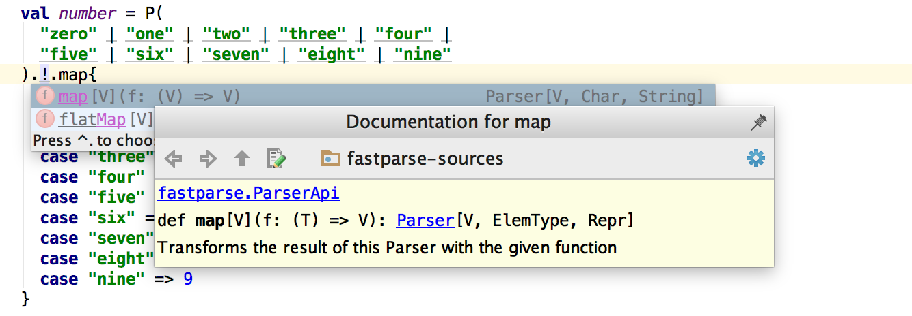

Parsing structured text into data structures has always been a pain. If
you are like me, you may have wondered: why do all the parsing tools seem to be
[parser-generators instead of just configurable-parsers]? After all, when you
look at, say, a 2D physics library like [Chipmunk2D], you just get a bunch of
classes and functions you can call. In contrast, parsing libraries like [YACC]
or [ANTLR] often seem to require custom build steps, compile-time
source-code-generation, and other confusing things which you never see in most
"normal" libraries.

It turns out, simple libraries do exist for parsing, under the name "Parser
Combinators". While not as well known, these parser combinator libraries expose
a bunch of classes and functions you can use to build a parser in a convenient
way: without the boilerplate of hand-written [recursive-descent parsing], the
fragiity of [Regexes], or the complexity of code-gen tools like [ANTLR]. This
post will explore one such library, [FastParse], and show how parser combinators
can make the process of parsing structured text simple, easy and fun.

[Chipmunk2D]: https://chipmunk-physics.net/
[YACC]: https://en.wikipedia.org/wiki/Yacc
[ANTLR]: https://en.wikipedia.org/wiki/ANTLR
[parser-generators instead of just configurable-parsers]: http://stackoverflow.com/questions/8780288/why-parser-generators-instead-of-just-configurable-parsers
[FastParse]: http://www.lihaoyi.com/fastparse/
[Regexes]: https://en.wikipedia.org/wiki/Regular_expression
[recursive-descent parsing]: https://en.wikipedia.org/wiki/Recursive_descent_parser

-------------------------------------------------------------------------------

## Parsing Text

Often when programming, you find yourself dealing with structured text or
binary data, and need to parse it into some kind of data-structure before you
can use it: whether you find yourself working with JSON, Python source code,
some proprietary data-format or your own custom programming language syntax.
Traditionally, your options for parsing it look something like this:

1. **Does it have a pre-existing parser?** If so, use it! This handles common
   formats like [JSON] or [Python] source code fine, but for less ubiquitous
   data-formats, you might not be able to find a good parser, and thus you're
   on your own...

2. **Can I parse it using `String.split`?** This applies to surprisingly many
   data-formats: for example, many file formats are simply "one entry per line"
   in which case `String.split("\n")` works great. However, this falls down
   for anything non-trivial: even something as simple as [CSV] can't be naively
   split on `"\n"` and `","`, due to the present of quoted commas and escaping.

3. **Can I parse it using [Regexes]?** This sometimes works, especially if the
   input data is sufficiently regular, or if you don't need 100% accuracy.
   However regex-based parsers tend to be fragile and inaccurate, with both
   false positives and false negatives, and can't handle recursive formats
   like JSON, [XML], or most programming languages.

4. **Can I parse it using a hand-written [recursive-descent parsing]?** This
   technique is basically ultimately flexible and basically *always* works, but
   is tedious, verbose and error-prone. This is what the [Scala] compiler does,
   for example.

5. **Can I parse it using a parser-generator?** These tools like [YACC] or
   [ANTLR] generate source code which is then compiled into an executable
   parser. They are widely used, but somewhat confusing and annoying to get
   started with (due to the custom build step). The standard [Python] and
   [Ruby] interpreters use this approach, as do tools like [Intellij IDEA]

[Ruby]: https://en.wikipedia.org/wiki/Ruby_(programming_language)
[Intellij IDEA]: https://en.wikipedia.org/wiki/Scala_(programming_language)
[Scala]: https://en.wikipedia.org/wiki/Scala_(programming_language)
[Python]: https://en.wikipedia.org/wiki/Python_(programming_language)
[JSON]: https://en.wikipedia.org/wiki/JSON
[CSV]: https://en.wikipedia.org/wiki/Comma-separated_values
[XML]: https://en.wikipedia.org/wiki/XML

Overall, if you can't find a pre-existing parser, these options are a choice
between easy/inflexible splits/regexes and flexible/difficult recursive descent and
parser-generators. What about the use case where I want something that's both
easy and flexible?

Parser Combinator libraries provide such an option: something slightly more
flexible than regexes, but less complex than writing your own recursive-descent
parser or using a parser-generator.

For the purpose of this post, I will be using the [FastParse] library in the
Scala programming language. However, there exist many other parser combinator
libraries for Scala, as well as similar libraries in almost
every major language: from [JParsec] for Java, [PyParsing] for Python, [Parsec]
for Haskell, and many more. The syntax between these libraries/languages will
differ, but the underlying parser-combinator concepts should be mostly the same
across all of them.

[JParsec]: https://github.com/jparsec/jparsec
[PyParsing]: http://pyparsing.wikispaces.com/
[Parsec]: https://wiki.haskell.org/Parsec

## Your First Parser Combinator

FastParse can be used in any Scala project, built using any tool (SBT, Maven,
Gradle...), and deployed in any environment. But the easiest way to get started
is probably via the
[Ammonite Scala REPL](http://www.lihaoyi.com/Ammonite/#Ammonite-REPL)

```
$ sudo curl -L -o /usr/local/bin/amm https://git.io/viYun && chmod +x /usr/local/bin/amm && amm

$ haoyi-mbp:~ haoyi$ amm
Loading...
Welcome to the Ammonite Repl 0.7.6
(Scala 2.11.8 Java 1.8.0_102)
@
```

This requires you have Java installed as a pre-requisite, and drops you into an
interactive Scala REPL you can use to immediately start playing around with the
[FastParse] library (which is bundled).

The simplest FastParse parser is shown below:

```scala
@ import fastparse.all._
import fastparse.all._

@ val parser = P( "hello" )
parser: Parser[Unit] = parser
```

Here, we import the `fastparse` library and define a parser (with the `P(...)`
function) that parses a single string, `"hello"`, and nothing else. You can
use this parser simply by calling `.parse` on it:

```scala
@ parser.parse("hello")
res2: Parsed[Unit] = Success((), 5)

@ parser.parse("goodbye")
res3: Parsed[Unit] = Failure("hello":1:1 ..."goodbye")
```

Here, we can see that parsing `"hello"` succeeded, returning `()` (Which is
`Unit` or `void` in Scala) and parsing until index 5. On the other hand,
trying to parse `"goodbye"` failed at row 1 character 1 (i.e. the first
character) as it expected `"hello"` but instead found `"goodbye"`.

If there's not enough input to parse, `.parse` also fails:

```scala
@ parser.parse("hel")
res4: Parsed[Unit] = Failure("hello":1:1 ..."hel")
```

On the other hand, if there's *too much* input, `.parse` succeeds but with an
index showing how much it actually parsed:

```scala
@ parser.parse("hellogoodbye")
res5: Parsed[Unit] = Success((), 5)
```

If we want to catch the case where we didn't completely parse the input, it's
straightforward to compare the success index (5) against the length of the
input string (12) to see whether or not we fully consumed the input, or use
the `End` operator we'll discuss later.

As a start, this parser probably isn't any more useful than a
`String.startsWith` method call. However, it's how you combine parsers that
really gives the parser combinators their value

## Regex-Like Parsers

There are two basic ways you combine parsers in FastParse syntax: `a | b` and
`a ~ b`.

`a | b` can parse anything `a` or `b` can parse, tried left-to-right
(i.e. `a` gets priority, and `b` is only tried if `a` fails):

```scala
@ val parser = P( "hello" | "goodbye" )
parser: Parser[Unit] = parser

@ parser.parse("hello")
res7: Parsed[Unit] = Success((), 5)

@ parser.parse("goodbye")
res8: Parsed[Unit] = Success((), 7)

@ parser.parse("dunno")
res9: Parsed[Unit] = Failure(("hello" | "goodbye"):1:1 ..."dunno")
```

As you can see, parsing either `"hello"` or `"goodbye"` works, but parsing
`"dunno"` makes it fail complaining it expected `"hello" | "goodbye"` at
row 1 character 1 but instead found a `"dunno"`. You can chain more things
together with `|`, and it will try all of them left-to-right.

`a ~ b` parses `a` *followed by* `b`:

```scala
@ val parser = P( "hello" ~ "goodbye" )
parser: Parser[Unit] = parser

@ parser.parse("hellogoodbye")
res11: Parsed[Unit] = Success((), 12)

@ parser.parse("hello")
res12: Parsed[Unit] = Failure("goodbye":1:5 ..."")

@ parser.parse("goodbye")
res13: Parsed[Unit] = Failure("hello":1:1 ..."goodbye")
```

As you can see, this parses `"hellogoodbye"` all at once. If you try to parse
just `"hello"`, it fails claiming it's looking for `"goodbye"` at row 1
character 5, but found no input since it had reached the end of the string. If
you try to parse just `"goodbye"`, it fails claiming
it's looking for `"hello"` at row 1 character 1, but instead found `"goodbye"`.
Again, `~` is chainable so you can chain as many parsers as you want and
they'll each run one after the other.

Note you can end the chain with a `~ End` parser, if you wish to fail the parse
if it doesn't consume the whole input:

```scala
@ val parser = P( "hello" ~ "goodbye" ~ End )
parser: Parser[Unit] = parser

@ parser.parse("hellogoodbye")
res30: Parsed[Unit] = Success((), 12)

@ parser.parse("hellogoodbyeworld")
res31: Parsed[Unit] = Failure(End:1:13 ..."world")
```

Here, parsing `"hellogoodbyeworld"` failed because it was expecting to have
parsed until the `End` of the input string, but instead it found more
characters left over. This is something you usually only want to do at the
"end" of the parser when you know nothing should be left over, and saves you
from always needing to check if the success-index/input-length line up.

On the other hand, if you are happy to parse prefixes of the input string and
don't mind if it doesn't use the whole thing, you can also just leave it off.

You can combine `|` and `~`, which is when things start getting interesting:

```scala
@ val parser = P( ("hello" | "goodbye") ~ " " ~ ("world" | "seattle") ~ End )
parser: Parser[Unit] = parser
```

This passes on all the inputs you would expect:

```scala
@ parser.parse("hello world")
res15: Parsed[Unit] = Success((), 11)

@ parser.parse("hello seattle")
res16: Parsed[Unit] = Success((), 13)

@ parser.parse("goodbye world")
res17: Parsed[Unit] = Success((), 13)

@ parser.parse("goodbye seattle")
res18: Parsed[Unit] = Success((), 15)
```

And also fails on the things you'd expect it to fail:

```scala
@ parser.parse("hello universe") // Not "world" or "seattle"
res19: Parsed[Unit] = Failure(("world" | "seattle"):1:7 ..."universe")

@ parser.parse("helloworld") // Missing the single " " blank space
res20: Parsed[Unit] = Failure(" ":1:6 ..."world")

@ parser.parse("hello  world") // Too many blank spaces
res21: Parsed[Unit] = Failure(("world" | "seattle"):1:7 ..." world")

@ parser.parse("i love seattle") // Nobody loves seattle
res22: Parsed[Unit] = Failure(("hello" | "goodbye"):1:1 ..."i love sea")

@ parser.parse("hello seattle moo")
res23: Parsed[Unit] = Failure(End:1:14 ..." moo")
```

Earlier, we saw how a trivial combinator parser is about as powerful as a
`String.startsWith` call. Now, we have a slightly more complex combinator
parser which is about as powerful as a regex
(e.g. `(hello|goodbye) (world|seattle)`), though with more informative errors
when the parse fails. Still, nothing to write home about.

Similarly, there is syntax for marking parts of a parser as repeated:

```scala
@ val parser = P( ("hello" | "goodbye") ~ " ".rep(1) ~ ("world" | "seattle") ~ End )
parser: Parser[Unit] = parser

@ parser.parse("hello world")
res25: Parsed[Unit] = Success((), 11)

@ parser.parse("hello     world")
res26: Parsed[Unit] = Success((), 15)

@ parser.parse("helloworld")
res27: Parsed[Unit] = Failure(" ":1:6 ..."world")
```

Here, `.rep(1)` means it repeats the `" "` parser at least once. Thus if we
have one or multiple spaces between the `"hello"` and `"world"`, the parser
consumes all of them, but if you have no spaces at all it complains it was
looking for a `" "` but instead found a `"world"` at character 6. You can also
pass in explicit `min=...`, `max=...` calls if you want to bound it to a
particular range, or `exactly=...` if you want it to repeat exactly N times.

Marking a parser as optional is done using `.?`:

```scala
@ val parser = P( ("hello" | "goodbye") ~ (" ".rep(1) ~ ("world" | "seattle")).? ~ End )
parser: Parser[Unit] = parser

@ parser.parse("hello     world")
res26: Parsed[Unit] = Success((), 15)

@ parser.parse("hello")
res27: Parsed[Unit] = Success((), 5)

@ parser.parse("hello ")
res28: Parsed[Unit] = Failure(End:1:6 ..." ")
```

Here, you can see that the `" ".rep(1)` parser as well as the
`("world" | "seattle")` parser are all optional. The cases which you would expect
to work (with and without a trailing `"     world"`) all work, but if there is
 a trailing `" "` but no `"world"` it fails.

This is because when I try to parse
`"hello "` with a trailing space, `" ".rep(1)` succeeds in parsing the
space but `("world" | "seattle")` fails (since there's no more input after the
space). Since the whole trailing-space-world is optional, the parse backtracks
to character 6, to see if it can continue the parse without it, now
expecting to see the `End` of input. Since it isn't the end - there is still
one more `" "` at index 6 - the parse fails.

Again, nothing a regex `(hello|goodbye)( +(world|seattle))?` couldn't do, just
laid out in longer and more verbose syntax. The next few sections will cover
features of the parser combinator library that go beyond what a regex is
capable of.

## Capturing and Transforming Parsers

So far, all our parsers have been of type `Parser[Unit]`, returning `()` in
the `Success` result. This `Unit` in Scala, and is equivalent to `void` in
Java or `None` in Python, and basically says "no value": i.e. these parsers
parse the input, check that it matches what the parser expects, but doesn't
return any useful value at the end.

This is a surprisingly good default
because most parsers don't care about most of the things they're parsing. If
you are parsing Java, for example, you don't care about all the whitespace, all
the `{` or `}`s, `(`s or `)`s, `//` comments and `/**/` comments. They need to
exist, and you need to be able to identify them while parsing, but there's no
need to store any information about them after you're done with the parse.

Thus in the cases where we actually care about the thing we're parsing, we must
capture it using the `.!` operator:

```scala
@ val parser = P( ("hello" | "goodbye").! ~ " ".rep(1) ~ ("world" | "seattle").! ~ End )
parser: Parser[(String, String)] = parser

@ parser.parse("hello seattle")
res41: Parsed[(String, String)] = Success(("hello", "seattle"), 13)

@ parser.parse("hello     world")
res42: Parsed[(String, String)] = Success(("hello", "world"), 15)
```

As you can see, we added `.!` to capture both the `("hello" | "goodbye")` as
well as the `("world" | "seattle")`, and thus when we successfully parse it we
get the results as a tuple containing the two strings. We did *not* `.!`
capture the one-or-more-spaces parser in the middle, so the spaces it parsed
don't appear in the output.

However, often we don't want tuples of strings: we want some kind of class
with named fields that contains the data we want. For example, in Scala we may
define this as

```scala
@ case class Phrase(isHello: Boolean, place: String)
defined class Phrase
```

In which case, we can use `.map` to turn the tuple of `(String, String)` into
an instance of that class:

```scala
@ val parser = P( ("hello" | "goodbye").! ~ " ".rep(1) ~ ("world" | "seattle").! ~ End ).map{
    case ("hello", place) => new Phrase(true, place)
    case ("goodbye", place) => new Phrase(false, place)
  }
parser: Parser[Phrase] = parser

@ parser.parse("hello world")
res45: Parsed[Phrase] = Success(Phrase(true, "world"), 11)

@ parser.parse("goodbye   seattle")
res46: Parsed[Phrase] = Success(Phrase(false, "seattle"), 17)
```

Finally, we have something we can do with parser combinators that you can't
easily do with a regex. Sure, after you regex a string, you can grab the
captured groups out by index (`result.group(0)`, `result.group(1)`, ...)
and then manipulate them, but you can't conveniently define it as part of the
regex. There's no such thing as "a regex returning a `Phrase` object",
whereas here we do have a `Parser[Phrase]` returning the `Phrase` object on
success. And we can pattern match against the `Parsed.Success` to extract that
`Phrase` object and make use of it

```scala
@ val Parsed.Success(result, index) = parser.parse("goodbye   seattle")
result: Phrase = Phrase(false, "seattle")
index: Int = 17

@ result.isHello
res48: Boolean = false

@ result.place
res49: String = "seattle"
```

## Breaking up Parsers

The above example is getting a bit long, but it's easy to break it up: we
define smaller parsers using the same `val foo = P(...)` syntax, and simply
make use of them in the "main" parser:

```scala
@ val prefix = P( "hello" | "goodbye" ).!
prefix: Parser[String] = prefix

@ val suffix = P( "world" | "seattle" ).!
suffix: Parser[String] = suffix

@ val ws = P( " ".rep(1) ) // white-space
space: Parser[Unit] = space

@ val parser = P( prefix ~ ws ~ suffix ).map{
    case ("hello", place) => new Phrase(true, place)
    case ("goodbye", place) => new Phrase(false, place)
  }
parser: Parser[Phrase] = parser
```

Here, we can see that the individual `prefix` and `suffix` parsers are
`Parser[String]` rather than `Parser[Unit]`: they will return a `String` if
their parse succeeds. `space` is still `Parser[Unit]` since it did not capture
anything, and the main `parser` is still `Parser[Phrase]`. In general,
all FastParse parsers have a static type that tells you what you are going to
get out of it, which is useful both for the programmer to know what to expect
as well as for the compiler to help check that you didn't make a mistake.

For example, if you made a mistake and assumed in the `.map` call that the
`prefix ~ " ".rep(1) ~ suffix` produced a 3-tuple `(String, String, String)`
instead of a 2-tuple of `(String, String)`:

```scala
@ val parser = P( prefix ~ wd ~ suffix ).map{
    case ("hello", spaces, place) => new Phrase(true, place)
    case ("goodbye", spaces, place) => new Phrase(false, place)
  }
```

The compiler will catch it right away, before any code is run:

```scala
cmd3.sc:2: constructor cannot be instantiated to expected type;
 found   : (T1, T2, T3)
 required: (String, String)
  case ("hello", spaces, place) => new Phrase(true, place)
       ^
```

Assuming you didn't make a mistake, usage of the "main" `parser` parser is
exactly the same as it was earlier:

```scala
@ val Parsed.Success(result, index) = parser.parse("goodbye   world")
result: Phrase = Phrase(false, "world")
index: Int = 15

@ result.place
res54: String = "world"

@ parser.parse("goodbyeseattle")
res55: Parsed[Phrase] = Failure(" ":1:8 ..."seattle")
```

Though we could also use `prefix` or `suffix` on their own, as they are
perfectly good `Parser[String]` objects

```scala
@ prefix.parse("hello")
res56: Parsed[String] = Success("hello", 5)

@ prefix.parse("goodbye")
res57: Parsed[String] = Success("goodbye", 7)

@ prefix.parse("moo")
res58: Parsed[String] = Failure(("hello" | "goodbye"):1:1 ..."moo")
```

This is something regexes have a problem with: when a regex grows huge,
it is not easy to break it up while keeping it valid and easily-understandable.
Furthermore, if you find yourself capturing lots of different things in a large
regex, it's easy to mix up the snippets captured by e.g. `group(5)` with
`group(7)`. With parser combinators, each `Parser[T]` can have its components
easily broken out into separate parts, and they're all statically typed as
`Parser[String]`, `Parser[Unit]`, `Parser[Phrase]`, etc. so if you try to
combine them in invalid ways, you get a helpful compiler error.

In the end, all these `prefix`, `suffix`, `parser` things are just Plain Old
Scala Objects of type `Parser[T]`. They can be instantiated anywhere, assigned
to local (or global) variables, just like any other object. You can refactor
parts of a large parser out, assign them to meaningful names, and combine them
to make the "larger" parser without needing a single monolithic "grammar blob"
that contains all your parsing logic.

## Recursive Parsers

This ability to reference parsers by name inside another parser
means parsers can be recursive! For example here we change `Phrase` into a
tree-like object: it's either a `Word` containing a string, or a `Pair`
containing two other phrases:

```scala
@ {
  sealed trait Phrase
  case class Word(s: String) extends Phrase
  case class Pair(lhs: Phrase, rhs: Phrase) extends Phrase
  }
defined trait Phrase
defined class Word
defined class Pair
```

Here, we wrap everything in `{}`s, so the REPL will execute the three
statements as one "block" rather than separate commands. This is necessary here
and for the subsequent definitions, which are recursive and thus only make
sense when put together.

Now, we can modify the parser to instead of having parsing a hard-coded
"prefix space suffix" grammar, instead allow either the prefix or suffix to be
themselves an invocation of `parser`, but surrounded by parens:

```scala
@ {
  val prefix = P( "hello" | "goodbye" ).!.map(Word)
  val suffix = P( "world" | "seattle" ).!.map(Word)
  val ws = P( " ".rep(1) )
  val parened = P( "(" ~ parser ~ ")" )
  val parser: Parser[Phrase] = P( (parened | prefix) ~ ws ~ (parened | suffix) ).map{
    case (lhs, rhs) => Pair(lhs, rhs)
  }

  }
prefix: Parser[Word] = prefix
suffix: Parser[Word] = suffix
parened: Parser[Phrase] = parened
parser: Parser[Phrase] = parser
```

Here, we introduce a new `parened` parser, which is literally just `parser` but
with a `"("` before it and `")"` after. Inside `parser`, `prefix` is now
`(parened | prefix)` and `suffix` is now `(parened | suffix)`. Thus, `parser`
and `parened` are now mutually recursive: each one can call the other as part
of their parse. The definitions of `prefix`, `suffix` and `ws` themselves are
unchanged.

And we can use it:

```scala
@ parser.parse("hello seattle")
res66: Parsed[Phrase] = Success(
  Pair(Word("hello"), Word("seattle")),
  13
)

@ parser.parse("hello (goodbye seattle)")
res67: Parsed[Phrase] = Success(
  Pair(
    Word("hello"),
    Pair(Word("goodbye"), Word("seattle"))
  ),
  23
)

@ parser.parse("(hello  world)   (goodbye seattle)")
res68: Parsed[Phrase] = Success(
  Pair(
    Pair(Word("hello"), Word("world")),
    Pair(Word("goodbye"), Word("seattle"))
  ),
  34
)

@ parser.parse("(hello  world)  ((goodbye seattle) world)")
res69: Parsed[Phrase] = Success(
  Pair(
    Pair(Word("hello"), Word("world")),
    Pair(
      Pair(Word("goodbye"), Word("seattle")),
      Word("world")
    )
  ),
  41
)
```

As you can see, we now have a working parser that can parse a given
tree-shaped input into a tree-shaped data-structure. Not bad for 7 lines of
code! By now, we're far beyond what most regexes are capable of, but the code
for our recursive-language parser is still short and easily-understandable.

## Putting it together

As a little capstone project for this post, I'm going to implement a small
arithmetic evaluator using parser combinators. This is similar to what people
make you do during programming job interviews, but with a twist: it must work
on the english representations of things! For example, while a traditional
arithmetic evaluator may evaluate:


```scala
(1 + 2) * (9 - 3)
```

To return `18`, for this exercise, we will parse input such as:

```scala
(one plus two) times (nine minus three)
```

Which should also evaluate to `18`. To simplify things, we will limit the
"literal" number from `zero` to `nine`, avoiding all the complexities around
inputs like `fifteen` or `twelve` or `one hundred twenty eight`.

To begin with, let's implement the way to parse literal numbers:

```scala
@ val number = P(
    "zero" | "one" | "two" | "three" | "four" |
    "five" | "six" | "seven" | "eight" | "nine"
  ).!.map{
    case "zero"  => 0
    case "one"   => 1
    case "two"   => 2
    case "three" => 3
    case "four"  => 4
    case "five"  => 5
    case "six"   => 6
    case "seven" => 7
    case "eight" => 8
    case "nine"  => 9
  }
number: Parser[Int] = number
```

Here, we manually list out all the possible numbers, and inside the `map` call
match each string to the integer value it represents. You can see that due to
our `map` call, `number` is now a `Parser[Int]`: on success, it's result is a
32-bit integer.

Testing this is easy:

```scala
@ number.parse("one")
res71: Parsed[Int] = Success(1, 3)

@ number.parse("seven")
res72: Parsed[Int] = Success(7, 5)

@ number.parse("zero")
res73: Parsed[Int] = Success(0, 4)

@ number.parse("nine")
res74: Parsed[Int] = Success(9, 4)

@ number.parse("lol")
res75: Parsed[Int] = Failure(("zero" | "one" | "two" | "three" | "four" | "five" | "six" | "seven" | "eight" | "nine"):1:1 ..."lol")
```

As you can see, it parses the correct number (the first number inside the
`Success(...)` value) for each input, and fails if the input is invalid. It
even has a relatively-helpful error message showing what it expected, and what
it found. Great!

Next, we have to parse the recursive tree-like structure, so we can handle
stuff like

```scala
(one plus two) times (nine minus three)
```

To begin with, we know it's going to look something like

```scala
val parser = P( lhs ~ ws ~ operator ~ ws ~ rhs )
```

Where `ws` is the parser for whitespace, maybe `" ".rep(1)` like what we saw
earlier, though we could make it more complex like `(" " | "\n").rep(1)` if we
wanted whitespace to encompass newlines as well. For now, let's use
`" ".rep(1)`:

```scala
val ws = P( " ".rep(1) )
```

This doesn't compile yet - we haven't defined `lhs` and `rhs` - but it's a
start.

What should the main `parser` return? Earlier, we defined our own custom
`Phrase` class that's shaped like a binary tree. However, if we just want to
evaluate the expression and don't need the tree, we can just make the parser
return `Int` to begin with and skip needing to build a tree just to traverse it
and evaluate it later:

```scala
val parser: Parser[Int] = P( lhs ~ ws ~ operator ~ ws ~ rhs )
```

If we *needed* a tree, we could of course do something similar to what we did
earlier and define a tree-shaped class hierarchy. But for now let's skip that.

Now what goes on `lhs` and `rhs`? Well it's either a `number`, or the `parser`
itself surrounded by parens. Furthermore, unlike earlier, there's no difference
between what can go in `lhs` and `rhs`, so let's just call them both `expr`:

```scala
val expr = P( "(" ~ parser ~ ")" | number )
val parser: Parser[Int] = P( expr ~ ws ~ operator ~ ws ~ expr )
```

We still haven't defined `operator`: let's restrict it to the four most basic
operators for now

```scala
@ val operator = P( "plus" | "minus" | "times" | "divide" ).!
operator: Parser[String] = operator
```

Here, we use `.!` capture on the `operator` parser so we can see exactly which
operator was parsed. We will need that later to decide how to combine the
result of the left-side `expr` and the right-side `expr`.

Now, we're almost done. But if you try to run this, you get a compile error:

```scala
@ {
  val expr = P( "(" ~ parser ~ ")" | number )
  val parser: Parser[Int] = P( expr ~ ws ~ operator ~ ws ~ expr )
  }
cmd80.sc:2: type mismatch;
 found   : fastparse.core.Parser[(Int, String, Int)]
 required: fastparse.all.Parser[Int]
    (which expands to)  fastparse.core.Parser[Int]
val parser: Parser[Int] = P( expr ~ ws ~ operator ~ ws ~ expr )
                                                       ^
Compilation Failed
```

As you can see, it's complaining because it sees that the entire `parser`
parser is a `Parser[(Int, String, Int)]`, where-as we annotated it as a
`Parser[Int]`. This is because it is made of three sub-parsers which return
values:

```scala
(expr: Parser[Int]) ~ ws ~ (operator: Parser[String]) ~ ws ~ (expr: Parser[Int])
```

Thus, if we want to convert the `Parser[(Int, String, Int)]` to a
`Parser[Int]`, we need to map it. In this case, let's make the `map` function
combine the `lhs` and `rhs` results, depending on what the `operator` was:

```scala
val expr = P( "(" ~ parser ~ ")" | number )
val parser: Parser[Int] = P( expr ~ ws ~ operator ~ ws ~ expr ).map{
  case (lhs, "plus", rhs) => lhs + rhs
  case (lhs, "minus", rhs) => lhs - rhs
  case (lhs, "times", rhs) => lhs * rhs
  case (lhs, "divide", rhs) => lhs / rhs
}
```

And this works!

```
@ parser.parse("three times seven")
res81: Parsed[Int] = Success(21, 38)

@ parser.parse("(eight divide two) times (nine minus four)")
res82: Parsed[Int] = Success(20, 42))

@ parser.parse("five times ((nine times eight) minus four)")
res83: Parsed[Int] = Success(340, 42)
```

Here is the full code:

```scala
import fastparse.all._

val number = P(
  "zero" | "one" | "two" | "three" | "four" |
  "five" | "six" | "seven" | "eight" | "nine"
).!.map{
  case "zero"  => 0
  case "one"   => 1
  case "two"   => 2
  case "three" => 3
  case "four"  => 4
  case "five"  => 5
  case "six"   => 6
  case "seven" => 7
  case "eight" => 8
  case "nine"  => 9
}

val ws = P( " ".rep(1) )

val operator = P( "plus" | "minus" | "times" | "divide" ).!

val expr = P( "(" ~ parser ~ ")" | number )

val parser: Parser[Int] = P( expr ~ ws ~ operator ~ ws ~ expr ).map{
  case (lhs, "plus", rhs) => lhs + rhs
  case (lhs, "minus", rhs) => lhs - rhs
  case (lhs, "times", rhs) => lhs * rhs
  case (lhs, "divide", rhs) => lhs / rhs
}
```

We have now written a simple FastParse parser for "english-like" arithmetic
expressions, that allows you to parse and evaluate them in one go. The entire
thing is 30 lines of straightforward code. You can paste this entire snippet
into the Ammonite Scala REPL by surrounding it in `{}`s (to make sure it is
run as one block), or you can use it in any existing Scala project by adding a
dependency on FastParse on Maven Central. You get full IDE support for working
with your FastParse parsers, since after all they're just Plain Old Scala code.



It is worth taking a moment to consider alternatives: if you were to
implement this using some other technique, how would you do so? This is the
behavior that we want to implement

```scala
@ parser.parse("three times seven")
res81: Parsed[Int] = Success(21, 38)

@ parser.parse("(eight divide two) times (nine minus four)")
res82: Parsed[Int] = Success(20, 42))

@ parser.parse("five times ((nine times eight) minus four)")
res83: Parsed[Int] = Success(340, 42)
```

How would you implement this equivalent using...

- Regexes?
- A hand-written recursive-descent parser?
- Using YACC or ANTLR?

As an exercise, it is worth trying to use one of these non-parser-combinator
approaches to solve this arbitrary task to compare what the solution looks
like. Above, we have a implementation in 30 lines of relatively simple code,
that could easily be embedded in any larger codebase without any special
tooling or build-step.

What would the alternatives look like? I will leave that as an exercise for
the reader.

## Conclusion

We have now walked through the basics of parsing structured text into useful
values (whether a tree-shaped data-structure, or a single `Int` result) using
parser combinators. While this demonstration is done using [FastParse] in
Scala, the code would look almost the same using one of the parser-combinator
libraries in any other language, just spelled differently:

- In [PyParsing], `a ~ b` is instead spelled `a + b` (Python lets you
  operator-overload `+` but not `~`), `a | b` is still `a | b`, and `.map` is
  instead `.setParseAction`

- In [JParsec], `a ~ b` is instead spelled `Parsers.sequence(a, b)`,
  `a | b` is spelled `Parsers.or(a, b)`, and `.map` is still called `.map`


Overall, things are spelled differently, and some things have minor
differences, but most parser combinator libraries in all languages are
pretty similar. You have some way of constructing "Parser" objects. You combine
these small Parser objects into bigger Parser objects, via operators like `|`,
`~`, or `map`. You call `.parse` using a Parser object on some input, and it
parses it into some value (or fails). That's all there is to it.

Hopefully this post has demonstrated the value of parser-combinators. They
exist as a middle ground:

- Less cryptic and more flexible than regexes, e.g. allowing sub-parsers to be
  split out and given names, and easily handling recursive grammars

- Simpler to write than a hand-rolled recursive descent parser

- Simpler to get started with than code-gen tools like YACC or ANTLR

Parsers that demand the utmost performance and customizability will still
likely need to use hand-rolled recursive descent or code-gen tools to achieve
that. However, there is a large class of parsers that does not need
super-performance or super-customizability:

- Perhaps you want to parse some obscure data-format: where a regex is almost -
  but not quite - enough, and you can't find a convenient third-party parser
  for it

- Perhaps you are inventing your own programming language - too complex for
  a regex (programming languages syntax tends to be recursive), too unique for
  an third-party parser to exist (after all, you just invented it!) but early
  enough in the process that performance doesn't really matter and you just
  want something working quickly

It is these cases where parser-combinator libraries shine: you can quickly and
easily bang out a working, robust parser with ok-performance in a matter of
minutes, and move on to the next problem. For many formats, writing a complete
FastParse parser may well take less time than figuring out how to integrate
`ANTLR` into your build system! Perhaps later on, if you decide you need to
push the limits of performance and customizability, you can re-write it in
something more serious, but for now chances are [you ain't gonna need it].

[you ain't gonna need it]: https://en.wikipedia.org/wiki/You_aren%27t_gonna_need_it

Note that the parsers above are just a simple example of what you can do with
FastParse parser combinators. The actual [FastParse Documentation][FastParse]
has a lot more detail in every topic:

- A wide range of built-in parsers for handling common use cases
- Error reporting behavior
- Cuts: what, why, how
- Several example parsers (Arithmetic, JSON, Python, Scala, CSS, ...),
- Automatic whitespace handling
- Monadic parsers, with `.flatMap`
- How to parse indentation-grammars, like Python
- Performance comparisons
- Internal implementation details
- Debugging Tactics

While the parsers above are just toy examples, parser combinators are flexible
and performant enough to build working parsers for complex, real-world
languages like CSS, JSON, Scala, or Python. Parsers that people use in
production.

Parsing structured text does not need to be difficult, confusing, or tedious.
With parser combinator libraries like [FastParse], your parser is just another
object in your program you call functions on. Making a bigger parser is just
taking smaller parsers and combining/transforming them with functions/operators
like `~`, `|`, or `.rep()`. No opaque blob of cryptic regex to puzzle through,
no special build/code-gen step to set up. The same IDEs and compilers you use
for the rest of your code give you help and catch your errors when working with
parser combinators.

Hopefully by this point you have an understanding of what parser combinators
are, and why you might use them. Have you used any parser combinator libraries
in the past, or have any parsing related war-stories to tell? Let us know in
the comments below!
