There are many descriptions floating around the internet, trying to explain
functional programming in simple terms. Unfortunately, most discuss details 
only loosely related to functional programming, while others focus on topics 
that are completely irrelevant. So of course, I had to write my own!

This post is my own understanding of what is the "core" of "functional 
programming", how it differs from "imperative" programming, and what the main
benefits of the approach are. As a worked example, we will use a kitchen recipe
as a proxy for the more-abstract kind of logic you find in program source code,
to try and make concrete what is normally a very abstract topic. That recipe is
one of my favorite recipes available online, [Michael Chu's Classic Tiramisu].

[Michael Chu's Classic Tiramisu]: http://www.cookingforengineers.com/recipe/60/The-Classic-Tiramisu-original-recipe

-------------------------------------------------------------------------------


- [What Functional Programming is Not](#what-functional-programming-is-not)
    - [Helper Methods](#helper-methods)
    - [Writing Things in Haskell](#writing-things-in-haskell)
    - [Compile-time AST Macros](#compile-time-ast-macros)
    - [Static Types](#static-types)
- [Step by Step Imperative Recipes](#step-by-step-imperative-recipes)
    - [Kitchen Refactoring](#kitchen-refactoring)
- [Functional Programming Recipes](#functional-programming-recipes)
    - [Tiramisu Diagram to Functional Programming](#tiramisu-diagram-to-functional-programming)
    - [Preventing Errors with Functional Programming](#preventing-errors-with-functional-programming)
    - [Refactoring a Functional Tiramisu Recipe](#refactoring-a-functional-tiramisu-recipe)
    - [The Core of Functional Programming](#the-core-of-functional-programming)
- [Conclusion](#conclusion)


A topic as broad as "Functional Programming", or "FP" has too many different 
interpretations and facets to be summarized in one blog post. Nevertheless, 
this post will discuss what *I* think is the most core, basic level of 
functional programming. This will hopefully be something that everyone, from FP 
newbies to FP "experts", should be able to empathise with and agree is a useful 
part of functional programming.

It's not surprising that many people have tried to explain functional 
programming using kitchen/recipe/cookbook examples: learning things "by 
analogy" of things you already know is one of the easiest ways of learning.
However, all explanations I have seen fall short. I will begin by examining 
some typical, *incorrect* explanations of what functional programming is about, 
before discussing how [Michael Chu's Classic Tiramisu] recipe:
 
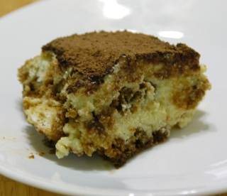

Can provide insight into what I think are the core techniques and benefits of 
functional programming.

[Negative Examples]: https://news.ycombinator.com/item?id=13281413

## What Functional Programming is Not

There are many poor explanations people have given for "what is functional 
programming". Here is a selection:

### Helper Methods

One of the most common misconceptions of what FP is is illustrated by the 
following example:

> FP => I'll have a Sazerac
>
> Imperative => Excuse me sir, could you take some ice, add rye whiskey, add 
> bitters, add absinthe, shake, strain into a glass, and add a lemon garnish 
> before bringing it to me

While this example was taken from the 
[y-combinator message board][Negative Examples], I've seen 
this attitude in many places: the idea that functional programming is 
just taking imperative instructions, and wrapping them in a helper. In this 
case, the messy imperative code will all sit inside a single helper:

```python
def sazerac():
    ... 10000 lines of messy imperative code ...
```
 
But even in imperative programming you always end up factoring things into 
helper methods. Java has helper methods. Write assembly, and it ends up being 
organized with sub-procedures to encapsulate messes of imperative code. 

Thus, while this is a useful technique, writing helper methods to wrap your 
messy code in a single method/function/subprocess/subroutine call does not 
count as functional programming. 

Furthermore, *picking an easier/simpler problem*, despite making your code 
look neater, does not count as "Functional Programming" either. Calling a 
single method that executes a huge blob of code that *someone else* has written
is convenient, but is not functional programming. The point of FP
is to face the complexity, own it, and control it, not shove it inside some 
unmaintained helper function or say it's a problem for some "other department" 
to deal with.

### Writing Things in Haskell

```
sazerac = do
    add ice
    add ryeWhisky
    add bitters
    add absinthe
    shake
    strainInto glass
    add lemonGarnish

main = serve $ makeCocktail sazerac
```

- Also from the [y-combinator message board][Negative Examples]

It's often said that you can write COBOL in any language, that you can write 
Java in any language. Well, you can write any language in Haskell too: the
above is basically writing Bash in Haskell

Just because something is implemented in Haskell with Monads, doesn't mean it's
functional programming. If it looks like imperative code written in Bash, and
it's semantics are like imperative code written in Bash, it's imperative code. 
This example certainly looks exactly like imperative code written in Bash 
except it's run using `serve $ makeCocktail` instead of `bash cocktail.sh`.

### Compile-time AST Macros

Some variant of Lisp (or [Scheme]?) was probably one of the first implemented FP 
languages; and Lisps tend to have compile-time AST macros that
allow you to transform sections of the program at compile-time. 

[Scheme]: https://en.wikipedia.org/wiki/Scheme_(programming_language)

But compile-time code-transformations are not unique to Lisp; apart from
other FP languages that have them, like [Template Haskell] or [Scala Macros],
many languages have some sort of compile-time code transformation. 
From [Java Annotation Processors], to my own [MacroPy] project in Python, it turns
out that compile-time ast macros are just as feasible in imperative languages,
doing imperative programming. You can manipulate mutable ASTs using imperative
Python code just as easily as you can elegantly transform immutable ASTs using
Scala.

[Scala Macros]: http://docs.scala-lang.org/overviews/macros/overview.html
[Template Haskell]: https://wiki.haskell.org/Template_Haskell
[Java Annotation Processors]: http://hannesdorfmann.com/annotation-processing/annotationprocessing101
[MacroPy]: https://github.com/lihaoyi/macropy

Furthermore, there are a large set of "obviously" functional programming 
languages that don't have AST-transforming macros at all. Purescript, 
non-Template Haskell, Scala 2.9,
and many other "obviously" functional languages do not include support for
compile-time AST transformations. So whatever is the core of functional 
programming, it's not AST macros.

### Static Types

There are a large number of people who use FP together with
static types, e.g. in languages like Haskell, Scala, or Ocaml. Thus, if you 
spend all your time within this world, it might be tempting to think that 
FP is all about static types. [Higher-kinded], [Rank-N], 
[Dependent], the fancier the types, the more functional the programming.   

[Higher-kinded]: http://stackoverflow.com/questions/6246719/what-is-a-higher-kinded-type-in-scala
[Rank-N]: https://wiki.haskell.org/Rank-N_types
[Dependent]: https://en.wikipedia.org/wiki/Dependent_type

However, there are probably just as many people using FP 
without static types: in some parts of the Javascript community, Clojure, 
Scheme or one of the many other Lisps. It turns out, that all those using FP 
without types still get many of the benefits. And then there are all those 
people in static-typed languages like Java that use minimal FP in their code. 

So static types, while present in many FP languages, are not the core of FP.

## Step by Step Imperative Recipes

Now that we've looked at a few common misconceptions of what FP is,
let's look at what the core of FP *actually is* (according to me) in contrast 
to "imperative" programming, using [Michael Chu's Classic Tiramisu]:
 


As an example. To begin with, we'll explore an "imperative" recipe, that is 
probably familiar to those you already know.

Michael Chu's Classic Tiramisu, like all the other recipe's on his excellent
recipe site has roughly four sections on the page:

1. The backstory of the recipe

2. A step-by-step guide, with photos, of how to make the Tiramisu

3. A diagram of the overall process, showing which ingredients are combined with
   which others, to create the resultant Tiramisu

4. A lively and entertaining comments section

For the purpose of this programming blog we will only be looking at parts `2.` 
and `3.`: the step by step guide, and the process diagram.
The step by step guide details, in order, a series of steps that you can take
to make a Tiramisu. At a high level, hiding many of the details, it
looks like this:

1. Begin by assembling four large egg yolks, 1/2 cup sweet marsala wine, 16 
   ounces mascarpone cheese, 12 ounces espresso, 2 tablespoons cocoa powder, 1 
   cup heavy cream, 1/2 cup granulated sugar, and enough lady fingers to layer a 
   12x8 inch pan twice (40). 
  
2. Stir two tablespoons of granulated sugar into the espresso and put it in 
   the refrigerator to chill.

3. Whisk the egg yolks

4. Pour in the sugar and wine and whisked briefly until it was well blended.

5. Pour some water into a saucepan and set it over high heat until it began 
   to boil. 
  
6. Lowering the heat to medium, place the heatproof bowl over the water and 
   stirred as the mixture began to thicken and smooth out. 

7. Whip the heavy cream until soft peaks.

8. Beat the mascarpone cheese until smooth and creamy. 
 
9. Poured the mixture onto the cheese and beat

10. Fold in the whipped cream

11. Assemble the tiramisu. 

    - Give the each ladyfinger cookie 
      a one second soak on each side and then arrange it on the pan

    - After the first layer of ladyfingers are done, use a spatula to spread 
      half the cream mixture over it.

    - Cover the cream layer with another layer of soaked ladyfingers.

    - The rest of the cream is spread onto the top and cocoa powder sifted over 
      the surface to cover the tiramisu.

15. The tiramisu was now complete and would require a four hour chill in the
    refrigerator.

This is, I think, something like what most people would think of when told 
"imperative recipe". You start with a set of inputs (the bullet `1.`) and then
perform a series of steps until you have a result at the end. (For now, I'm
ignoring the pictures in the recipe, though you could think of them as a sort
of `assert` function for a would-be chef to check some invariants after each 
step to make sure his tiramisu hasn't gone terribly wrong!)

A simplified Python version of this recipe (ignoring the fact that I'm 
overloading the same functions to work on different types/number of arguments) 
may look something like this:

```python
def make_tiramisu(eggs, sugar1, wine, cheese, cream, fingers, espresso, sugar2, cocoa):
    dissolve(sugar2, espresso)
    mixture = whisk(eggs)
    beat(mixture, sugar1, wine)
    whisk(mixture) # over steam
    whip(cream)
    beat(cheese)
    beat(mixture, cheese)
    fold(mixture, cream)
    assemble(mixture, fingers)
    sift(mixture, cocoa)
    refrigerate(mixture)
    return mixture # it's now a tiramisu
```

### Kitchen Refactoring

Like most imperative code, it works, but may be hard to understand deeply or 
difficult to refactor. For example, in cooking terms, you may ask the following
questions:

- If I have two people to make this tiramisu, which parts can be done in 
  parallel?
  
- My expresso hasn't arrived yet; can I shift that step down and do other 
  things first and include the expresso later when it arrives? 
  
    - What if my eggs haven't arrived? Which steps can I do first before
      the eggs turn up?

- At step 9. I screwed up and spilled the bowl onto the floor. Which steps do 
  I need to re-do (and which ingredients I may have to re-purchase) to recover 
  and continue the recipe?
 
    - What if I spilled the bowl at step 10? Or step 8?

- Just before step 10, you realize you forgot to do step 7. How much of
  your ingredients have been ruined?
    
    - What if the forgotten step was step 4? Or step 2?

All four of these are things that happen regularly in a kitchen, and also 
happen to correspond to things you do with program code all the time: 
parallelizing things over the available cores to speed things up, shuffling 
the order of a computation around, dealing with failures and exceptions, or
plain old bugs and mistakes.

The answers to these questions are left as an exercise to the reader; in this
case, with 12 steps, it's not terribly hard to figure out. A few minutes
carefully studying the recipe and you could probably figure it out, so you should
definitely give it a try. 

--------------------------------------------------------------------------------

In a large 
software project, with a codebase containing thousands or millions of lines of
imperative code, that time could easily stretch to days, weeks, or months trying
to figure out how to properly recover when one of those imperative steps fails,
or how to make your legacy PHP monolith do something faster by using more 
than 1 of the 32 cores you have available on your beefy server. 

**The problem in these cases often isn't that you don't know how to run stuff 
in a separate process in PHP - the problem is that you don't know 
enough about your own code to decide what to run in that other process**. 
To move things onto a separate process, you need
to know exactly what each bit of code depends on, and who depends on it, so you
can pick a set with minimal dependencies to run somewhere else (since 
inter-process communication is expensive). That's difficult when you have a
pile of imperative code and don't even understand it enough to easily move 
things around *within* a single process.


The reason that these kinds of analyses are hard on this imperative recipe is
the same reason that the analyses are hard when programming in an imperative
style: 

- There is an ordering of the steps, but the ordering between some steps is 
  required, e.g. the series 9, 10, 11, while those between other steps is 
  entirely arbitrary: step 2 could be done anywhere before step 11, and step 7
  and 8 could be swapped or done much earlier and nobody would care.
  
- The instructions are based on changing the state of things, e.g. pouring
  stuff into `mixture`, a term that we use repeatedly throughout the recipe 
  but means a different thing in each step. Even the meaning of `cheese` and 
  `cream` changes as the recipe progresses (e.g. after calling `whip(cream)`),
  but it is entirely hidden from you and not obvious from the code.
  
Overall, these factors make it hard to decide, given a single step *S*, what 
steps *S* depends on, and what *other* steps depend on *S*. Again, it is 
possible to figure it out, but what is somewhat-tedious to figure out in a 
16-line tiramisu recipe becomes painful and difficult in a 1,000,000 line 
enterprise codebase.

So that's what an imperative Tiramisu recipe looks like. What does a "functional 
programming" Tiramisu recipe look like?


## "Functional Programming" Recipes

It turns out, there's a FP version of this recipe right underneath the 
imperative one! The "process diagram" mentioned above is an excellent
illustration of how such a recipe would look like using "Functional 
Programming":

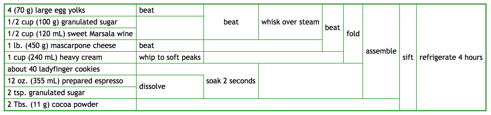

To read this, the raw ingredients are on the left, and each of the boxes 
represents a single operation that transforms and combines the ingredients.
After all the combinations have taken place, you end up on the right with a
single, complete Tiramisu. While this "2D" format is not how people write 
program source code, the underlying structure is not too different from how
people structure "FP" programs, which I will demonstrate below.

This diagram leaves out some the *detail* that the full
imperative recipe provides, even compared to the abridged version I transcribed
above. For example, chilling the expresso or explicitly boiling the water
are left out, and the details of *assemble* are not included. Nevertheless, it
contains the same high-level steps of how to build the tiramisu I abridged 
above. We're not leaving out large numbers of operations or hiding things
behind high-level instructions: all the same steps are still there, just 
organized slightly differently.

But even if this diagram has the same "content" as the imperative 
instruction-list I discussed earlier, what about this makes this presentation 
of the recipe more "functional"?

### Tiramisu Diagram to Functional Programming

While nobody actually writes their code in a 2D table-flowchart-thing like
this tiramisu diagram is, it turns out underneath the 2D format the "core"
of this diagram is the dependency graph between elements:

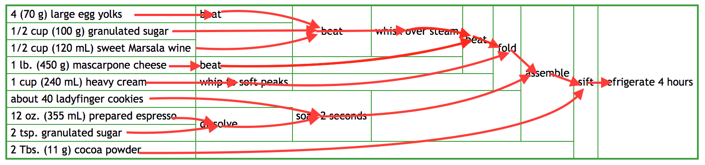

Where each box takes in some "inputs" from the left, and results in an "output" 
that can be used by more-rightward boxes. This can be straightforwardly 
represented in code by treating the boxes as functions, e.g. in the following
Python code:

```python
def make_tiramisu(eggs, sugar1, wine, cheese, cream, fingers, espresso, sugar2, cocoa):
                 
    return refrigerate(
        sift(
            assemble(
                fold(
                    beat(
                        whisk( # over steam
                            beat(beat(eggs), sugar1, wine)
                        ), 
                        beat(cheese)
                    ), 
                    whip(cream)
                ), 
                soak2seconds(fingers, dissolve(sugar2, espresso))
            ), 
            cocoa
        )
    )
```

(Again, forgive the fact that I'm overloading the same functions to work
on different types and numbers of arguments)

If it's not immediately clear how this code relates to the "functional 
programming dependency diagram" I discussed above, we can draw the dependency
graph *of this code*: showing where the input variables go, where the return
value of each function goes, all the way into the "final" result that gets 
returned:

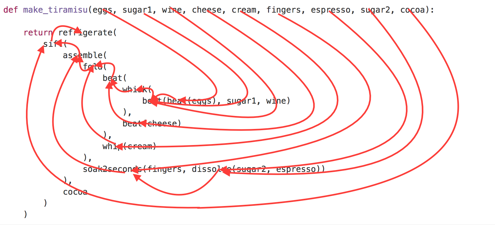

It might look like a bit of a mess, but if you look carefully, you will see 
that **although the graphs are laid out differently, the fundamental structure
of the two graphs is identical!** That is what I mean when I say the 2D 
box-diagram is a "FP Recipe": although people don't tend to write code in 2D 
box-diagrams, the underlying structure that the diagram represents is totally
equivalent to some "FP"-ish Python code, not too dissimilar to what people *do*
write. 

This code looks very unlike code you are likely to see in a Python project, "in
the wild", but we can fix that! If you prefer to have intermediate named values 
instead of one big expression, 
it's straightforward to pull out each function call into it's own statement: 


```python
# FP         
def make_tiramisu(eggs, sugar1, wine, cheese, cream, fingers, espresso, sugar2, cocoa):
    beat_eggs = beat(eggs)
    mixture = beat(beat_eggs, sugar1, wine)
    whisked = whisk(mixture)
    beat_cheese = beat(cheese)
    cheese_mixture = beat(whisked, beat_cheese)
    whipped_cream = whip(cream)
    folded_mixture = fold(cheese_mixture, whipped_cream)
    sweet_espresso = dissolve(sugar2, espresso)
    wet_fingers = soak2seconds(fingers, sweet_espresso)
    assembled = assemble(folded_mixture, wet_fingers)
    complete = sift(assembled, cocoa)
    ready_tiramisu = refrigerate(complete)
    return ready_tiramisu
```

That makes it look entirely "pythonic", indistinguishable from the code you 
might find in any random project on Github

Moving every expression into a separate statement is a straightforward 
transformation, at least for FP programs, and is the kind of thing that 
compilers regularly do automatically. 
Thus, although that block-flow-chart diagram may have looked a bit foreign at 
first, it really isn't *that* different from the code people write day to day, 
all year round.

In fact, it looks not too unlike the "Imperative" version we came up with 
earlier!

```python
# Imperative
def make_tiramisu(eggs, sugar1, wine, cheese, cream, fingers, espresso, sugar2, cocoa):
    dissolve(sugar2, espresso)
    mixture = whisk(eggs)
    beat(mixture, sugar1, wine)
    whisk(mixture) # over steam
    whip(cream)
    beat(cheese)
    beat(mixture, cheese)
    fold(mixture, cream)
    soak2seconds(fingers, espresso)
    assemble(mixture, fingers)
    sift(mixture, cocoa)
    refrigerate(mixture)
    return mixture # it's now a tiramisu
```

These two snippets of code look very similar, but the top one is "Functional
Programming" while the bottom one is "Imperative Programming". The difference
between them? 

- In the first, you can see that `beat(cheese)` must come 
  before `beat(whisked, beat_cheese)`, because `beat_cheese`
  is defined by the `beat(cheese)` and used by `beat(whisked, beat_cheese)`. 
  Even if you know nothing about `beat`, `cheese` or `whisked`, it is clear
  from the code that if you tried to reverse the order - and 
  `beat(whisked, beat_cheese)` *before* `beat(cheese)`, it wouldn't work.

- In the second, it's not so clear: does `beat(cheese)` *need* to come before 
  `beat(mixture, cheese)`? Or does `beat(mixture, cheese)` need to come before
  `beat(cheese)`? In this case, we have a link to the "docs" (the original 
  recipe) so we can look it up, but which one depends on the other - and 
  whether they are currently in the right order - is not clear from the code.
  

But how does this seemingly-trivial difference affect the way you build 
software?

### Preventing Errors with Functional Programming

The difference between the two Python snippets, the `# FP` and `# Imperative`
snippets, will become clear with the following thought experiment: what if we
try to make changes to the code?

Changing code is something we do all day, and sometimes we do it incorrectly.
It would be a nice properly of a codebase if changes tended to be easier to
make correctly, and incorrect changes were easier to spot. We'll discuss the 
latter first.

If I try to tidy things up and accidentally move the statement

```python
beat_cheese = beat(cheese)
```

below

```python
cheese_mixture = beat(whisked, beat_cheese)
```

It should be clear to me that something is wrong, because there will be no 
`beat_cheese` in scope to create the `cheese_mixture`. Even if it's not clear
to me, it's probably clear to my linter and editor:
 


As you can see, not only does the usage of `beat_cheese` raise an error because
no such variable is defined, the *definition* of `beat_cheese` *also* raises a
visual warning: it is greyed out since it is dead code! This makes it very hard
to miss when you make such trivial error, and saves you time: rather than 
waiting 10s for your test suite to run, within less than 1s your linter would 
have lit up and flagged the lines as invalid. Over the days, months and years,
this adds up to a significant productivity boost

However, in the *Imperative* case, it's not clear how 

```python
beat(mixture, cheese)
```

Relates to the things before or after it. If I remove the `beat(cheese)` 
earlier, I still have a `cheese` to pass in. If I remove the
`beat(mixture, cheese)` entirely, I still have a `mixture` I can use in later
steps of the recipe. So how do I know, from looking at the code, that removing 
a step or re-ordering them so that `beat(cheese)` comes after 
`beat(mixture, cheese)` is a problem? 

The answer is, you often don't, and neither does your computer, or your editor
and linter, who aren't going to help you spot the fact that you accidentally 
swapped two of the imperative statements:
 
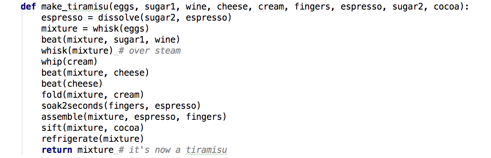

Fundamentally, in the "FP" example, the code is laid out in a way that the
"correct" usage is obvious: each function, e.g. `beat`, only depends on the
things that are passed into it, and it's output is only depended upon by 
whoever uses it's return value. In the "Imperative" example, it's not clear
who depends on who: you have to memorize the fact that `beat(cheese)` must come 
before `beat(mixture, cheese)`, and not the other way around. 

While this is not
difficult assuming we are looking at already-correct code (the current order is
the correct order!), when mistakes are made, and code happens to be incorrect,
"FP" code makes the mistakes much easier for you (or your linter) to spot so 
you can correct them.

--------------------------------------------------------------------------------

While this example may seem contrived, the basic problem exists in all large 
codebases I've worked with. For example, maybe you've bumped into code similar 
to the following three functions:

```python
def initialize():
   ... 1000 lines of messy code, no return value...
   
def make_app():
   ... 2000 lines of messy code, no return value...

def start_server():
   ... 4000 lines of messy code, no return value...
```


Which transitively depend on a 1 million line codebase ("The App").
How could I know that `start_server()` needs to be
called before `make_app()`, which itself needs to be called before 
`initialize()`, when all of them are global functions which don't 
take arguments or return anything? I have certainly spent countless days of my
career puzzling over such mysteries in large codebases, and I am sure others
have too. If `start_server` returned something I needed to pass to `make_app`,
which returned something I needed to pass to `initialize`, that would
make it clear from the outset which one needs to come before the other.

Re-ordering or shuffling around statements is not uncommon. When you
are refactoring a piece of code to let you re-use it in a different place, a 
lot of time is spent shifting bits of code up and down small amounts, just like
the example I showed above, so that the code you want to re-use is all in one
place and you can extract it into a helper. 

Perhaps you just want to tidy up what was previous a messy function to organize 
the code a bit better than it already is, grouping related lines so they can be 
read together easily, without changing any behavior at all.

Or perhaps, as mentioned earlier, someone made a mistake and the code *that 
already exists* is incorrect, and your job is to figure out which of the 
statements is out of order so you can fix it.

All of these are things that software engineers do day in, day out. And often,
we make mistakes when doing so. With functional programming, whether in a typed
language or not, it tends to be much more clear when you've made a trivial, 
dumb error. That means you get feedback quicker: you get correctly quietly by 
your linter in the privacy of your own laptop, and can quickly fix it and make
progress, rather than waiting a long time only to be loudly yelled
at by Jenkins CI in front of your entire team.

### Refactoring a Functional Tiramisu Recipe

Even if you haven't already-made a mistake, and are just *thinking* of making
a change to a codebase, the `# FP` version of the code is a lot easier to think
about than the `# Imperative` version. The same often applies whether you're
writing dealing with Python, Javascript, Scala, or a Tiramisu recipe!

I have already shown above how the 2D-block-diagram version of this recipe is 
exactly equivalent in semantics to a "FP" Python function. For this section I
will use the 2D-block-diagrams to illustrate my points, as it is much clearer
visually, but the same kind of reasoning applies to "FP" code in Python or any
other programming language. While working with an FP style, you quickly get 
used to performing the same analyses in your head, just as quickly, but on
lines of source code rather than 2D-block-diagrams.

What is interesting is that this structure lets us very easily answer some of
the questions we asked above:

> - If I have two people to make this tiramisu, which parts can be done in 
    parallel?

This one is easy: 

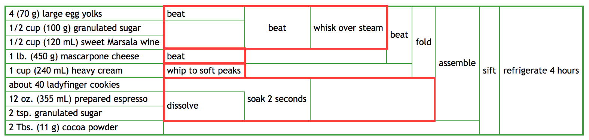

Anything vertically separated can be done in parallel. For 
example, preparing the ladies fingers and preparing the eggs/sugar/wine are
separate and can be done independently, as can whipping the cream and 
mascarpone cheese. Thus, if you have three people, you might assign: 

- one person to be the egg/wine/sugar mixture czar, 
- one to be the mascarpone/cream czar, and 
- one to be the expresso/ladyfingers czar. 

On the other hand, anything horizontally separated has to be done sequentially:

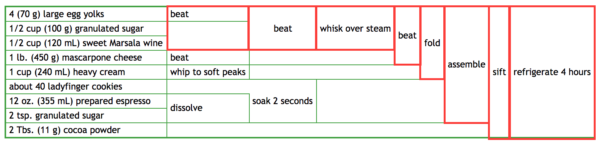

Thus even if you parallelize the early bits, the later 
beat-fold-assembly-refrigerate steps all have to be done sequentially, and how
much time you can save on your Tiramisu is limited by the length of the 
[Critical Path]. 

Working with the "FP" representation of the recipe doesn't 
shorten the critical path, and thus doesn't affect how much you can 
"theoretically" speed up your recipe with parallelism. What it does do is make 
clear exactly which parts of the recipe can be parallelized and which can't,
so you can more quickly organize your work to get maximum parallelism given the 
constraints of the recipe, and then move on to other things.

Again, while we're 
looking at a 2D-block-diagram, the same applies to FP-style code in Python,
Javascript, Scala, or any other programming language.


[Critical Path]: https://en.wikipedia.org/wiki/Critical_path_method

> - My expresso hasn't arrived yet; can I shift that step down and do other 
    things first and include the expresso later when it arrives? 
  
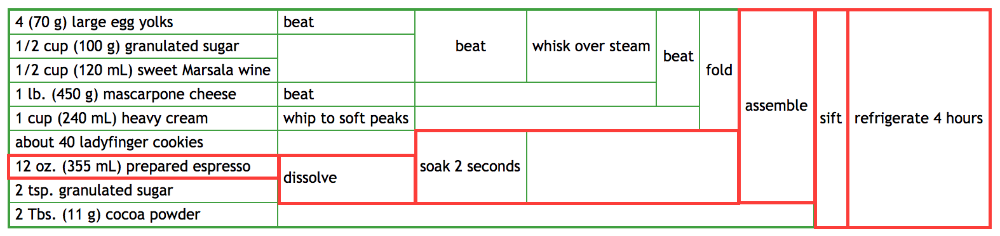
  
If you expresso hasn't arrived, anything depending on it can't be done, 
but anything else involving eggs/sugar/wine/cheese/cream can be prepared:
the sections marked in red make it clear which parts of the recipe depend on
expresso; the rest can be done while waiting for the expresso to arrive

>    - What if my eggs haven't arrived? Which steps can I do first before
      the eggs turn up?

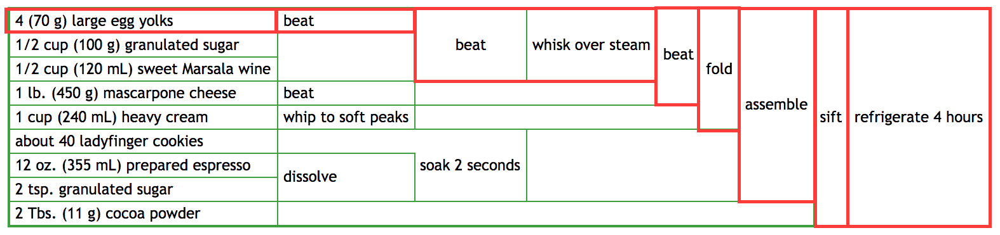

In this case, the top block can't be done but you can prepare the bottom and 
middle blocks: preparing the expresso, beating the cream and mascarpone cheese.
Again, this is obvious from looking at the diagram

> - At step 9. I screwed up and spilled the bowl onto the floor. Which steps do 
    I need to re-do (and which ingredients I may have to re-purchase) to recover 
    and continue the recipe?

Step 9 is when you beat the Mascarpone cheese into the egg mixture. Once we 
find it on the diagram, it's clear what we need to do:
 
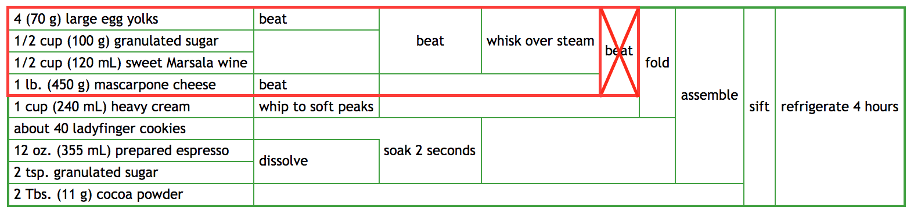

You will need to get some new eggs/sugar/wine/cheese and 
beat/beat/whisk/beat them all over again  

>    - What if I spilled the bowl at step 10? Or step 8?

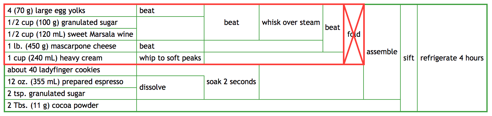

Spilling the bowl at step 10 (folding the whipped cream into the main mixture) 
is the same as spilling the bowl at step 9, except you need to get new 
cream too.

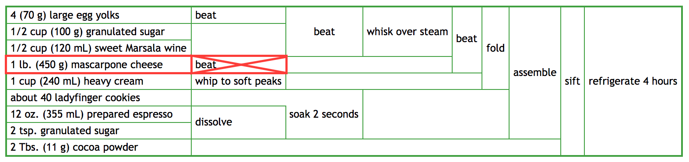

Spilling the bowl at step 8 (beating Mascarpone cheese) and you just need to 
get new mascarpone cheese and beat it. The rest of your ingredients are fine. 

> - Just before step 10, you realize you forgot to do step 7. How much of
    your ingredients have been ruined?

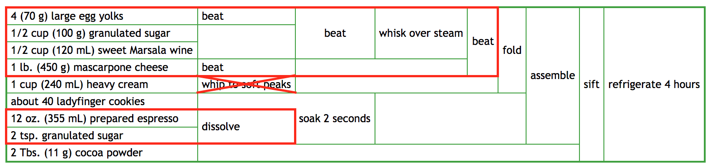

In the diagram above, the red boxes represent the steps we've already
done, up to step 10 (folding in the whipped cream). As you can see, not having
done step 7 (whipping the heavy cream) is no big deal; we haven't needed to 
done it up to now, so we can do it and continue with step 10 

>    - What if the forgotten step was step 4? Or step 2?

If you forgot step 4 (whisking in wine and sugar to the beaten eggs) you've 
ruined your eggs/sugar/wine/cheese:

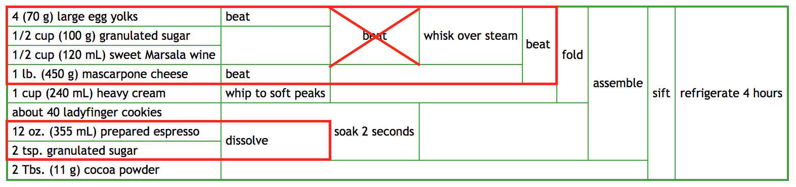

As you can see, the stuff we've been whisking and beating was not prepared
properly before being whisked and beaten, since we forgot to mix in the wine
and sugar. Assuming we don't know enough kitchen chemistry to incorporate the
wine/sugar in at this stage (Our eggs may well have turned into omelettes by 
now without the additional liquid from the wine...) we will need to re-do all 
the steps in the upper red box.

If you forgot step 2 (dissolving sugar into expresso) you're fine. The expresso 
hasn't been needed yet:

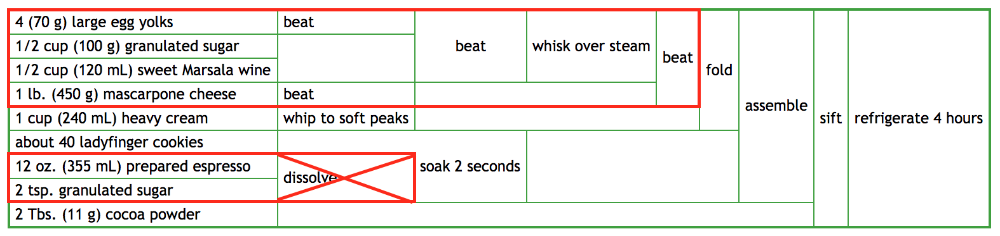

According to the imperative recipe above, we *should* have done the expresso
mixing first before starting on the egg/wine/cheese. But even though we didn't
do it, it is trivial to see from the FP-style recipe that there really isn't 
any loss: no other steps so far depended on that, no other ingredients were
ruined.

--------------------------------------------------------------------------------

As you can see, many of the questions that were non-trivial to answer when 
dealing with the imperative code back in [Kitchen Refactoring](#kitchen-refactoring)
are now trivial to answer when working with the FP-style 2D-block-diagrams.

Again, while nobody actually codes in 2D-block-diagrams (except skilled 
engineers running recipe blogs) the 2D-block-diagrams are equivalent to a 
relatively straightforward snippet as shown above. With some experience dealing
with FP code, you can often perform the same analyses just as easily when 
working directly with the equivalent Python code we showed earlier. And it's 
not just about programmers: automated tools linters or IDEs often perform the
same analysis on the fly, as 
[shown earlier](#preventing-errors-with-functional-programming), quickly 
alerting you if you make a mistake that means the recipe can no longer be 
completed successfully:


### The Core of Functional Programming

**The core of Functional Programming is thinking about data-flow rather than 
control-flow**. Although, by virtue of editing plain text, you are forced to
order your code in a linear sequence of statements, those statements are a
thin skin over what you really care about: the shape and structure of the 
data-flow graph within your program.

```python
def make_tiramisu(eggs, sugar1, wine, cheese, cream, fingers, espresso, sugar2, cocoa):
    beat_eggs = beat(eggs)
    mixture = beat(beat_eggs, sugar1, wine)
    whisked = whisk(mixture)
    beat_cheese = beat(cheese)
    cheese_mixture = beat(whisked, beat_cheese)
    whipped_cream = whip(cream)
    folded_mixture = fold(cheese_mixture, whipped_cream)
    sweet_espresso = dissolve(sugar2, espresso)
    wet_fingers = soak2seconds(fingers, sweet_espresso)
    assembled = assemble(folded_mixture, wet_fingers)
    complete = sift(assembled, cocoa)
    ready_tiramisu = refrigerate(complete)
    return ready_tiramisu
```


Similarly, when *executing* a "functional program" in a single thread, you are
forced to pick a linear order in which you execute each individual instruction,
which e.g. might be the same as the order in which it is written down in the
code. But since we know what *really* matters is the shape of the 
data-flow graph, we can freely re-arrange the statements in the code, and the 
order of execution, as long as the graph shape is preserved. Since the 
data-flow graph matches the graph of definitions and usages, even your editors
and linters understand it enough to warn you if you re-arrange things in an
invalid order. In fact, if you have multiple cores (or multiple cooks!) 
you can execute parts of it in parallel, not in any linear order at all! 
Exactly in what order the [program-counter](https://en.wikipedia.org/wiki/Program_counter)
proceeds from instruction to instruction is irrelevant.

This is in contrast to an imperative program, where the exact *order* in which 
the program-counter executes each statement, going in and out of loops, in and
out of sub-routines, is the key to understanding the 
program. In an imperative program, you tend to think in terms of steps that 
must happen "before" and "after", and make sure that the control-flow of the
program executes the commands in the right order for the program to work.

**Note that none of the FP examples here are "less complex" than the 
"imperative" recipe we discussed above**. It's about the same number of lines:

```python
def make_tiramisu(eggs, sugar1, wine, cheese, cream, fingers, espresso, sugar2, cocoa):
    dissolve(sugar2, espresso)
    mixture = whisk(eggs)
    beat(mixture, sugar1, wine)
    whisk(mixture) # over steam
    whip(cream)
    beat(cheese)
    beat(mixture, cheese)
    fold(mixture, cream)
    assemble(mixture, fingers)
    sift(mixture, cocoa)
    refrigerate(mixture)
    return mixture # it's now a tiramisu
```

```python
def make_tiramisu(eggs, sugar1, wine, cheese, cream, fingers, espresso, sugar2, cocoa):
    beat_eggs = beat(eggs)
    mixture = beat(beat_eggs, sugar1, wine)
    whisked = whisk(mixture)
    beat_cheese = beat(cheese)
    cheese_mixture = beat(whisked, beat_cheese)
    whipped_cream = whip(cream)
    folded_mixture = fold(cheese_mixture, whipped_cream)
    sweet_espresso = dissolve(sugar2, espresso)
    wet_fingers = soak2seconds(fingers, sweet_espresso)
    assembled = assemble(folded_mixture, wet_fingers)
    complete = sift(assembled, cocoa)
    ready_tiramisu = refrigerate(complete)
    return ready_tiramisu
```

whether as multiple statements, one big expression, or as a 2D block diagram. 
All the same operations are present: `beat`ing, `whip`ing, `fold`ing, etc.. 
Functional Programming is not about hiding ugly code in helper methods and 
hoping nobody notices: it's about managing the same complexity in a way that
makes the dependencies between each piece of code obvious, by
following the graph of where function arguments come from and where return 
values end up.

When you have a working program, having the dependency graph of function
return values being passed into other functions as arguments makes it really
easy to analyze code. For example, if we were curious what *exactly* is 
required to get our `wet_fingers_mixture`, we can see:
 
- `wet_fingers` comes from `soak2seconds(fingers, sweet_espresso)` 
- `sweet_espresso` comes from `dissolve(sugar2, espresso)`
- `sugar2`, `fingers`, `espresso` are the initial ingredients of the recipe

An there you have it: just a few steps, entirely mechanical, and we can see 
exactly what `wet_fingers` needs. We need no understanding of what `dissolve`
does, or what a `sugar2` is: just from the structure of the code we can 
already see what `wet_fingers` requires. Just as importantly, we can also see
that it does *not* depend on `folded_mixture`, `whipped_cream`, or any of the
other steps that are above it in the code: while those steps "come before" the
operations that give us a `wet_fingers`, it's clear from this analysis that 
their ordering is entirely accidental, and that we could e.g. prepare the 
`wet_fingers` before the other steps if we so desired.

It's not hard to do this yourself, but any IDE 
with jump-to-definition should be able to do this for you, and so can automated
linters and code analysis tools. And understanding the code is the first step
in changing it, without bugs.

When you have a broken program, having the dependencies be easy to analyze 
means it's easier to spot when you
make a mistake or do something out of order: even in a dynamic language like 
python, a subtly bad copy-paste job can get called out by your editor so you
can fix it before needing to run any code:


Whether you're working in a dynamic language like Python or a static language
like Scala, whether your code is currently working or broken, Functional 
Programming's data-flow-centric approach helps you understand your code faster,
easier and with more tooling help than a Imperative, mutation-heavy approach.

## Conclusion

**The core of Functional Programming is thinking about data-flow rather than 
control-flow**


While this may seem a trivial definition of "Functional Programming", I think
it is really the core of the idea. While there are many further steps, from the
simple (immutability, referential transparency, ...) to the more advanced (monads, 
lenses, ...) this core of should be something that everyone, from newbies 
to old hands, whether using Scala or Clojure or Haskell or React.js, should be 
able to empathise with. Even in a language like Python, as I have used for the
examples, it is possible to program in a more "Functional" style, and reap some
of the benefits of functional programming.

Those more advanced topics don't really fit this worked example anyway: kitchen
ingredients tend to be very, very mutable (and perishable!).

Though it's growing, this baseline-level of FP is not yet widespread in 
industry. 

- Whole languages, such as Bash, make it a pain in the neck to take
  non-trivial function arguments or return non-trivial results, resulting in
  people's code writing things to the filesystem, hopefully "before" someone
  else needs to read them.

- Languages like Java encourage
  patterns where you instantiate a half-baked object and then set the fields 
  later, praying that nobody accidentally tries to use it "too early" it in 
  it's half-baked state while it's internal variables are garbage. 
  
In all of these cases, the *order* in which things run - exactly how the 
program-counter progresses from statement to statement, in and out of for-loops,
in and out of sub-routines - is critical. 

Even in the kitchen, having a "FP-style" recipe like the block diagram I showed
above is helpful, because when the person bringing your Marsala Wine is 
stuck in traffic, it makes it easier to re-organize your recipe so you can get
as much work done immediately. When that person arrives, it helps you figure 
out how to parallelize the work over the people you have available. When 
someone screws up, it helps you figure out exactly which ingredients you need
to re-purchase and steps you need to re-do. 

This widespread applicability, even to fields outside the software world, and 
to every "FP" language *within* the software world, is why I think this is 
truly what functional programming is all about.
