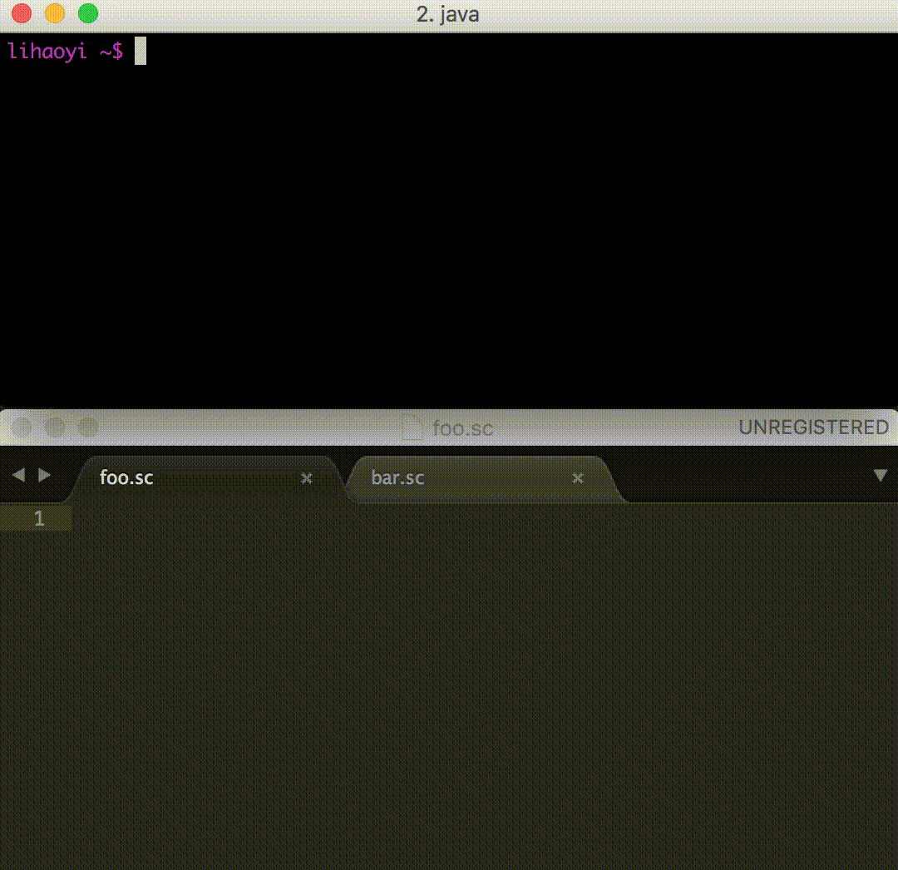
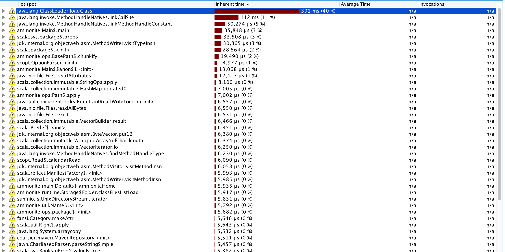

[Ammonite: Scala Scripting] is an open-source project that lets you use the 
Scala programming language for "scripting" 
purposes: as an interactive REPL, small scripts, or a systems shell. Scala has
traditionally been a "heavy, powerful" language with "heavy, powerful" tools,
and Ammonite aims to let you use it for small, simple tasks as well.

While people have been using Ammonite continuously over the last two years
it's been in development, I've only recently started
tagging Release Candidates (RCs) in the run-up to publishing Ammonite 1.0.0. 
This post will explore how Ammonite has changed over the years, and what's 
different now as we approach a 1.0 release.

[Ammonite: Scala Scripting]: http://ammonite.io/
[Ammonite]: http://ammonite.io/

-------------------------------------------------------------------------------

In this post, we will first cover the motivation behind the Ammonite project: 
what it does, and why it exists. Then we will talk about the goals of the 
upcoming 1.0 release, and explore some concrete ways Ammonite has changed in
the run-up to 1.0 to try and achieve those goals. 

- [What is Ammonite?](#what-is-ammonite)
    - [Ammonite-Repl](#ammonite-repl)
    - [Ammonite-Scripts](#ammonite-scripts)
- [Towards 1.0](#towards-10)
    - [Coherence and Completeness](#coherence-and-completeness)
    - [Polish](#polish)
    - [Well-understood Issues](#well-understood-issues)
- [Conclusion](#conclusion)

In short, Ammonite 1.0 doesn't add any shiny new features, but contains a *lot* 
of work to make the existing features work better, smoother, and easier. If 
you've used (or considered using) Ammonite in the past and were turned off by 
it's rough edges, you should definitely give it another try!

## What is Ammonite?

[Ammonite: Scala Scripting] is an open-source project that I've worked on for two years now. 
It provides an [IPython]-esque rich REPL experience and a way to run Scala 
script files. Essentially, it lets Scala compete for use in places you may 
previously have been using [Python] or [Bash]: for small housekeeping or automation 
scripts, filesystem and system-administration, and as an interactive 
general-purpose programming REPL.

[IPython]: http://ipython.org/
[Python]: https://www.python.org/
[Bash]: https://en.wikipedia.org/wiki/Bash_(Unix_shell)

[Ammonite] is made of two main facets:

- [Ammonite-REPL](#ammonite-repl)
- [Ammonite-Scripts](#ammonite-scripts)

### Ammonite-REPL


The Ammonite-REPL is an improved Scala REPL. Basically an [IPython] REPL for 
Scala, it is a drop-in replacement to the default Scala REPL and provides a 
great number of quality-of-life improvements: syntax-highlighted input, 
multi-line editing, pretty-printed output, and many other things. It also fixes 
[many issues](http://ammonite.io/#OtherFixes) with the in-built 
Scala REPL that made it hard to use for "real" work. In this section I'll 
discuss two of them:

- [Echo-ed output is unreadable](#echo-ed-output-is-unreadable)
- [Ctrl-C kills everything; bye bye work!](#ctrl-c-kills-everything-bye-bye-work)

#### Echo-ed output is unreadable

One huge use of the REPL is to be able to immediately see the results of 
computations:

```text
scala> 1 + 2
res0: Int = 3

scala> Seq(1, 2, 3).zip(Seq(2, 3, 4))
res1: Seq[(Int, Int)] = List((1,2), (2,3), (3,4))
```

This works great in small examples, but as the computations become even just
*slightly* larger, it totally unusable:

```text
scala> sys.env
res0: scala.collection.immutable.Map[String,String] = Map(SHELL -> /bin/bash, LOGNAME -> lihaoyi, PATH -> /usr/local/bin:/usr/bin:/bin:/usr/sbin:/sbin:/Library/TeX/texbin, JAVA_MAIN_CLASS_30510 -> scala.tools.nsc.MainGenericRunner, TERM -> xterm-256color, XPC_SERVICE_NAME -> 0, TERM_PROGRAM -> iTerm.app, HOME -> /Users/lihaoyi, ITERM_SESSION_ID -> w1t0p1:2845AB2A-5D4D-4369-AEE7-C5119D8078F9, Apple_PubSub_Socket_Render -> /private/tmp/com.apple.launchd.2DBcShJMTX/Render, USER -> lihaoyi, JAVA_ARCH -> x86_64, __CF_USER_TEXT_ENCODING -> 0x1F5:0:0, XPC_FLAGS -> 0x0, TMPDIR -> /var/folders/zk/w7xfpj_51t90z7xv5kw2zdm80000gn/T/, TERM_SESSION_ID -> w1t0p1:2845AB2A-5D4D-4369-AEE7-C5119D8078F9, SHLVL -> 2, _ -> /usr/bin/java, TERM_PROGRAM_VERSION -> 3.0.10, PWD -> /Users/lihaoyi, LC_CTYPE -> UTF-...
 
scala> Seq.tabulate(100)(Seq.tabulate(_)(x => x)) 
intermediateResult: Seq[Seq[Int]] = List(List(), List(0), List(0, 1), List(0, 1, 2), List(0, 1, 2, 3), List(0, 1, 2, 3, 4), List(0, 1, 2, 3, 4, 5), List(0, 1, 2, 3, 4, 5, 6), List(0, 1, 2, 3, 4, 5, 6, 7), List(0, 1, 2, 3, 4, 5, 6, 7, 8), List(0, 1, 2, 3, 4, 5, 6, 7, 8, 9), List(0, 1, 2, 3, 4, 5, 6, 7, 8, 9, 10), List(0, 1, 2, 3, 4, 5, 6, 7, 8, 9, 10, 11), List(0, 1, 2, 3, 4, 5, 6, 7, 8, 9, 10, 11, 12), List(0, 1, 2, 3, 4, 5, 6, 7, 8, 9, 10, 11, 12, 13), List(0, 1, 2, 3, 4, 5, 6, 7, 8, 9, 10, 11, 12, 13, 14), List(0, 1, 2, 3, 4, 5, 6, 7, 8, 9, 10, 11, 12, 13, 14, 15), List(0, 1, 2, 3, 4, 5, 6, 7, 8, 9, 10, 11, 12, 13, 14, 15, 16), List(0, 1, 2, 3, 4, 5, 6, 7, 8, 9, 10, 11, 12, 13, 14, 15, 16, 17), List(0, 1, 2, 3, 4, 5, 6, 7, 8, 9, 10, 11, 12, 13, 14, 15, 16, 17, 18), List(0, 1, 2, 3, 4,...
```

Note that these aren't even particularly large or complex computations; they 
are barely a step up from the "toy" examples that look good in a REPL. 
Nonetheless, they are enough to render the `Print` in `Read Eval Print Loop` 
completely useless!

In Ammonite, output is nicely formatted, indented, colored, and truncated:

```scala
@ sys.env
res0: Map[String, String] = Map(
  "SHELL" -> "/bin/bash",
  "LOGNAME" -> "lihaoyi",
  "PATH" -> "/usr/local/bin:/usr/bin:/bin:/usr/sbin:/sbin:/Library/TeX/texbin",
  "TERM" -> "xterm-256color",
  "XPC_SERVICE_NAME" -> "0",
  "TERM_PROGRAM" -> "iTerm.app",
  "HOME" -> "/Users/lihaoyi",
  "ITERM_SESSION_ID" -> "w0t0p1:8654A65A-4029-46B6-BEB2-99DDC7ECD6E5",
  "Apple_PubSub_Socket_Render" -> "/private/tmp/com.apple.launchd.2DBcShJMTX/Render",
...

@ Seq.tabulate(100)(Seq.tabulate(_)(x => x))
res1: Seq[Seq[Int]] = List(
  List(),
  List(0),
  List(0, 1),
  List(0, 1, 2),
  List(0, 1, 2, 3),
  List(0, 1, 2, 3, 4),
  List(0, 1, 2, 3, 4, 5),
  List(0, 1, 2, 3, 4, 5, 6),
  List(0, 1, 2, 3, 4, 5, 6, 7),
...
```

You can customize how much input you want to display, run the `show()` 
builtin to show more or less of it, or the `browse()` built-in if you want. 
to scroll through the output using a pager. This simple improvement - pretty 
printed output - makes a huge difference to how easily you can work with 
non-trivial data-structures in your Scala REPL.
  
#### Ctrl-C kills everything; bye bye work!  

When computations get larger than toy-examples, it's common to spend several
minutes building up the intermediate results you need. Sometimes, the data 
takes a while to fetch, your algorithm just needs 10s of seconds to process, or
you simply need some time exploring to put together the data you want
to work with.

```scala
// Lots of earlier steps

scala> val intermediateResult = doExpensiveComputation1()
// Takes 30 seconds to run
intermediateResult: ExpensiveComputedThing = ...
```

Unfortunately, it's also common to have bugs in your computations to cause them
to loop forever and not terminate! Or perhaps your command will *eventually*
terminate, but it will take long enough you want to stop it and run 
something else.

While it would be great if we never hit such issues, but in practice we do, and 
the Scala REPL is not forgiving when we need to kill such a run-away 
computation:

```scala
scala> val finalResult = doExpensiveComputation2(intermediateResult)
// Hmm I think it hung, better try a different computation
^Ctrl-C

$ // Oh no we've been kicked out to Bash and lost all our work! 
```

Again we have an issue that destroys our core REPL functionality: here breaking
the `Loop` in our `Read Eval Print Loop`! The whole point of a REPL is to loop
around after a command so you can run others; "kicking me back to the Bash 
shell" isn't part of the acronym.

There's no good reason for this to be the case. After all, if your
Bash command takes too long, `Ctrl-C`ing doesn't kick you out of your Bash 
shell! The same can be said of Ruby, Python, and countless other language 
REPLs. In the case of Scala, I was finding myself losing minutes worth of work 
when my I ran the wrong command and needed to interrupt it. There had to be a
better way

In Ammonite, You can interrupt a run-away command without killing the process,
letting you continue your work:

```scala
@ while(true) ()
... hangs ...
^Ctrl-C
Interrupted!

@
```

If you are doing serious work in the REPL, making mistakes is par for the 
course. Ammonite lets you recover from some these mistakes and keep going,
remaining productive and making progress rather than being forced to kill the
process and lose all your work.

While this has some edge cases, e.g. interrupting the main thread during 
class-loading can cause the JVM to end up in a funny state and needing to be
restarted. In practice, however, this happens pretty rarely. Even when it does
happen, needing to restart your JVM once in a while is better than needing to
restart it every single time you `Ctrl-C`!

### Ammonite Scripts

The second major facet that Ammonite provides is the ability to write and execute
Scala scripts:



[SBT]: http://www.scala-sbt.org/

Scripts, like a Scala REPL, offer a light-weight way of executing Scala code
without the boilerplate and slowness of the standard Scala [SBT] built
tool. While there is an short initial delay when you start working with a 
script (due to [glacial slowness](#the-scala-compiler-is-slow) of a 
not-yet-warmed-up Scala compiler) after it warms up iteration is quick and 
snappy. The compiled scripts are cached such that subsequent runs are 
acceptably fast (at least as far as running on the JVM goes, which introduces 
a significant [classloading delay](#jvm-initialization-is-slow)
that is difficult to avoid)

In general, Ammonite's Scala Scripts aim to let you displace even more of your
unsafe Bash/Python/Perl code with "safer" Scala. While for many scripts the 
initial 0.5-1s JVM startup time is unacceptable, there are also many for which
that startup time is, while not great, acceptable. You may find Ammonite Scala
Scripts useful in cases where your script is:

- Complex enough that you value being able to write it in a safer and more 
  maintainable language
   
- Long-running enough that Ammonite's slow startup doesn't matter, or is 
  or computationally-intensive enough that the startup overhead is overshadowed 
  by Scala's excellent steady-state performance.
  
- Already run using using a heavy-weight [SBT] 
  project, and you want something faster, even if not super-fast.

#### Script Dependencies 

One thing that is relatively unique about Ammonite's Scala Scripts is the lack
of any external build-tool or dependency-file: you just `import $ivy` any third
party packages you need within your script, and they get automatically 
downloaded and cached for you when necessary. This lets you write scripts to do
all sorts of interesting things really easily:

- [dealing with Web APIs](http://ammonite.io/#HTTPRequests) and 
  [Web Scraping](http://ammonite.io/#ScrapingHTML)

- [Launching GUIs](http://ammonite.io/#GUIApplications) to interact
  with a user

- Processing [Office Documents](http://ammonite.io/#OfficeAutomation),
  [Images](http://ammonite.io/#ImageProcessing) or
  [Natural Language](http://ammonite.io/#MachineLearning)
  
- Running [Web Servers](http://ammonite.io/#PlayFrameworkServer)

All these things are *possible* to do in other scripting languages, but often
require setup to happen and dependencies to be installed before you can run 
your code. Ammonite's `amm` script-runner makes it totally seamless: you just
run `amm MyScript.sc`, and everything that needs to be downloaded will be 
downloaded in order to make your script execute. Ammonite gives you access to 
the *enormous* JVM package ecosystem at your fingertips, and makes it all 
seamlessly available to you as-necessary within the smallest of your helper 
scripts.

Ammonite-Scripts were a natural outgrowth from the Ammonite-REPL: a lot of the
same infrastructure needed to evaluate Scala snippets and making their results
available to downstream code is the same. The scripting facet of Ammonite was
built with the help of our GSOC students [Lazslo Mero](https://github.com/laci37) 
and [Abhishek Kumar](https://github.com/coderabhishek) over the two summers of
2015 and 2016.

-------------------------------------------------------------------------------

Most of Ammonite's core features have been around for ages.

For example, the beautiful syntax-highlighted multi-line editing terminal
has been around since May 2015, not long after the first commit in the project 
in Jan 2015. The ability to write [Ammonite Scripts](#ammonite-scripts) was 
first implemented in June 2015. Pretty-printed output was there from the very 
start.

Given that these core features have been around for ages, what's there to do
for 1.0?

## Towards 1.0

1.0 doesn't mean that development is done: there are still missing features 
(e.g. IntelliJ Support), limitations (e.g. unnecessary recompilation of scripts 
in diamond-dependency structures) and leftover sloppiness (e.g. how you can 
`import $ivy` multiple versions of the same library). 

For Ammonite, 1.0 means...
 
- A model of "how things work" that is coherent and complete
- A polished user-experience
- Bugs and limitations that are generally understood

I'm going to explore a number of specific cases which illustrate how Ammonite
1.0 embodies these principles, compared to earlier versions of Ammonite or
related tools.

- [Coherence and Completeness](#coherence-and-completeness)
    - [Case Study: Script Import Semantics](#case-study-script-import-semantics)
    - [Case Study: Separating REPL builtins from Script builtins](#case-study-separating-repl-builtins-from-script-builtins)
- [Polish](#polish)
    - [Case Study: No Stack Traces](#case-study-no-stack-traces)
    - [Case Study: Command-line Interface](#case-study-command-line-interface)
- [Well-understood Issues](#well-understood-issues)
    - [Case Study: Slow Startup](#case-study-slow-startup)
    
### Coherence and Completeness

**Coherence** means that a product has an underlying logic to it, that a user can
leverage to understand how to use it without knowing about the implementation.

**Completeness** means that all the ways you can use a product work; you won't bump
into behavioral "holes" where it misbehaves when used in unexpected ways.

Both are important properties to have, especially for new users: they are the 
ones who are trying to build a mental model of how your software works, and 
they are the ones who will be making mistakes and trying to use it in strange
ways you've never thought possible.

Ammonite has traditionally had neither of these. Many of it's 
features were initially experimental: in many cases it wasn't clear from the 
start whether a feature would be *possible*, nevermind whether that feature 
would be *useful*. At the time it didn't make sense to think deeply about all 
the edge cases in a feature or how it interacts with other features. If 
implementing your feature isn't possible, or people don't find it useful, it 
doesn't matter how elegantly it handles edge cases!

However, by now Ammonite has validated both the *possibility* and *usefulness* 
of most of its features, so it makes sense to start making the hodge-podge of
features fit together. What features can be streamlined to work more nicely 
with the others? What edge cases should we explicitly prohibit, since they have
no reasonable semantic? I'll discuss two cases:
  
- [Case Study: Script Import Semantics](#case-study-script-import-semantics)
- [Case Study: Separating REPL builtins from Script builtins](#case-study-separating-repl-builtins-from-script-builtins)

#### Case Study: Script Import Semantics

Ammonite has since 2015 allowed you to run scripts from the REPL or from Bash,
import scripts from other scripts, and load third-party libraries. If I wanted
to import a script `folder/Imported.sc` from another script `Main.sc`, the 
original mechanism looked something like this:

```scala
// folder/Imported.sc
val thingy = 31337
```
```scala
// Main.sc
import ammonite.ops._
load.module(pwd/'folder/"Imported.sc") // import the other script
@
println(thingy) // use value defined in other script
```

The imported script `Imported.sc`, defining the `thingy` value, is pretty 
simple. The script *doing* the import, however, has a number of confusing 
things:

- `import ammonite.ops._`, which pulls in the `pwd` value representing the
  working directory
  
- The `/'folder/"Imported.sc"` snippet, which constructs the 
  [Ammonite-Ops](http://ammonite.io/#Ammonite-Ops) `Path` object
  to the script you wish to import
  
- The `@` separator, which splits `Main.sc` into two sections, which are 
  compiled & run one after the other.
  
The `@` separator requires some explanation: this operator splits the script 
into multiple compilation-units, each one compiled and executed sequentially. 

This is necessary because `load.module` is a plain-old-function-call that 
processes the target script and loads it into your classpath. Thus the 
`println(thingy)` in the second block will not compile until the `load.module` 
has both compiled *and* executed, in order to bring the contents of 
`Imported.sc` into your classpath so the use of `thingy` in the second section 
can compile and run.
  
Importing third-party libraries was similar:

```scala
// DependsOnLibrary.sc
load.ivy("com.lihaoyi" %% "scalatags" % "0.6.5") // import third-party library
@
import scalatags.Text.all._ // use third-party library
println(div("hello")) // <div>hello</div>
```

Again, the `load` function call, the `@` separator, and the "real" body of the
script in needing to be in the second section.

All these hoops a user needs to jump through to import a script makes sense 
from an *implementation* point of view, but they do not make sense from a 
*user's* point of view. After all, they just want to specify the script to 
import, or the third-party library: they don't want to be fussing around with
`Path` objects or `@` separators! In practice it was a common mistake to
leave the `@` out and wonder why the script isn't compiling.

Since version [0.7.0](http://ammonite.io/#0.7.0), Ammonite started 
providing a [Magic Import](http://ammonite.io/#import$file) syntax 
for importing scripts:

```scala
// folder/Imported.sc
val thingy = 31337
```
```scala
// Main.sc
import $file.folder.Imported
println(Imported.thingy)
```

And importing third-party libraries:

```scala
// DependsOnLibrary.sc
import $ivy.`com.lihaoyi::scalatags:0.6.5`, scalatags.Text.all._

println(div("hello")) // <div>hello</div>
```

Here, we can see that the `load` calls have been replaced by `import $file` and
`import $ivy` commands. There are two main benefits:

- All the ceremony is gone: the necessity to break 
  the script with a `@`, the `import ammonite.ops._`, quotes around 
  `pwd/'folder/"Imported.sc"`. Removing these greatly reduces the amount of 
  "ceremony" around a relatively simple process: letting the user specify a 
  script or file to import.

- The new `import $file` and `import $ivy` syntax
  behaves the same way that a Scala programmer already expects imports to work.
  
`import $file.folder.Imported` doesn't just make variables 
magically appear in your local namespace, the way `load.module()` did. Instead, 
it brings the `Imported` object containing the declarations in that script into 
scope for you to use, just like a normal Scala import statement! Similarly,
the `$ivy` import can happen in-line with the actual `scalatags.Text.all._`
import from the library, just like any other import can.

Overall, the new `import $ivy` and `import $file` syntax are slightly less 
flexible than the older `load.module` and `load.ivy` commands, but without all
the implementation-details exposed. Their semantics closely matches
that of normal import statements, which a Scala programmer (or a 
programmer coming from other languages e.g. Python or Javascript) would 
already be familiar with. 

The old `load.ivy` and `load.module` syntax wasn't intentionally designed to be
awkward to use; rather, it wasn't really designed at all! The original feature 
was a proof-of-concept of script-loading and third-party-library loading, 
itself a novel and interesting feature. Attention was focused on making it 
*work* rather than making it *easy*. But now that the it is well-established as a 
core feature of Ammonite, both in scripts and in the REPL, it's definitely 
worth making work more coherently.

Judging by the quantity of tickets and questions in the 
[gitter chat room](https://gitter.im/lihaoyi/Ammonite), the new
`import $ivy` and `import $file` syntax has greatly reduced the amount of 
confusion felt by users of Ammonite when writing scripts.


#### Case Study: Separating REPL builtins from Script builtins

While **coherence** is making sure the features that exist fit coherently with 
what a user expects, **completeness** is making sure the user can use 
Ammonite's various features however they like, without bumping into cases that 
don't make sense or simply don't work. 

A good example for this is the built-in capabilities that Ammonite exposes.
Ammonite started out as a REPL, and originally exposed a large number of 
builtin functions such as `history` to view the history of commands, `typeOf`
to query the type of a value, the `load.ivy` and `load.module` builtins 
described above, and many more. While other REPLs like [IPython] or the 
built-in Scala REPL tended to expose these commands as special syntax (such as 
`:history` or `:type`), Ammonite exposes these as normal Scala functions that 
the user calls in the REPL, e.g.
 
```scala
@ history

@ typeOf("hello") // java.lang.String

@ load.ivy("com.lihaoyi" %% "scalatags" % "0.6.5")

@ prompt() = "> "
``` 
 
Later, many of them were moved to an `interp` object, e.g. 
`interp.history` or `interp.prompt` or `interp.load.ivy`, to avoid polluting 
the global namespace:

```scala
@ interp.history

@ interp.prompt() = "> "
```

As Ammonite's script-running functionality appeared, initially it was 
simply running the scripts as consecutive REPL commands: things behaved as if
you ran them in the REPL, and the same built-in functions were available. 
However, over time it became clear that the built-in functions could be divided
into two categories

- Those that only made sense in the REPL, such as `history` or 
  `prompt`. After all, a script doesn't have a "history" of commands,
  nor does it display a prompt! 

- Those that were just as useful in both the REPL and Scripts, such as 
  `load.ivy` to pull in third-party libraries, or `load.module` 
  to import scripts. Scripts need to import third-party libraries or other
  scripts just as much as the REPL does.

Initially, REPL-centric built-in functions simply did *nothing* when run in
scripts: `history` was always empty, and setting the `prompt` didn't change
anything. In the run up to Ammonite 1.0, these REPL-centric built-ins were 
moved into the `repl` object, e.g. `repl.history` or `repl.prompt`, separate 
from the general-purpose built-ins such as `interp.load.ivy`, and the `repl` 
object was simply not available to use in Scripts.

As a result, it is now clear which built-ins are available to Scripts and which 
built-ins are only available to  the REPL, and a user won't bump into an 
builtin that doesn't work. This brings a sense of *completeness* to the API 
that didn't exist earlier, when those builtins simply didn't do anything if 
used in the wrong place.

### Polish

Ammonite 1.0 doesn't have any major features that earlier versions of Ammonite 
did not have, but most of the features that it does have work *much* better 
than they used to, in a variety of ways. These are improvements to the common
use case, improvements to obscure use cases, and improvements to the case where
the user does entirely the wrong thing but the error message now guides them to 
help them figure it out.

By "Polish", I don't mean deep, fundamental changes to make things better. 
Rather, I'm referring to the easy stuff: sanding down a sharp corner here, 
smoothing a rough patch there. All shallow, straightforward, relatively 
superficial changes, that nonetheless add up to a huge improvement in UX. I 
will discuss two cases:

- [Case Study: No Stack Traces](#case-study-no-stack-traces)
- [Case Study: Command-line Interface](#case-study-command-line-interface)

#### Case Study: No Stack Traces

Exceptions with stack-traces are a wonderful tool during development. When
something goes wrong, your program halts with a useful trace of roughly what
chain of functions calls brought it to the point where things fell apart. You 
can then quickly figure out what caused it to misbehave, or add some logging to
the relevant places, and fix your code.

However, exceptions are not a good experience for the end-user: while an 
Ammonite *developer* seeing a failure may be interested in Ammonite's internal 
stack trace that resulted in it, an *end-user* would likely be more interested 
in what exactly *they* did wrong, and couldn't care less about the trace of 
Ammonite's internal method calls!

Right from the start, for the "core" code paths, Ammonite avoided showing
internal stack traces to the user: e.g. any exceptions thrown in the REPL or
in Scripts were truncated to only show the portion that relates to user-code:

```scala
@ for(i <- 0 until 10) println(100 / i)
java.lang.ArithmeticException: / by zero
  ammonite.$sess.cmd0$.$anonfun$res0$1(cmd0.sc:1)
  scala.collection.immutable.Range.foreach$mVc$sp(Range.scala:156)
  ammonite.$sess.cmd0$.<init>(cmd0.sc:1)
  ammonite.$sess.cmd0$.<clinit>(cmd0.sc)
```

However, in many of the less-core code paths, failures still resulted in 
exceptions. Cases like:

- Running a script that doesn't exist
- Failures in the "predef" files, which are run during initialization

And many more used to throw exceptions that resulted in Ammonite's internal
stack traces being shown; in the lead up to 1.0, we've fixed them one by one.
When running a missing file, instead of seeing:

```bash
$ amm/target/amm missing.sc
Exception in thread "main" java.nio.file.NoSuchFileException: missing.sc
	at sun.nio.fs.UnixException.translateToIOException(UnixException.java:86)
	at sun.nio.fs.UnixException.rethrowAsIOException(UnixException.java:102)
	at sun.nio.fs.UnixException.rethrowAsIOException(UnixException.java:107)
	at sun.nio.fs.UnixFileSystemProvider.newByteChannel(UnixFileSystemProvider.java:214)
	at java.nio.file.Files.newByteChannel(Files.java:361)
	at java.nio.file.Files.newByteChannel(Files.java:407)
	at java.nio.file.Files.readAllBytes(Files.java:3152)
	at ammonite.ops.Path.getBytes(Path.scala:322)
	at ammonite.ops.read$.apply(FileOps.scala:331)
	at ammonite.ops.read$.apply(FileOps.scala:330)
	at ammonite.main.Scripts$.runScript(Scripts.scala:42)
	at ammonite.Main.runScript(Main.scala:163)
	at ammonite.MainRunner.runScriptAndPrint(Main.scala:305)
	at ammonite.MainRunner.runScript(Main.scala:284)
	at ammonite.Main$.main0(Main.scala:239)
	at ammonite.Main$.main(Main.scala:189)
	at ammonite.Main.main(Main.scala)
```

A user will now see:

```bash
$ amm missing.sc
Script file not found: /Users/lihaoyi/missing.sc
```

Providing user-centric error messages in cases like these takes effort; 
sometimes this is easy, sometimes (e.g. in the case of failures during 
initialization) this requires somewhat invasive refactoring. While features
are raw and fresh, and it's not clear if people would find them valuable at 
all, it may make sense to play "fast and loose" and simply throw exceptions 
in these cases, as we did in earlier versions of Ammonite.

Over time, the number of people using Ammonite and making mistakes has grown,
as has our certainty that our features are useful (and won't go away in a 
future version). Thus, in the run-up to Ammonite 1.0, a lot of effort has gone
into trying to provide user-friendly, stack-trace-free error messages in the
face of user error. 

That means rather than getting a screenful of irrelevant 
stack trace, a new user using Ammonite and making mistakes should hopefully
receive useful feedback from the errors and quickly learn what it is that they
are doing wrong.

#### Case Study: Command-line Interface

Ammonite has, since early on, provided a command-line interface where you can
start the Ammonite REPL or run Ammonite Scala Scripts from an external shell,
such as Bash. For example, you could define a main method in your script:

```scala
// Args.sc
@main
def main(i: Int, s: String): Unit = {
  println(s * i)
}
```

Which you could then run:

```bash
$ amm Args.sc 3 Hello
HelloHelloHello
```

However, in earlier versions of Ammonite, there were a number of limitations.
For example, if you tried to define a main method taking `String*` args, in 
order to forward the argument array to your own argument parser, you couldn't:

```scala
// Args.sc
@main
def main(s: String*): Unit = {
  println(s)
}
```

```bash
$ amm Args.sc forwarded1 forwarded2 --forwarded-flag forwarded3 
Error: Unknown option --forwarded-flag
```

This was a limitation of the existing argument parser, Scopt, which insists on
handling *all* arguments, and doesn't have the concept of leaving some 
arguments alone for downstream code to process.

Furthermore, the usage messages you got when running scripts with the wrong 
arguments was somewhat strange:  

```bash
$ amm Args.sc
The following arguments failed to be parsed:
(i: Int) was missing
(s: String) was missing
expected arguments: (i: Int, s: String)
```

As someone who understands Scala, this way of presenting the information sort
of makes sense, but it definitely is foreign to how "most" command line 
applications present their help docs.

In the run up to Ammonite 1.0, these things have been improved. You can now 
forward arguments properly by making your entrypoint take a `String*` argument:
 
```bash
$ amm Args.sc forwarded1 forwarded2 --forwarded-flag forwarded3
ArrayBuffer(forwarded1, forwarded2, --forwarded-flag, forwarded3)
```

And when trying to run Ammonite Scala Scripts, you now get help messages much
more in line with what you would expect a command-line application to provide:

```bash
$ amm Args.sc
Missing arguments: (--i: Int, --s: String)

Arguments provided did not match expected signature:

main
  --i  Int
  --s  String  
```

A larger Ammonite script with multiple `@main` methods, and some 
`@doc`-annotations on them, may look like this:
 
```scala
// MultiMainDoc.sc
import ammonite.ops._
val x = 1

@main
def mainA() = {
  println("Hello! " + x)
}

@doc("This explains what the function does")
@main
def functionB(i: Int @doc(
                "how many times to repeat the string to make " +
                "it very very long, more than it originally was"
              ),
              s: String @doc("the string to repeat"),
              path: Path = pwd) = {
  println(s"Hello! ${s * i} ${path.relativeTo(pwd)}.")
```

And be run via:

```bash
$ amm amm/src/test/resources/mains/MultiMainDoc.sc
Need to specify a subcommand to call when running MultiMainDoc.sc

Available subcommands:

  mainA

  functionB
    --i     Int: how many times to repeat the string to make it very very long,
            more than it originally was
    --s     String: the string to repeat
    --path  ammonite.ops.Path (default /Users/lihaoyi/Dropbox/Github/Ammonite)

$ amm MultiMainDoc.sc mainA
Hello! 1

$ amm MultiMainDoc.sc functionB 4 "Hello"
Hello! HelloHelloHelloHello .

$ amm MultiMainDoc.sc functionB --i 4 --s "Hello"
Hello! HelloHelloHelloHello .
```

Originally the whole idea of scripts, command-line interfaces and `@main` 
methods was a novel experiment that may-or-may-not work. By now, however, these 
are core features of Ammonite that many people rely on, including myself. 
Approaching Ammonite 1.0, we have put in work to polish the command-line 
interface to Ammonite Scala Scripts: making it convenient, flexible, and 
idiomatic both to those coming from Scala and those coming from Bash.

### Well-understood Issues

Ammonite 1.0 will not be free of issues: bugs, missing features, or 
limitations. However, it should hopefully be free of *unknown* problems. There
should hopefully be no known issues which turns out to be easily fixed by a 
trivial patch, or mysterious issues whose cause is totally unknown. The bulk of 
those should be fixed, or at least investigated and understood, by 1.0.

The open issues that remain should hopefully be 

- Non-trivial
- With known causes
- With known approaches to solve them

This is a hard goal to reach in a big project. While Ammonite is not a huge 
amount of lines of code, it is definitely complex in the number of features it
contains, the third-party dependencies it uses, and how everything interacts.

Nevertheless, things like:

- "my scripts are not re-compiling right when changed" 
  
- "ivy cache sometimes gets corrupted, no idea why" 

Should hopefully be mostly gone by 1.0. What remains should be issues that are 
substantial, difficult, but at least somewhat well-understood. I'll discuss one
example of this:

- [Case Study: Slow Startup](#case-study-slow-startup)

#### Case Study: Slow Startup

While Ammonite tries to compete with other scripting languages like Ruby or 
Python or Javascript, it suffers from a large flaw: the startup time of the
scripts and REPL.

```scala
$ cat foo.sc
println("hello world!")

$ time amm foo.sc
Compiling foo.sc
hello world!

real    0m3.550s
user    0m9.443s
sys     0m0.370s

$ time amm foo.sc
hello world!

real    0m0.968s
user    0m1.365s
sys     0m0.115s
```

Ammonite currently takes about 1 second to boot, regardless of whatever script 
you are running. Furthermore, if the script hasn't already been compiled, 
compiling  and running it takes over *3 seconds*. This is a tremendously long
time, when Python boots in 0.03 seconds and Bash in 0.005 seconds:

```
$ time python -c "print 'hello world'"
hello world

real    0m0.028s
user    0m0.011s
sys     0m0.013s

$ time bash -c "echo 'hello world'"
hello world

real    0m0.004s
user    0m0.002s
sys     0m0.001s
```


One question which you might ask is: why is Ammonite's startup time so slow?
it turns out there are three main factors:


##### The Scala compiler is slow

```scala
$ cat foo.scala
object Main{
  def main(args: Array[String]): Unit = {
    println("hello world")
  }
}

$ time scalac foo.scala

real    0m1.427s
user    0m4.663s
sys     0m0.222s
```

It turns out that the Scala compiler is just inherently slow. Glacially slow.
Compiling a simple "hello world" example above takes just over 1.4 seconds on 
my Macbook Pro, which is frankly a absurd given how fast modern processors are!
This is purely running the compiler, without any of the other miscellaneous 
code that Ammonite contains.

Unfortunately, there isn't that much I can do about this. Ammonite relies on
the Scala language and thus the Scala compiler to compile it's scripts and REPL
commands, so there's no getting around it. 

The core Scala team is hard at work trying to squeeze out improvements in Scala 
compiler performance this year, and the Dotty (Scala 3.0) team promises to make 
things faster still. So while this is a problem, there isn't that much to do to
solve it in the near-term, and hopefully the core Scala compiler engineers will
continue grinding away at this problem, making things better not just for 
Ammonite but for everyone using Scala.

##### Cold JVMs are slow

Ammonite has a `--watch`/`-w` flag, which lets you watch a set of scripts and
have them automatically re-compile/re-run when any of them changes. This keeps
the JVM "hot": while the "user-land" state in the Scala compiler's 
`scala.tools.nsc.Global` object gets discarded each time, the JVM's classes and
any JIT-compiled code is kept around. Adding some logging to Ammonite see how 
long each compilation takes, we can see that there's a tremendous benefit to
keeping the JVM "hot":

```
$ ./amm -w foo.sc
Compiling foo.sc
Hello World!!
2244 ms to compile
Watching for changes to 1 files... (Ctrl-C to exit)

Compiling foo.sc
Hello World!!!
457 ms to compile
Watching for changes to 1 files... (Ctrl-C to exit)

Compiling foo.sc
Hello World!!!!
372 ms to compile
Watching for changes to 1 files... (Ctrl-C to exit)

Compiling foo.sc
Hello World!!!!!
330 ms to compile
Watching for changes to 1 files... (Ctrl-C to exit)

Compiling foo.sc
Hello World!!!!!!
261 ms to compile
Watching for changes to 1 files... (Ctrl-C to exit)

Compiling foo.sc
Hello World!!!!!!!
225 ms to compile
Watching for changes to 1 files... (Ctrl-C to exit)

Compiling foo.sc
Hello World!!!!!!!!
255 ms to compile
Watching for changes to 1 files... (Ctrl-C to exit)
```

As you can see, the first compile takes 2.2 seconds, which is not 
surprising since it includes the 1.4 seconds taken to run the Scala compiler,
in addition to the time needed for Ammonite's own initialization. However,
subsequent "hot" compiles go down dramatically, eventually stabilizing at 
around 0.25 seconds for each compile.

##### JVM initialization is slow

An empty, "hello world" program on the Java Virtual Machine starts up speedily 
enough:

```java
$ cat Main.java
public class Main{
  public static void main(String[] args){
    System.out.println("Hello World");
  }
}

$ javac Main.java

$ time java Main
Hello World

real	0m0.104s
user	0m0.072s
sys	0m0.021s
```

Here, we can see that a hello world Java application starts up in 0.1 seconds.
Not great, compared to say Python or Bash, which take 0.03s and 0.004s 
respectively, but perhaps acceptable.

0.1 seconds isn't the end of the world. However, as the program complexity
grows, this 0.1 seconds grows quickly. For example, merely using the Scala
standard library is enough to slow it down to more than 0.3 seconds:

```scala
$ cat Main.scala
object Main{
  def main(args: Array[String]): Unit = {
    println(Seq("I", "am", "Cow").iterator.reduce(_ + " " + _))
  }
}

$ scalac Main.scala

$ time scala Main
I am Cow

real	0m0.342s
user	0m0.315s
sys	0m0.068s
```

Scala doesn't requires some special runtime initialization that Java doesn't; 
it's simply that the Scala collections-library example requires loading more 
classfiles than the Java hello-world code:

```bash
$ java -verbose:class Main | head -n 5
[Opened rt.jar]
[Loaded java.lang.Object from rt.jar]
[Loaded java.io.Serializable from rt.jar]
[Loaded java.lang.Comparable from rt.jar]
[Loaded java.lang.CharSequence from rt.jar]
...

$ java -verbose:class Main | grep Loaded | wc -l
419

$ scala -J-verbose:class Main | grep Loaded | wc -l
1268
```

An Ammonite script, *even after being compiled* takes about 1 second to 
start running

```
$ cat foo.sc
println("Hello world")

$ time amm foo.sc
Compiling foo.sc
Hello world

real	0m3.991s
user	0m9.778s
sys	0m0.436s

$ time amm foo.sc
Hello world

real	0m1.008s
user	0m1.409s
sys	0m0.118s
```

A large portion of that is because Ammonite, even when cached, ends up loading
about 2100 classfiles in order to run:

```
$ java -verbose:class -jar $(which amm) foo.sc | grep "Loaded" | wc -l
Compiling foo.sc
    5472

$ java -verbose:class -jar $(which amm) foo.sc | grep "Loaded" | wc -l
    2103
```

As you can see, running a non-cached script pulls in over 5400 classfiles. This
isn't unexpected, since for a non-cached script Ammonite will need to load the
entire Scala compiler as well as auxiliary tools like 
[FastParse](https://github.com/lihaoyi/fastparse) in order to
work. However, even when cached it still ends up loading over 2100 classfiles,
which definitely contributes to the initial startup delay.

This can be seen clearly if you run a profiler on the startup process, and see
all the time being spent in `java.lang.ClassLoader#loadClass` and other 
class-initialization-time instructions like `MethodHandleNatives#linkCallSite`:



We can see that much of the time being spent isn't being spent actually 
*running* any code; it's simply the the JVM initializing classfiles and other
things on-load. Speeding up the initialization code within Ammonite wouldn't 
help at all!

--------------------------------------------------------------------------------

Ammonite's startup time is a problem. It is a problem for the REPL, for 
pre-compiled scripts, and for not-yet-compiled scripts. It may not be a problem 
for *all* use cases, but it is definitely a problem for *many* situations where 
the Ammonite REPL and Ammonite's Scala Scripts could be used. 

There are ways to get around this classloading/JVM-initialization slowness. 
Some of which we are already doing, some would be the subject of future 
investigation. We could:

- Ensure that Ammonite loads the bare-minimum classes which are truly
  needed to run pre-compiled scripts, and not load in extraneous ones. We 
  already do this, and there are 
  [integration tests](https://github.com/lihaoyi/Ammonite/blob/38f65740673ae39330daeb1d88c2cb35aebc79e0/integration/src/test/scala/ammonite/integration/BasicTests.scala#L55-L85) 
  ensuring that e.g. the Scala compiler classfiles never get loaded when 
  running cached scripts.
  
- Provide a "watch-and-reload" capability that will keep the JVM
  alive between runs of a script, and keep the classfiles already-loaded: this
  we already do with the [--watch/-w flag](http://ammonite.io/#WatchandReload)

- When running the REPL, start a compilation in the background to warm up the 
  JVM while the user is typing the first command, so hopefully when the command
  is submitted it can compile quickly on the warm JVM. Ammonite [already does 
  this](https://github.com/lihaoyi/Ammonite/blob/7fb934a602d0922e311e755b57045a2dfc1b0254/amm/src/main/scala/ammonite/Main.scala#L128-L137)

- Run Ammonite via [Nailgun](http://www.martiansoftware.com/nailgun/) in order 
  to keep the JVM persistent between runs: this would avoid both initialization
  overhead as well as slowness working with cold JVMs. We do not do this due to
  potential problems with re-using stale/dirty JVMs between runs, but it is an 
  option
  
- Port Ammonite's Scala Scripts to run on [Scala.js](http://www.scala-js.org/) 
  or [Scala-Native](http://www.scala-native.org/), which have
  runtimes with much lower startup times. This is possible, but will require [a
  lot of work on Ammonite](https://github.com/lihaoyi/Ammonite/issues/437) to 
  make feasible, and in the case of Scala-Native we need to wait for 
  Scala-Native itself to mature.
  
- Hope for some additional improvements in future versions of Scala or the JVM;
  the JVM may get some sort of [Ahead of Time](http://openjdk.java.net/jeps/295)
  compilation in future, and Scala 3.0 codenamed "Dotty" may get a 
  [whole-program link-time optimizer](https://d-d.me/talks/scaladays2015/#/).
  Both of these could reduce Ammonite's startup delay

We do not have a solution for
the problem right now, but I like to think that we understand it well enough
that it's not a mysterious problem. By now, it is a known quantity with some 
potential solutions or workarounds, some already implemented.
 
We will not have a final solution by the time the 1.0 release is cut, to this
and many other issues, but hopefully we would have understood them well enough 
that they will fall into the bucket of "well-understood issues".

## Conclusion

Ammonite 1.0 isn't about adding tremendous new features; rather, it's about
taking the bundle of existing features and making them work tightly together.

1.0 won't be the last version of Ammonite; it isn't even the last version that
will break backwards compatibility. But it is a version of Ammonite that I 
think will be sufficiently coherent & complete, polished, and with open issues 
that are known and relatively well-understood.

Scala has always claimed to be a "Scalable Language", but in practice has 
always fallen short: people use Scala to build "big" things. Compilers, 
distributed systems, theorem provers, enterprise software. Traditionally, 
nobody used Scala to build "small" things, scripts or one-off REPL commands. 
For these "small" tasks, people use languages like Bash, Python or Ruby.

The Scala language is concise and flexible, exactly what you need for a 
language you use interactively in the REPL. It can easily leverage the huge 
ecosystem of JVM modules, which is exactly what you want in Scripts. What 
bogs it down is the unfriendly-ness of the default Scala REPL and the 
heavy-ness of the default Scala build tool, [SBT]. Ammonite, with it's REPL
and scripts, attempts to fix both of these.

Installation instructions for the latest 1.0.0 Release Candidate are available
on the [Ammonite website](http://ammonite.io). If you are actively 
using Ammonite, you should definitely upgrade. If you have used Ammonite in the 
past and been turned-off by rough edges and unsolved issues, you should give it
another chance. And if you've never used Ammonite before, but you are a Scala
developer who wants an easier way to work with the Scala REPL or quick scripts, 
or you are a non-Scala developer who has wanted a safer, more robust language 
to write their Bash scripts in, you should definitely give it a try!


