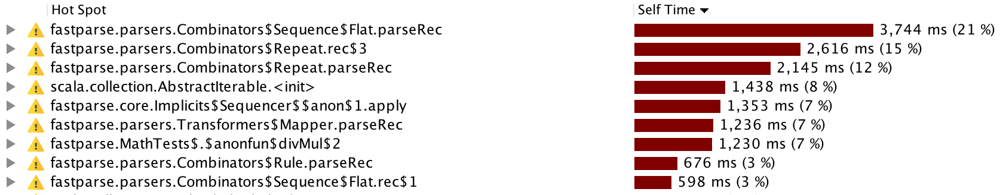
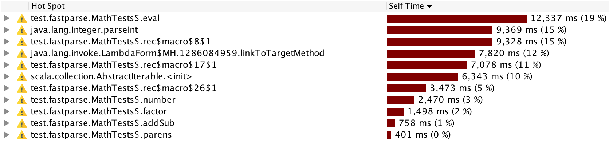

This blog post introduces [Fastparse 2](http://www.lihaoyi.com/fastparse/), a
new major version of the FastParse parser-combinator library for Scala. In
exchange for some minor tweaks in the public API FastParse 2 gives you parsers
that run 2-4x faster on real-world parsers than FastParse 1. This brings
Fastparse - already one of the fastest Scala parsing libraries - close to the
speed of hand-written parsers.

This blog post will demonstrate the small difference in usage and large
difference in performance between Fastparse 1 and Fastparse 2, explore how the
major changes to Fastparse's internals enable such an improvement, and discuss
some other improvements in usability that appeared in the transition.

-------------------------------------------------------------------------------

Fastparse 1 provides a way to very easily define recursive-descent parsers in
the Scala programming language. For example, here is a complete arithmetic
expression parser written in a few lines of Scala:

```scala
def eval(tree: (Int, Seq[(String, Int)])): Int = ???

import fastparse.all._

val number = P( CharIn('0' to '9').rep(1).!.map(_.toInt) )
val parens = P( "(" ~/ addSub ~ ")" )
val factor = P( number | parens )

val divMul: P[Int] = P( factor ~ (CharIn("*/").! ~/ factor).rep ).map(eval)
val addSub: P[Int] = P( divMul ~ (CharIn("+-").! ~/ divMul).rep ).map(eval)
val expr: P[Int]   = P( addSub ~ End )
```

From this, you can just call `.parse` on any of the parser objects, pass in the
string you want to parse, and it spits out the parsed (and in this case
evaluated) output:

```scala
val Parsed.Success(2, _) = expr.parse("1+1")
val Parsed.Success(15, _) = expr.parse("(1+1*2)+3*4")
val Parsed.Success(21, _) = expr.parse("((1+1*2)+(3*4*5))/3")
val Parsed.Failure(expected, failIndex, extra) = expr.parse("1+1*")
assert(expected == (number | parens), failIndex == 4)
```

Fastparse parsers easily take 1/10th as much code as a hand-written recursive
descent parser to implement. Compared to parser-generator tools like ANTLR or
Lex/Yacc, Fastparse doesn't require any special build or code-generation step:
Fastparse parsers are simply objects you define directly in your code and call
methods on. This makes Fastparse much easier to get started with than with the
more traditional parser generator tools.

In exchange for this convenience, Fastparse has a performance penalty over
hand-written or generated parsers: anywhere from 4-10x slower. While this is not
ideal, it is often good enough, as parsing is rarely the bottleneck in your
computations.

Fastparse 2 changes the public API slightly from Fastparse 1, meaning the above
parser needs to be written as:

```scala
import fastparse._, NoWhitespace._

def number[_: P] = P( CharIn("0-9").rep(1).!.map(_.toInt) )
def parens[_: P] = P( "(" ~/ addSub ~ ")" )
def factor[_: P] = P( number | parens )

def divMul[_: P]: P[Int] = P( factor ~ (CharIn("*/").! ~/ factor).rep ).map(eval)
def addSub[_: P]: P[Int] = P( divMul ~ (CharIn("+\\-").! ~/ divMul).rep ).map(eval)
def expr[_: P]: P[Int]   = P( addSub ~ End )
```

Note the different imports, how `val`s have changed into `def`s, the `[_: P]`
syntax at every definition, and the slightly different syntax for calling
`CharIn` (`"0-9"` vs `'0' to '9'`). I will go into more detail into these
changes later, but you can see that the bulk of the parser code, as well as it's
overall structure, are unchanged.

The usage-site syntax for the parsers has also changed slightly, from
`foo.parse("...")` to `parse("...", foo(_))`:

```scala
val Parsed.Success(2, _) = parse("1+1", expr(_))
val Parsed.Success(15, _) = parse("(1+1*2)+3*4", expr(_))
val Parsed.Success(21, _) = parse("((1+1*2)+(3*4*5))/3", expr(_))
val Parsed.Failure(expected, failIndex, extra) = parse("1+1*", expr(_))
```

There are changes between the two versions, but relatively small ones. What kind
of performance difference do we see between Fastparse 1 and Fastparse 2? To do
this, we can easily run a simple benchmark seeing how fast parsers written using
both versions can parse some sample data, e.g. the `"((1+1*2)+(3*4*5))/3"` input
above. This gives us:

- Fastparse 1: 309,688 iterations/second
- Fastparse 2: 646,644 iterations/second

That's a 2.1x improvement from Fastparse 1 to Fastparse 2, on what is basically
the same code! This is a relatively simple parser where Fastparse 1 performs the
best: we can take a look at other parsers implemented using Fastparse to have a
better view of how the two versions compare when used to write more complex,
real-world parsers.

## Performance

The following table compares the performance of parsers written for real
programming languages written using Fastparse 1 and 2, on when parsing some
real-world input (numbers are number of iterations parsing an arbitrary
benchmark, average of 5 runs, bigger numbers is better)

| Parser         | Fastparse 1 | Fastparse 2 | Speedup |
|:---------------|------------:|------------:|--------:|
| Json Parser    |         551 |        1165 |    2.11 |
| Python Parser  |         150 |         361 |    2.41 |
| Jsonnet Parser |        1215 |        5378 |    4.43 |
| CSS Parser     |         149 |         626 |    4.20 |
| Scala Parser   |          90 |         288 |    3.20 |

In all cases, the parser code is roughly identical: like the arithmetic math
parser shown above, it required some tweaks to support Fastparse 2, but was
basically the same code in both cases. For simpler parsers like the arithmetic
parser or the JSON parser we see a ~2x speedup, but for more complex parsers
like Jsonnet, CSS or Scala we see speedups ranging from 3x to 4x and beyond.

The above table compares Fastparse 1 and Fastparse 2, but how does Fastparse 2
compare to the non-Fastparse parsers used in the real world? Comparing JSON
parsers specifically, here is a comparison of the times taken to parse JSON into
an AST for the Fastparse 2 JSON parser and a variety of popular, purpose-built
JSON parsers:

| Parser                               | Timing |
|:-------------------------------------|-------:|
| Fastparse 2 JSON Example Parser      |   1595 |
| Circe Parser                         |   3324 |
| Argonaut Parser                      |   1491 |
| uJson Parser                         |   2666 |
| Json4s Parser                        |   1009 |
| Play JSON Parser                     |   2266 |
| Scala Parser Combinators JSON Parser |      9 |


Note that the parsing work isn't exactly equivalent: Circe, for example, avoids
parsing numbers during the initial parse, leaving them as strings for later
processing. However, it shows roughly where things stand: the Fastparse 2 JSON
parser (37 lines of code) is within a factor of 2 of the fastest hand-written
JSON parsers in the Scala community such as Circe (~600 lines, include Jawn) and
uJson (~600 lines), edges out parsers for popular projects like Argonaut (~240
lines) and Json4s (~300 lines), and leaves scala-parser-combinators in the dust
by a factor of 177 (~120 lines, including the lexer).

Similar numbers can be seen comparing the ScalaParse Scala parser (731 lines)
with that of the Scala compiler's parser (~6500 lines):

| Parser                        | Timing |
|:------------------------------|-------:|
| Fastparse 2 ScalaParse Parser |    203 |
| Scalac Parser                 |    754 |

Or the PythonParse Python parser (664 lines) with that of the Jython parser
(~3700 lines of ANTLR):

| Parser                         | Timing |
|:-------------------------------|-------:|
| Fastparse 2 PythonParse Parser |    406 |
| Jython Parser                  |    472 |

In all these cases, we can see that the Fastparse 2 parsers are competitive with
hand-written, production-quality parsers in speed: at worst Fastparse 2 is
within a small factor slower than the reference parser. In all cases, the
Fastparse 2 parser is ~1/10 the lines of code as the production parser, making
it that much easier to write, debug, and maintain.

### Direct Execution

The biggest difference between the two versions of Fastparse is the move from
the interpreter pattern to a more direct-style execution model. Parsing in
Fastparse 1 is a two stage process:

1. Evaluate the `val`s to construct your tree of `Parser[T]` objects, with each
   parser object having a reference to any nested parser objects. e.g., a
   `Repeat[T]` parser would have a reference to the `Parser[T]` that it is
   repeating.

2. Call `.parse` on the top-level `Parser[T]` object (which recursively calls
   `.parse` on all the smaller parser objects) to parse the input

Fastparse 2, in comparison, has a one stage parsing process:

1. Call the top-level parser `def` method (which recursively calls all the
  smaller parser methods) to parse the input

This difference in execution model is significant, even ignoring the time spent
constructing the `Parser[T]` objects (which is the case in the above
benchmarks), and even though if in both cases the parsers are roughly running
the same logic (i.e. the contents of `.parse` method in Fastparse 1 is the same
as the contents of the `def`s in Fastparse 2).

Much of it comes down to optimizability. There are two main things that might
try to help optimize your parser:

- The Scala compiler

- The Java Virtual Machine's just-in-time (JIT) compiler

Both optimizers would be unable to help much optimizing the `.parse` methods
called by Fastparse 1:

- The Scala compiler because it doesn't know at compile-time *which* `.parse`
  method to call until the parser is constructed at runtime. The code that gets
  executed at when you call `.parse` isn't present when you *write* your parser,
  but instead scattered throughout the various `.parse` methods compiled
  before-hand and wired together at runtime.

- The JVM because every time `.parse` is called, which implementation actually
  needs to be run depends on which exact `Parser[T]` *instance* you called
  `.parse` on, rather than on which *piece of code* is calling `.parse`. The JVM
  is only good at optimizing the latter.

The problem with JVM optimizations is interesting: there is no reason in
principle why the JVM *can't* figure out that the method-implementation-to-run
always depends on the instance it's being called on, and optimizing accordingly,
but right now it *doesn't*. There is novel work in the
[Truffle/Graal](https://github.com/oracle/graal/tree/master/truffle) project to
effectively optimize this sort of structure, though still at a highly
experimental stage.

### Inlining

Fastparse 2 performs heavy ahead-of-time inlining during compilation, using
macros. Consider an example parser method from the above arithmetic parser:

```scala
def number[_: P] = P( CharIn("0-9").rep(1).!.map(_.toInt) )
```

Without inlining this would be implemented as 6 different method calls: the
`P()` method, the `CharIn` method, the `.rep(1)` method, the `.!` method, the
`.map` method, and the `_.toInt` function literal passed to `.map`. Normally all
this indirection results in overhead: though the JVM will try its best to
optimize it at runtime, for a variety of reasons it still wouldn't end up as
fast as simple, hand-written code with loops and index-variables specialized for
the task.

Fastparse 2 automatically inlines all the operations here, resulting in a single
method with roughly the following body:

```scala
def number[_: P] = {
  val ctx = P.current
  val captureStart = ctx.index
  
  var count = 0
  var looping = true

  while(continue){
    if (ctx.index >= ctx.input.length) looping = false
    else {
      val c = ctx.input.charAt(ctx.index)
      if (!('0' <= c && c <= '9')) looping = false
      else {
        looping = true
        ctx.index += 1
      } 
    }
    count += 1
  }
  
  if (count < 1) { 
    ctx.isSuccess = false
    ctx.index = captureStart
  }else{
    ctx.isSuccess = true
    ctx.index = index
  }
  if (ctx.isSuccess) ctx.successValue = ctx.input.slice(captureStart, ctx.index)
  if (ctx.isSuccess) ctx.successValue = ctx.successValue.toInt
}
```

The above is slightly simplified, but it roughly illustrates what Fastparse 2
does when it inlines the code: you can see the `CharIn` logic (`'0' <= c && c <=
'9'`) embedded within the `.rep` loop, embedded within the `.!`
substring-capturing logic (`ctx.input.slice(captureStart, ctx.index)`), and so
on. This means that rather than calling a forest of different functions,
Fastparse 2 ends up generating code not too different from what you would see if
you wrote the parsing code by hand, efficiently consuming character by character
from the input.

By aggressively inlining code at compile-time, Fastparse 2 avoids the overhead
that normally comes with convenient parser-combinator-style APIs, and ensures
that what ends up running is remarkably close to what someone may write by hand,
giving both great performance and concise, easy-to-read code.

## Partial Evaluation

Fastparse does some cleverness during inlining: if it knows the some input to
your parser (e.g. it's a string literal), it is able to pre-compute exactly what
code it needs to generate at runtime to do it's job. For example, consider the
change from Fastparse 1's:

```scala
val myParser = P( CharIn('0' to '9') )
```

To Fastparse 2's:

```scala
def myParser[_: P] = P( CharIn("0-9") )
```

While the syntax is slightly different, using `"0-9"` instead of `'0' to '9'`,
this lets Fastparse 2 provide most of the same convenience of Fastparse 1.
Furthermore, Fastparse 2 is able to inspect the string at compile time and
generate code to match *exactly* those characters:

```scala
def myParser[_: P] = P{
  val ctx = P.current
  if (ctx.index >= ctx.input.length) ctx.isSuccess = false
  else {
    val c = ctx.input(ctx.index)
    ctx.isSuccess = '0' <= c && c <= '9'
    ctx.index += 1
  }
}
```

This allows `CharIn` call to evaluate much faster than a normal function: rather
than needing to inspect the range input range at runtime (`'0' to '9'`) and then
seeing if the character matches, the macro generates exactly the code necessary
to check if there's a match. This cuts out unnecessary checks and logic leaving
only the bare-minimum of code necessary to consume the character.

There are many other cases where Fastparse 2 performs this partial evaluation:
when matching string literals, if the string is known at compile time:

```scala
def myParser[_: P] = P( "hello" )
```

A "typical" implementation of such a parser would be to check if the input
starts with the relevant string using `.startsWith`, which internally loops over
the characters of the string, and then incrementing the parse index by
`.length`:

```scala
def myParser[_: P] = P{
  val ctx = P.current
  if (ctx.input.startsWith("hello", ctx.index)) {
    ctx.index = ctx.index + "hello".length
    ctx.isSuccess = true
  } else {
    ctx.isSuccess = false
  }
}
```

But if Fastparse can see that `"hello"` is a literal, it simply compares the
characters directly:

```scala
def myParser[_: P] = P{
  val ctx = P.current
  val i = ctx.index
  val input = ctx.input
  if (i + 5 < input.length && 
      input(i) == 'h' && 
      input(i+1) == 'e' && 
      input(i+2) == 'l' && 
      input(i+3) == 'l' && 
      input(i+4) == 'o') {
    ctx.index = ctx.index + 5
    ctx.isSuccess = true
  } else {
    ctx.isSuccess = false
  }
}
```

Thus avoiding all the machinery of calling into `.startsWith`, looping over the
characters, keeping track of the loop index, etc..


## Debugging & Profiling

Fastparse 2 isn't just faster than Fastparse 1, but it is also much easier to
debug and profile to understand the runtime behavior of your parser.

Fastparse 1 has always provided a `.log` method, that wraps a parser and prints
out helpful logging every time that parser starts and finishes:

```scala
def DeepFailure[_: P] = P( "C" ).log
def Foo[_: P] = P( (DeepFailure | "A") ~ "B".!).log

parse("AB", Foo(_))
// +Foo:1:1, cut
//   +DeepFailure:1:1
//   -DeepFailure:1:1:Failure(DeepFailure:1:1 / "C":1:1 ..."AB")
// -Foo:1:1:Success(1:3, cut)
```

However, other than `.log`, adding `println`s in Fastparse 1's parsers is pretty
difficult: you cannot, for example, add a `println` as follows:

```scala
val DeepFailure = P{
  println("Start of DeepFailure")
  "C" 
}
```

This is because the `println` will run at parser *instantiation* time, and not
at parser *execution* time: when you actually want to see what's going on.

Similarly, profiling parsers was also difficult: if you attached a profiler to
the arithmetic math parser shown earlier, you would see a trace that looks as
follows:



While this tells you that the `Combinators$Repeat` parsers (`foo.rep`) and
`Combinators$Sequence` parsers (`foo ~ bar`) are taking up all the time, it
doesn't tell you *which* of the `.rep`s and `~`s in your codebase those are!

The basic issue here is that the separation between parser instantiation time
and execution time causes issues with many common workflows: you are likely more
used to writing & debugging *code that does things*, rather than writing &
debugging *code which creates an immutable object-hierarchy which is then
interpreted to do things*. All the workflows & techniques that work in the
former do not work in the latter!

In Fastparse 2, thanks to it's direct execution model, you can in fact add
`println`s to your parser when it starts:

```scala
def DeepFailure[_: P] = P{
  println("Start of DeepFailure")
  "C" 
}
```
When it completes:

```scala
def DeepFailure[_: P] = {
  val res = P( "C" )
  println("Start of DeepFailure")
  res 
}
```

And you can even print miscellaneous metadata about the ongoing parse to help
you figure out what is going on:

```scala
def DeepFailure[_: P] = P{
  println(P.current.index)
  "C" 
}
```

Attaching a profiler in Fastparse2 is also much more informative:



Here, rather than seeing mysterious profiles of `Combinators$Repeat` and
`Combinators$Sequence`, we can now see clear profiles of the time taken in
`eval`, `number`, `factor`, etc.. This should make it much easier to profile
your Fastparse 2 parsers and figure out how to make them faster.

In general, Fastparse 2 plays much better than miscellaneous tools and workflows
than Fastparse 1. Fastparse 2 parsers are just plain methods rather than special
`Parser[T]` objects, and all your standard ways of working with
just-plain-methods now applies to your parsers.


## Conclusion

While Fastparse 2 is a bottom-up re-implementation of Fastparse's internals, it
is still very compatible with Fastparse 1: The entire Fastparse 1 test suite
passes on Fastparse 2 with the same sort of minor syntactic changes we saw
above. This even includes the large, complex parsers like the Python parser, CSS
Parser, or Scala parser that we used in the comparison benchmarks. If you have a
parser written using Fastparse 1, you should be able to port it to Fastparse 2
with only minor syntactic updates.

Fastparse 2 is a big step forward in performance and usability over Fastparse 1.
While Fastparse 1 was already the fastest & most usable parsing library
available for Scala, Fastparse 2 is another 2-4x speedup with further
improvements in usability and debuggability. Fastparse 2 brings fastparse
parsers ever closer in performance to hand-written parsers, and broadens the
feasibility of Fastparse to ever more general-purpose and high-performance use
cases.

Fastparse 2 has already been rolled out, is available on maven central, and and
is heavily used in the latest releases of projects such as
[Ammonite](https://github.com/lihaoyi/Ammonite),
[Sjsonnet](https://github.com/lihaoyi/sjsonnet) and
[Mill](https://github.com/lihaoyi/mill). If you ever find yourself needing to
parse some textual input into structured data, give Fastparse a try!