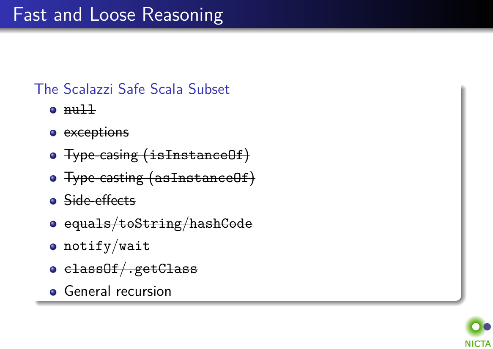

This post explores how you can make use of the type-safety of the Scala 
programming language to help catch the mistakes you make when writing 
Scala programs.

While Scala is has a compiler that can help you catch errors, and many call 
it "type-safe", there is in fact a whole range of ways you can write Scala 
that provide greater- or lesser- amounts of safety. We will discuss various 
techniques that you can use to shift your code to the "safer" side of the 
spectrum. We'll consciously ignore the theoretical side of things with it's
absolute proofs and logic, and focus on the practical side of how to make 
the Scala compiler catch more of your dumb bugs.

This is the third in the Strategic Scala Style series (after 
[Principle of Least Power] and [Conciseness & Names]). 

[Principle of Least Power]: StrategicScalaStylePrincipleofLeastPower.html
[Conciseness & Names]: StrategicScalaStyleConcisenessNames.html

-------------------------------------------------------------------------------

There are many facets to the term *Type Safety*. You could spend an 
entire career studying the theoretical foundations for the type-systems 
of the Haskell or Scala programming languages, and could spend *another* 
entire career studying the implementation of types inside the Haskell 
runtime or the Java Virtual Machine. We will ignore both those fields.
 
Instead, this post explores the practical side of how to use the Scala 
language in a "type safe" way, where the compiler's knowledge of *Types* 
lets you mitigate the consequences of your mistakes, often turning them 
into straightforward-to-fix-during-development compilation errors, thus
provides *Safety* in developing your code. An experienced Scala programmer
will likely find everything in this post "basic" or "obvious", but anyone 
less experienced will hopefully find these useful techniques to add to the
toolbox they use for solving problems in Scala.

Each of the techniques described here will have trade-offs: added verbosity,
complexity, extra class files, poorer runtimes performance. We'll ignore 
those trade-offs for this post, as usually they're pretty clear. This post
will only enumerate the possibilities, and not go into deep discussions on
whether the trade-offs are worth it. Furthermore, this post only applies
to *Vanilla Scala*, and not extensive third-party libraries like 
[Scalaz](https://github.com/scalaz/scalaz)
or [Cats](https://github.com/typelevel/cats) or 
[Shapeless](https://github.com/milessabin/shapeless). Those libraries would
have their own idioms or techniques that deserve their own post, if someone
with expertise is willing to write it up!

Like the [other][Principle of Least Power] [two][Conciseness & Names] posts 
in this series, hopefully none of the guidelines will be too controversial, 
and I aim to document what people experienced with the Scala language may
count as "common sense". Hopefully this post will lay a foundation
of common principles that people share and basic techniques to be aware of,
which you can combine with your own project-specific guidelines, preference 
and judgement when designing your Scala programs. 

- [Fundamentals](#fundamentals)
    - [What is a Type?](#what-is-a-type)
    - [What is Safety?](#what-is-safety)
    - [What is Type-safety?](#what-is-type-safety) 
- [Scalazzi Scala](#scalazzi-scala)
    - [Avoid Null](#avoid-null)
    - [Avoid Exceptions](#avoid-exceptions)
    - [Avoid Side Effects](#avoid-side-effects)
    - [Limitations of Scalazzi Scala](#limitations-of-scalazzi-scala)
- [Structured Data](#structured-data)
    - [Avoid Strings in favor of Structured Data](#avoid-strings-in-favor-of-structured-data)
    - [Encode Invariants in Types](#encode-invariants-in-types)
- [Self-describing Data](#self-describing-data)
    - [Avoid Integer Enums](#avoid-integer-enums)
    - [Avoid String Flags](#avoid-string-flags)
    - [Box Integer IDs](#box-integer-ids)
- [Conclusion](#conclusion)


## Fundamentals

Before we discuss concrete techniques and tradeoffs around type-safety, 
it makes sense to step back for a moment and ask what this is all about. 
What is a type? What does it mean to be "safe"? 

### What is a Type?

**A *Type* is something you know about a value in our program at compile 
time.** 

Basically every programming language has a different type-system. Some 
have generics, some have reified generics. Some, like Java, have reified 
types, where the "type" of a value always corresponds to a class or 
interface can be checked at runtime. Others, like C, don't. Dynamic 
languages like Python do not have static types, and so a type *only* 
exists at runtime. 

The Scala language, that this post is about, has its own, relatively 
complex, ad-hoc type-system. There are also some attempts to formalize 
it, e.g. in the [Dotty project]. This post will ignore all of that.

For this post, I will be using the definition above. A *Type* is 
something you know about a value in your program at compile-time. For 
example: 

- Something which is an `Int` definitely contains a 32 bit integer from
  `-2147483648` to `2147483647`
- Something which is a `Option[T]` definitely contains either a 
  `Some[T]`, or `None` 
- Something which is a `CharSequence` definitely contains `Char`s and 
  lets me call `.length`, `.chatAt`, and `.subsequence` methods, but 
  i don't know whether it is a `String`, a 
  `StringBuffer`, or something else. You don't know if it's mutable or 
  immutable, how it stores its contents, or what the performance 
  characteristics are. 
- Something which is a `String` also has characters, but you know it's 
  immutable, stores its contents in an internal array of characters, and 
  has O(1) lookup to look up `Char`s by index 

The type of a value tells you both what something can be, and what it 
cannot be. A `Option[String]` can be `Some` or `None`, but it *cannot* 
be a 32 bit integer! In Scala, this is not something you need to check 
in your code: it is something you can rely on being correct, with the 
compiler checking for you during compilation. 

This knowledge is exactly what comprises the "Type" of a value.

### What is a Type not?

#### A Class

By this definition, a type is not a class. Yes, in Java, and Scala on 
the JVM, all types are represented by classes (or interfaces). This does 
not hold true in e.g. [Scala.js], where you can define types to be 
synthetic (`trait`s extending `js.Any`) with no remnants left behind to 
inspect after everything is compiled, or in other programming languages. 

While the types being backed by classes is a true fact, it is an 
implementation detail that is mostly irrelevant to this post. 

#### The Scala Type System

The idea of a "Type" we discuss here is vague, broad, and applies to 
more languages than just Scala. [Scala's own type system] is complex, with 
classes, abstract types, refinement types, traits, type-bounds, context 
bounds, and other even more obscure things. 

From the perspective of this post, these all are details that serve the 
same purpose: to let you describe to the compiler things you know about 
the values in your program, and let it check that what you're doing is 
consistent with what you said you wanted to do.

### What is Safety?

***Safety* means that when you make a mistakes, the consequences are minor.**

There are probably even more definitions of Safety than there are of 
Types. The above definition is broader than types: it applies to 
security practices, isolation, robustness & resilience in distributed 
systems, and many other things. 

People make all sorts of mistakes: typos in code, poor load-estimation, 
copy-pasting the wrong command. When you make a mistake, what happens? 

- You see a red squiggly in your editor and fix it in 5 seconds
- You want for a full compile, taking 10s, then fix it
- You run the test suite, which takes 10s, then fix it
- You deploy the mistake, notice the bug a few hours later, fix it, and 
  deploy the fix
- You deploy the mistake, the bug goes un-noticed for weeks, and even 
  when noticed and fixed it takes weeks to clean up the mess of 
  corrupted data that it left behind 
- You deploy the mistake, and [find your company totally bankrupt 45    
  minutes later][Knight Case Study]. Your job, your team, your organization 
  and plans, all gone. 

Ignoring the idea of "types" and "compile time", it is obvious that 
different environments have different levels of safety. even runtime 
errors can have smaller impact if caught early and are easy to debug, 
making Python's habit of throwing `TypeError` at runtime when something 
doesn't match significantly "Safer" than PHP's habit of coercing 
values when things don't match (which tends to mask/hide problems 
resulting in data-corruption and obscure/hard-to-trace bugs). 

### What is Type Safety?

**Type-safety is making use of what we know of our values at compile-time 
to minimize the consequences of most mistakes.** 

For example, one "minor consequence" could be seeing an 
easy-to-understand compile error during development, and taking 30s to 
fix it. 

This definition follows straightforwardly from our definitions of 
"Types" and "Safety" above. It is significantly broader than most 
definitions of type-safety. In particular: 

- Type-safety is *not* writing Haskell; the idea is much broader than 
  that. 
  
- Type-safety is *not* avoiding mutable state, unless it contributes to 
  our goal stated above.
   
- Type-safety is *not* an absolute to reach, but a property to try and 
  optimize
   
- Type-safety is *not* the same for everyone; if different people tend 
  to make different sorts of mistakes, and their mistakes have different 
  levels of harm, they should optimize for different things to try and 
  minimize the overall harm of those mistakes.
  
- Even compile errors can have serious consequences if the 
  error-messages are inscrutable and resolving them is difficult! A nice
  compile error that you can fix in 10 seconds is different from a
  [humongous compile error] that might take you half an hour to understand
  before you can fix it

There are a wide variety of definitions of type-safety; if you ask 
a developer working in C++, a web developer writing Python, and a 
professor studying programming-languages, each one will have their own 
distinct definition. For this post, we will use the arbitrary, broad 
definition above:

**Type-safety is making use of what we know of our values at compile-time 
to minimize the consequences of most mistakes.** 

## Scalazzi Scala

Many people have thought a lot about how to write Scala in a way that is 
"type safe". The so-called "[Scalazzi Subset]" of the Scala language is 
one of those philosophies:



While there is a lot to discuss about these guidelines, we'll spend time 
reviewing a few of them I find the most interesting: 

- [Avoid Null](#avoid-null)
- [Avoid Exceptions](#avoid-exceptions)
- [Avoid Side-effects](#avoid-side-effects)
 
### Avoid Null

It is very tempting to use `null` to represent some data that is 
missing, un-initialized, or not available, e.g. as an uninitialzied value
 
```scala
class Foo{
  val name: String = null // override this with something useful if you want
}
```

Or a "no value" argument to pass into a function 

```scala
def listFiles(path: String) = ...

listFiles("/usr/local/bin/")
listFiles(null) // no argument, default to current working directory
```

[Scalazzi Scala](#scalazzi-scala) tells us to avoid doing this, and for 
good reason:

- `null`s can *appear anywhere* in your program, in any variable or 
  value, and there is no way to control what variable is or is-not 
  `null` 
   
- `null`s *propagate* throughout your program: you can pass `null`s 
  into functions, assign them to other variables, and store them in 
  collections.
   
Together, this means that `null` values tend to cause errors far away 
from where they where initialized, and are difficult to track down. When 
something blows up with a `NullPointerException`, you have to first find 
the misbehaving variable (there may be many variables in use in a single 
line of code!) and then trace it through as it gets passed in and out of 
functions and stored-in/retrieved-from collections, until you can figure 
out where the `null` initially came from.

In a dynamic language like Python, this sort of accidental 
wrong-value-propagation is common, and it's not unusual to spend hours 
tracing through the program, adding `print`-statements everywhere, 
trying to figure out where an invalid value came from. Often it's as simple
as someone mixing up the arguments to a function, passing in `user_id` 
instead of `user_email` or something equally trivial, but nonetheless it takes
a significant effort to track down and fix.

In a compiled language with a type-checker, like Scala, many such mistakes 
are caught before you even run your code by the compiler: passing in an 
`Int` or a `Seq[Double]` where a `String` is expected results in a 
type-error. Not all things are caught, but many of the more egregious 
mistakes are. Except for passing in `null` when no-`null` was expected.

Here are some alternatives to `null`s:

**If you are trying to represent a value that may-or-may-not exist, 
whether are a function argument or as a class attribute to override**:

```scala
class Foo{
  val name: String = null // override this with something useful if you want
}
```
Consider using an `Option[T]` instead:

```scala
class Foo{
  val name: Option[String] = None // override this with something useful if you want
}
```

`Some("foo")` and `None` instead of `"foo"` and 
`null` seems similar, but by doing so everyone knows it can be `None`, 
and unlike with `null`s you get a compilation error if you try to put 
the `Some[String]` somewhere a `String` was expected.

**If you are using `null` in a `var` as a placeholder for an 
un-initialized variable**

```scala
def findHaoyiEmail(items: Seq[(String, String)]) = {
  var email: String = null // override this with something useful if you want

  for((name, value) <- items){
    if (name == "Haoyi") email = value
  }
  
  if (email == null) email = "Not Found"
  doSomething(email)
}
```
Consider how you could replace it with a 
`val` and declare-and-initialize it all at one go. 

```scala
def findHaoyiEmail(items: Seq[(String, String)]) = {
  val email = 
    items.collect{case (name, value) if name == "Haoyi" => value} 
         .headOption
         .getOrElse("Not Found")
  doSomething(email)
}
```

Even if you can't initialize the `email` value in a single expression,
Scala lets you put arbitrary code inside curly `{...}`s when declaring a 
`val`, so in most cases any code you were going to use to initialize your 
`var` "later" you should be able to place inside the `{...}`s to 
declare-and-initialize your `val` at one go.

```scala
def findHaoyiEmail(items: Seq[(String, String)]) = {
  val email = {
    ...
  }
  doSomething(email)
}
```

And in doing so, we manage to prevent `email` from ever becoming `null`.


By simply avoid `null` in your program, you do not change the 
*theoretical* situation: in theory someone could pass in `null` and you 
would be in the same spot tracing down hard-to-debug problems. But you 
change the *practical* environment: you spend much less time tracing 
down hard-to-debug `NullPointerException`s. Every once in a while you 
still do (due to `null`s appearing due to initialization order, or 
third-party libraries using `null`s) but on *overall* the consequences 
for making mistakes tends to be lower. More bugs become
straightforward compilation errors to fix during development, rather than 
expensive runtime exceptions to track down.

### Avoid Exceptions

Exceptions are basically additional return-values for a piece of code. 
Any code you write can return the "normal" way via the `return` keyword 
or simply returning the last expression in a block, or it could throw an 
exception. And that exception can contain arbitrary data. 
 
While other languages like Java have tried to have the compiler check 
that you make sure to catch the exceptions that can be thrown, their 
"checked exceptions" feature has generally not been a success: the 
inconvenience of having to declare what checked exceptions you throw 
often leads to people just declaring their methods to have a blanket 
`throws Exception`, or to catch the checked exceptions and re-throw them 
as un-checked runtime exceptions. Later languages like C# or Scala have 
dropped the idea of checked exceptions entirely.

Why shouldn't you use exceptions?
 
- You have no way of statically knowing all the different kinds of 
  exception a piece of code can throw. You thus don't know if you've 
  handled all the possible "return" cases for that code 

- Annotations for what exceptions you throw are optional and trivially 
  fall out of sync with reality as development happens and refactorings 
  occur. 

- They propagate, so even if a library you're using has gone through the 
  discipline of annotating all its methods with the exceptions they 
  throw, the chances are in your own code you'll get sloppy and won't 
   
As a replacement for exceptions, you can return `Option[T]` to represent 
the result of a function with only one failure mode, or `Either[T, V]` 
or your own custom sealed-trait hierarchy to represent results with more 
than one failure mode:
 
```scala
sealed trait Result
case class Success(value: String) extends Result
case class InvalidInput(value: String, msg: String) extends Result
case class SubprocessFailed(returncode: Int, stderr: String) extends Result
case object TimedOut extends Result

def doThing(cmd: String): Result = ???
```

Using a sealed trait hierarchy, you can easily communicate to the user
exactly what failure modes exist, what data is available in each case, and
the compiler will provide a warning if the user failed to handle a case when
they `match` on the result of `doThing`.

In general, though, you will never get rid of *all* exceptions: 

- Any non-trivial program has enough different failure modes that it's 
  impractical to list them out exhaustively

- Many are uncommon enough that you actually do want to catch them in 
  bulk and handle generic "something went wrong" behavior to e.g. log or 
  report them, or re-try the logic, even if you don't know exactly what 
  caused it. 

- For these uncommon failure modes, logging them with debugging 
  information so you can examine them manually is the best you can do, 
  and exceptions with their stack-trace generation do it by default.
   
However, even with a stack trace, figuring out why un-wanted exceptions 
keep appearing takes significantly more time than seeing compile-errors 
due to trying to use an `Option[T]` where a plain-old `T` is desired. 

Programming in Scala is living in a world with exceptions: 

- `NullPointerException`s
- `MatchError`s from bad pattern matches
- `IOException`s for any sort of arbitrary filesystem or network failure
- `ArithmeticException`s when you divide by 0
- `IndexOutOfBoundsException` when you mess up your arrays 
- `IllegalArgumentException` when you mis-use third-party code

And many more! Nevertheless, just because they are everywhere 
doesn't mean you should add to the problem. In your own code, avoid 
using exceptions to improve type-safety and give the compiler more chances 
to catch your mistakes when you forget to handle failure cases in your 
`Option[T]`s or `Either[T, V]`s or `sealed trait` data types.
 
### Avoid Side Effects

Side effects are, at least in Scala, not tracked by the compiler. While 
they superficially don't have anything to do with "types", it can be 
argued that they undermine the type-safety we've defined 
[above](#what-is-type-safety). 

As an example, let's consider a piece of code like: 
 
```scala
var result = 0

for (i <- 0 until 10){
  result += 1
}

if (result > 10) result = result + 5 

println(result) // 50
makeUseOfResult(result)
```

While simpler than what happens in real codebases, it illustrates the 
point: we initialize `result` to some placeholder value, and then use 
side-effects to modify `result` to get it ready for the 
`makeUseOfResult` function which presumably does something important we 
care about.
 
There are many things that can go wrong. You could accidentally leave 
out one of the mutations 

```scala
var result = 0

for (i <- 0 until 10){
  results += 1
} 

println(result) // 45
makeUseOfResult(result) // getting invalid input!
```

This may seem like an "obvious" mistake, but when the snippet is 1000 
lines instead of 10, it's an easy mistake to make in the middle of a 
refactoring effort. It means that `makeUseOfResult` gets invalid input 
and might do the wrong thing. Here's another, equally common failure 
mode: 

```scala
var result = 0

foo()

for (i <- 0 until 10){
  results += 1
}

if (result > 10) result = result + 5 

println(result) // 50
makeUseOfResult(result)

...

def foo() = {
  ...
  makeUseOfResult(result)
  ...
}
```

Here, instead of accidentally botching the initialization code during a 
refactoring, we are accidentally making use of the `result` variable 
before it's finished being initialized! Maybe we're using it indirectly, 
in this example through the `foo()` helper, but the effect is the same: 
at some point in our program, we'll "see" `result` having the *wrong* 
value, and later on we'll see it having a different, *right* value.

In this case, a "solution" would be to eliminate the side effects, and 
giving the different "stages" of `result` different names:

```scala
val summed = (0 until 10).sum

val result = if (summed > 10) summed + 5 else summed

println(result) // 50
makeUseOfResult(result)
``` 

Although equivalent when done correctly, it is immune to the two 
accidental failure-modes shown above. Accidentally leaving out one stage 
in the computation results in a compile error:

```scala
val summed = (0 until 10).sum

println(result) // Compilation Failed: not found: value result
makeUseOfResult(result)
``` 

And similarly using `result` before it's ready, *even indirectly*, 
results in a compilation error:

```scala
foo() 

// Compilation Failed:  
// forward reference extends over definition of value summed
val summed = (0 until 10).sum

val result = if (summed > 10) summed + 5 else summed

println(result) // 50
makeUseOfResult(result)

def foo() = {
  
  makeUseOfResult(result)
  
}
def makeUseOfResult(i: Int) = ()
```

Although these may not be considered "type errors" in the sense of a 
value's type not lining up with an expected type, it *is* a case of the 
compiler using its knowledge of the code to catch our mistakes and 
making them easy to fix early, minimizing their impact. That definitely 
falls under the extra-broad umbrella of *Type Safety* we defined 
[earlier](#what-is-type-safety). 
 

### Limitations of Scalazzi Scala

Here's some code that is perfectly valid 
[Scalazzi Scala](#scalazzi-scala) as defined above, but will definitely 
upset people if it appeared in a code review:
 
```scala
def fibonacci(n: Double, count: Double = 0, chain: String = "1 1"): Int = {
  if (count >= n - 2) chain.takeWhile(_ != ' ').length
  else{
    val parts = chain.split(" ", 3)
    fibonacci(n, count+1, parts(0) + parts(1) + " " + chain)
  }
}
for(i <- 0 until 10) println(fibonacci(i))
1
1
1
2
3
5
8
13
21
34
```

This code is correct, and follows the [Scalazzi Scala](#scalazzi-scala)
guidelines to the letter: 

- No `null`
- No exceptions 
- No `isInstanceOf` or `asInstanceOf` 
- No side-effects and all values are immutable 
- No `classOf` or `getClass` 
- No reflection

Yet most people would agree it's terrible, unsafe code. Why is that? The 
answer lies in [Structured Data](#structured-data)...

## Structured Data

Not all data has the same "shape": if you have some data containing 
pairs of `(name, phone-number)`, there are a variety of ways you can 
store them: 

- In a `Array[Byte]`: this is the format that the filesystem stores them 
  in, after all! If you dump your data to disk, this is what it becomes. 
- In a `String`: when you open your data-file in a text editor, this is 
  what you see. 
- In a `Seq[(String, String)]`
- In a `Set[(String, String)]`
- In a `Map[String, String]`

All of these are valid data-structures for our name/phone-number pairs. 
How do we choose which representation to use? 

### Avoid Strings in favor of Structured Data

It is often tempting to treat `String`s as your data-store, storing data
by concatenating them together, extracting data by slicing them apart. For
example, you may want to get the hashcode of an object in hexadecimal form,
and notice that it's already part of the `toString`:

```scala
@ println((new Object).toString)
java.lang.Object@1ca40818
```

And may decide that splitting it on the `@` will be enough to get what you
want:

```scala
@ val myHashCode = (new Object).toString.split("@")(1)
myHashCode: String = "36de8d79"
```

And you'd be right! However, while this works "sometimes", it fails in many
other cases, e.g. when the object has a custom `toString`:

```scala
@ case class Foo()
defined class Foo
@ val myHashCode = (new Foo).toString.split("@")(1)
java.lang.ArrayIndexOutOfBoundsException: 1
  cmd33$.<init>(Main.scala:349)
  cmd33$.<clinit>(Main.scala:-1)
```

The solution is to avoid trying to take apart the `toString` string to get 
the data you want, and instead compute it yourself using the same technique
that `toString` does: using the `.hashCode` and converting it to base 16:

```scala
@ Integer.toHexString((new Object).hashCode)
res36: String = "a58a099"
@ Integer.toHexString((new Foo).hashCode)
res37: String = "114a6"
```

To use the example above, imagine we take in a string with user names and 
phone-numbers as comma-separated values, and want to find everyone whos phone
number starts with `415` indicating they're from California:

```scala
val phoneBook = """
Haoyi,6172340123
Bob,4159239232
Charlie,4159239232
Alice,8239239232
"""
```

We may come up with a piece of code like:

```scala
val lines = phoneBook.split("\n")

val californians = lines.filter(_.contains(",415"))
// Bob,4159239232
// Charlie,4159239232
```

And it will work. Until the text format changes, e.g. to tab-separated
values, and your code silently starts returning nothing:

```scala
val phoneBook = """
Haoyi   6172340123
Bob     4159239232
Charlie 4159239232
Alice   4159239232
"""

val lines = phoneBook.split("\n")

val californians = lines.filter(_.contains(",415"))
// <nothing>
```

In such situations, the better thing to do would be to first parse the
`phoneBook` into some structured data format (here a `Seq[(String, String)]`)
you expect, before working with the structured data to get your answer:
 
```scala
val parsedPhoneBook = for(line <- phoneBook.split("\n")) yield {
  val Seq(name, phone) = line.split(",")
  (name, phone)
}
// Seq( 
//   ("Haoyi", "6172340123"),
//   ("Bob", "4159239232"),
//   ("Charlie", "4159239232"),
//   ("Alice"," 8239239232")
// )

parsedPhoneBook.filter(_._2.startsWith("415"))
// Seq( 
//   ("Bob", "4159239232"),
//   ("Charlie", "4159239232")
// )
```

In such a scenario, if the input data format changes unexpectedly, your
code will fail loudly when computing `parsedPhoneBook`. Furthermore, the 
compiler can statically check to make sure that once you're passed that 
point, your code won't misbehave due to the data being in the wrong shape!
Thus you can be sure that data-format errors will only happen in one place,
and after that you can be confident your code is "safe": it won't blow up
randomly in the middle of your logic due to invalid input. 

Here we're only dealing with tuples of strings, but as the data-format gets 
more complex with more fields of more different types, it gets even more 
important to structure your data and make sure it fits the shape you expect
before you start trying to do work with it.

This may seem obvious to some people, but plenty of people would consider
slicing apart the `toString` to get what they want an acceptable solution.
For example, if you have a shell-scripting background, or a Perl background,
this sort of string-spicing is the normal way of doing things. You can 
actually achieve quite a lot with it, once you start including regexes and 
other more-advanced string-slicing techniques.
  
Nevertheless, this has no place in Scala programs. When you assume data is
"in the string", this is something that may or may not be true, and the 
compiler cannot help you verify. On the other hand, if you access and 
transform data via the methods and attributes of your objects, such as 
`.hashCode` or `toHexString`, you can be pretty sure that these will exist
and will work on whatever you pass in. And if you make a mistake and use
them in some incorrect way, the compiler is likely to be able to tell you,
whereas if you make a mistake string-slicing you get runtime errors. 
This is one way to improve the type-safety of your Scala code.

### Encode Invariants in Types

Even if you're out of the "storing things in strings" mindset, and are
storing/accessing your values in the form of structured data (objects with
methods and attributes, collections) there is still a wide range of 
different ways you can represent things. For example, in the 
[above example](#avoid-strings-in-favor-of-structured-data), we chose
to use a `Seq[(String, String)]` to store the phone-book containing users and
their phone numbers. But we could also easily pick a `Map[String, String]` or
a `Set[(String, String)]`. So which one should we use?

It turns out that apart from having different performance characteristics
(`Set` having a fast `contains` to check if a tuple exists in it, map has
a fast `contains` to check if a key exists) each of these data structures
promises different things:

- `Seq[(String, String)]`: it's possible to have duplicate entries (names, 
  phone-numbers, or both) and the order of the entries matters
- `Set[(String, String)]`: you can have duplicate names, duplicate 
  phone-numbers, but each (name, phone-number) pair is unique. Order of 
  entries doesn't matter
- `Map[String, String]`: you can have duplicate phone-numbers but no 
  duplicate names; the order of entries doesn't matter.
  
Just by looking at which data-structure you store your code in you can be 
sure, at compile time, of certain properties. If you have a `Map`, you know
you never need to worry about the same person having multiple phone-numbers,
whereas if you have a `Set` or a `Seq` it could happen and you may need to
write code to handle that case.

Similarly, if you find yourself writing a `lookup` function to get a user's
phone-number based on their name:

```
def lookup(name: String): ???
```

What should it return? It could return

- `String` if you are sure there is a 1 to 1 correspondence between names 
  and phone-numbers, and the name being looked up will always exist
- `Option[String]` if there's a 1 to 1 correpsondence between names and 
  phone-numbers but the name may not exist in the phonebook sometimes
  
Both of these return types correspond to the `Map[String, String]` case
abpve. But that's not all it could return, it could also return:

- `Seq[String]` if the name may correspond to multiple phone-numbers in 
  the phone-book (possibly with duplicates), or not exist, and the order 
  matters

- `Set[String]` if the name may correspond to multiple phone-numbers in 
  the phone-book without duplicates, or not exist, and the order does 
  not matter
  
These correspond to the `Seq[(String, String)]` and `Set[(String, String)]` 
cases above. But there are still other possibilities for the return type:

- `(String, Seq[String])` if the name may correspond to multiple 
  phone-numbers in the phone-book (possibly with duplicates), *but at 
  least one must exist*, and the order matters

- `(String, Set[String])` if the name may correspond to multiple 
  phone-numbers in the phone-book without duplicates, *but at least one 
  must exist*, and the order does not matter
  
By returning a tuple of `(String, Seq[String])`, you are guaranteeing to the
caller of your `lookup` function that you will always return *at least one*
item, never zero. That can be useful for the caller: they may use 

```scala
val (first, rest) = lookup(name)
rest.foldLeft(first)(...)
```

instead of


```scala
val numbers = lookup(name)
numbers.reduce(...)
```

And can be 100% confident that their code will not throw a 
`java.lang.UnsupportedOperationException: empty.reduceLeft` due to an empty
list being returned.

By the time you're returning a tuple `(String, Seq[String])`, the API starts
to get slightly inconvenient, and so many people will not go to such extents
to strictly define *exactly* what their values can contain. Nevertheless, if 
you want to optimize for extreme safety, this is a possible technique.

Libraries like Scalaz provide [NonEmptyList] data-structures that make this
slightly more convenient to use. Internally it is basically the same (a tuple 
of a single element and a list) but they provide nice APIs to make it less
clunky to work with.

Even if you're not going to return `(String, Seq[String])` from your functions
to enforce the non-emptiness of the result, or aren't going to depend on Scalaz
for these convenient data-types, this kind of analysis is still very useful
for improving the type-safety of your code. Rather than picking an arbitrary
type that "can" contain the data you want, it is often worth thinking for a 
moment about what *exactly* can appear in that value, and choosing from the
possible data-types the type that most precisely represents what you mean.


## Self-describing data

Even data with the same "shape", not all of it is the same! For example, a 
`Double` representing a value in Newtons is very different from a `Double`
representing a value in Pounds, even though they're both `Double`s, and 
confusing the two can cause your [$327,000,000 space-craft to crash and burn
][Mars Climate Orbiter]. Similarly, an `Int` containing a timestamp, an `Int` 
containing an ID, and an `Int` containing a enum or flag-value are not the 
same thing, despite all being `Int`s. You certainly aren't going to add your
ID `Int` to your enum `Int`: you can, but it's basically never what you want.

There is a solution to this: teach the compiler that these values have 
different meanings, even if they are the same shape! This means giving them
different types. Here are some common cases where you can do this

### Avoid Integer Enums

It is not an uncommon pattern to define an enumeration of possible values via:

```scala
val UNIT_TYPE_UNKNOWN = 0
val UNIT_TYPE_USERSPACEONUSE = 1
val UNIT_TYPE_OBJECTBOUNDINGBOX = 2
```

This has several advantages:

- `Int`s are cheap, take minimal memory to store or pass around
- By using constants instead of literals, it becomes a bit more obvious 
  "what" you are trying to do instead of seeing magic values like `2` pop 
  up everywhere within your code
  
Not bad. However, this code is "less safe" than it could be. For example,
the following is meaningless, and basically incorrect, but does not cause
a compile error:

```SVG
UNIT_TYPE_UNKNOWN + 10
```

Nor does

```scala
UNIT_TYPE_USERSPACEONUSE - UNIT_TYPE_OBJECTBOUNDINGBOX
```

In both of these cases, the result of the computation can't really be used
anywhere a `UNIT_TYPE` is expected. If I have a function taking a `UNIT_TYPE`
and pass in `UNIT_TYPE_UNKNOWN + 10`, I can't expect it to work.  

Although the `UNIT_TYPE` values are declared as `Int`s, none of the normal 
operations on `Int`s really apply to them. Similarly, while an `Int` can be 
anywhere from `+2147483647` to `-2147483648`, only *three* our of those *four 
billion* values can be used somewhere one of these `UNIT_TYPE` constants is 
being used. And like how there's nothing stopping you from performing invalid 
`Int` operations on a `UNIT_TYPE` constant, there's also nothing stopping you 
from passing in invalid `Int`s (for example, `15`) where a `UNIT_TYPE` constant 
from `0` to `2` is expected.
 
A more type-safe solution may be

```scala
sealed trait UnitType  
object UnitType{
  case object Unknown extends UnitType
  case object UserSpaceOnUse extends UnitType
  case object ObjectBoundingBox extends UnitType
}
```

Or perhaps

```scala
// You can also make it take a `name: String` param to give it a nice toString 
case class UnitType private () 
object UnitType{
  val Unknown = new UnitType
  val UserSpaceOnUse = new UnitType
  val ObjectBoundingBox = new UnitType
}
```

Both of these cases accomplish the same thing: by making `UnitType` an
actual type. That means if we try to perform `Int` operations on them
it gives a compile error:

```scala
@ UnitType.Unknown + 10
type mismatch;
 found   : Int(10)
 required: String
UnitType.Unknown + 10
                   ^
Compilation Failed
```

And so does trying to pass an invalid `Int` where a `UnitType` is expected:
  
```scala
@ val currentUnitType: UnitType = 15
type mismatch;
 found   : Int(15)
 required: UnitType
val currentUnitType: UnitType = 15
                                ^
Compilation Failed
```

Naturally, it will always be possible to intentionally convert `UnitType`s
to `Int`s and vice versa:

```scala
@ def unitTypeToInt(ut: UnitType): Int = ut match{
    case UnitType.Unknown => 0
    case UnitType.UserSpaceOnUse => 1
    case UnitType.ObjectBoundingBox => 2
  }
defined function unitTypeToInt
@ unitTypeToInt(UnitType.Unknown)
res46: Int = 0
@ unitTypeToInt(UnitType.ObjectBoundingBox)
res47: Int = 2
```

And this will no doubt be necessary if you're serializing the `UnitType`s to
send over the network, or you're passing them to third-party libraries that 
rely on the integer constants. Nevertheless, when you perform this conversion
you have to do so explicitly, and it's unlikely that you would "accidentally"
call `unitTypeToInt` (or the converse `intToUnitType`) to convert something
you didn't meant to. 

As in our definition of [Type Safety](#what-is-type-safety) above, it doesn't 
just matter what the *theoretical* problems are, but also the *practical* 
chances of bumping into them. And you are much less likely to accidentally
call a conversion function than you are to put a value in the wrong place!

### Avoid String Flags

For the same reason you want to [Avoid Integer Enums](#avoid-integer-enums),
you may also want to avoid using passing strings around to represent flags.
To use the same example, but tweaked to represent a common pattern of passing
around strings:

```scala
val UNIT_TYPE_UNKNOWN = "unknown"
val UNIT_TYPE_USERSPACEONUSE = "user-space-on-use"
val UNIT_TYPE_OBJECTBOUNDINGBOX = "object-bounding-box"
```

This has the same problem as using integers; you can call `.subString`,
`.length`, `.toUpperCase` and all other string methods on these `UNIT_TYPE`
flags, and they're all meaningless and definitely not what you want. 
Similarly, you can pass in all sorts of `String`s into places where a 
`UNIT_TYPE` flag is required, almost all invalid except for these three 
special values.

The solution is the same as we used to [Avoid Integer Enums](#avoid-integer-enums):
define a type to represent `UnitType` and then use that instead of `String`s:

```scala
sealed trait UnitType
object UnitType{
  case object Unknown extends UnitType
  case object UserSpaceOnUse extends UnitType
  case object ObjectBoundingBox extends UnitType
}

// Or perhaps

class UnitType private ()
object UnitType{
  val Unknown = new UnitType
  val UserSpaceOnUse = new UnitType
  val ObjectBoundingBox = new UnitType
}
```


### Box Integer IDs

IDs of varioues sorts are often stored as primitives; auto-incrementing 
IDs are often `Int`s or `Long`s, while UUIDs are often `String`s or 
`java.util.UUID`. However, unlike `Int`s or `Long`s, IDs have certain unique
properties:

- **All the arithmetic operations generally don't make sense**: given a 
  `userId: Int`, `userId * 2` or is something you basically never do.

- **Different IDs are not interchangeable**: if I have a `userId: Int` and
  a function `def deploy(machineId: Int)`, calling `deploy(userId)` is 
  basically never what I want

Although the IDs are probably stored in memory as `Int`s or `Long`s or 
`String`s or `java.util.UUID`s, and maybe stored in the database or caches
in the same way, they really can't be substituted for primitives, or used
in primitive operations, and can't even be substituted for each other. Thus,
it may make sense to box the IDs of various sorts into distinct classes, e.g.

```scala
case class UserId(id: Int)
case class MachineId(id: Int)
case class EventId(id: Int)
...
```

This has some memory overhead, and some performance overhead, but it does
ensure that if I have a `userId: UserId` and a `def deploy(machine: MachineId)`,
accidentally calling `deploy(userId)` would be come a compilation error rather 
than a runtime error. Or worse, having *no error* at runtime and instead 
*silently deploying the wrong machine*! It's not bulletproof - a "malicious"
programmer can easily call `deploy(MachineId(userId.id))` to work around this
barrier - but nevertheless would catch most cases of accidental re-use.
  
While the example given is short and "obvious", in real code, written by other 
people, possibly months or years ago, things are a lot less clear than 

```scala
def deploy(machineId: Int) = ...

deploy(myUserId) // wrong
deploy(myMachineId) // right
```

In a more realistic scenario we may be looking at:
 
```scala
def deploy(machineId: Int, 
           deployingUser: Int, 
           proxyMachine: Int, 
           timeout: Int,
           machineType: String,
           ipAddress: String,
           timeout: Int) = ...


deploy(
  myMachineId,
  myProxyId,
  myUserId,
  1000,
  "c3.xlarge",
  "192.168.1.1"
) // wrong

deploy(
  myMachineId,
  myUserId,
  myProxyId,
  1000,
  "c3.xlarge",
  "192.168.1.1"
) // right
  
```

And in such a scenario, we may be glad to pay the cost of boxing the different
sorts of IDs into different types:

```scala
def deploy(machineId: MachineId, 
           deployingUser: UserId, 
           proxyMachine: MachineId, 
           timeout: Int,
           machineType: String,
           ipAddress: String,
           timeout: Int) = ...
           
deploy(
  myMachineId,
  myProxyId,
  myUserId,
  1000,
  "c3.xlarge",
  "192.168.1.1"
) 
// type mismatch;
//   found   : MachineId
//   required: UserId
// myProxyId,
// ^
// Compilation Failed
```

In order to have the `// wrong` example be a compilation error rather than a 
runtime-error or runtime-misbehavior! 

This sort of technique can be taken arbitrarily far. For example, should 
`machineId` and `proxyMachine` be different types, instead of both 
`MachineId`? The answer to that depends on how often you re-use one as the
other. If you do make them different types (e.g. `DeployTargetId` and 
`ProxyMachineId`), re-using them isn't impossible: you simply need to write
some extra boilerplate to unwrap one via it's `.id` attribute and then wrap
it again in the desired wrapper:

```scala
case class DeployTargetId(id: Int)
case class ProxyMachineId(id: Int)

val deployTargetId: DeployTargetId = ???
val proxyId = ProxyMachineId(deployTargetId.id)
```

Practically, if you almost never wrap/unwrap the IDs when passing them around,
it's more worth giving them separate wrappers. If you find that you would need 
to wrap/unwrap the IDs continuously throughout your code, then it's not worth
giving them separate wrapper-types.


## Conclusion


In this post we've talked about what it means to be "type safe" from a 
practical point of view, and gone over a number of techniques that help 
improve the type-safety properties of your Scala code. In all these cases, 
the added safety is statistical: there isn't any 
theoretical barrier stopping people from reaching around "behind" your code
to do bad things, e.g. unwrapping your boxed integer IDs or converting your
non-string flags back into strings with by `match`ing on it. We just hope that
the added inconvenience of unwrapping these when we really need to is 
outweighed by the added safety of eliminating these "easy" mistakes in other 
situations. 

Whether the benefit *actually does* outweight the cost is an 
empirical question depending on how you are using the code: how often you
would get inconvenienced vs how often you'd be saved from your mistakes.
Basically all of these techniques have trade-offs, whether in terms of 
performance or convenience, and it's up to each developer to use their
judgement to decide what's the right trade-off for each scenario.

What other tips or techniques to you use to help maintain type-safety when
you're writing Scala? Let us know in the comments below!


[NonEmptyList]: http://eed3si9n.com/learning-scalaz/Validation.html#NonEmptyList
[Mars Climate Orbiter]: https://en.wikipedia.org/wiki/Mars_Climate_Orbiter#Cause_of_failure
[Knight Case Study]: http://pythonsweetness.tumblr.com/post/64740079543/how-to-lose-172222-a-second-for-45-minutes
[Dotty project]: https://github.com/lampepfl/dotty
[Scala.js]: http://www.scala-js.org/
[Scala's own type system]: http://ktoso.github.io/scala-types-of-types/
[humongous compile error]: TypeSafety/ParboiledError.txt
[Scalazzi Subset]: http://yowconference.com.au/slides/yowwest2014/Morris-ParametricityTypesDocumentationCodeReadability.pdf